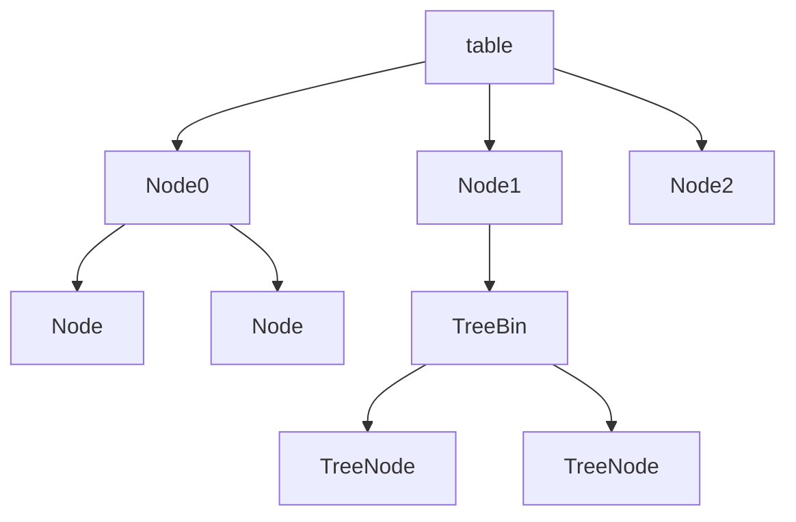
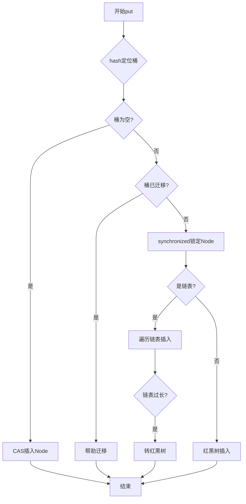
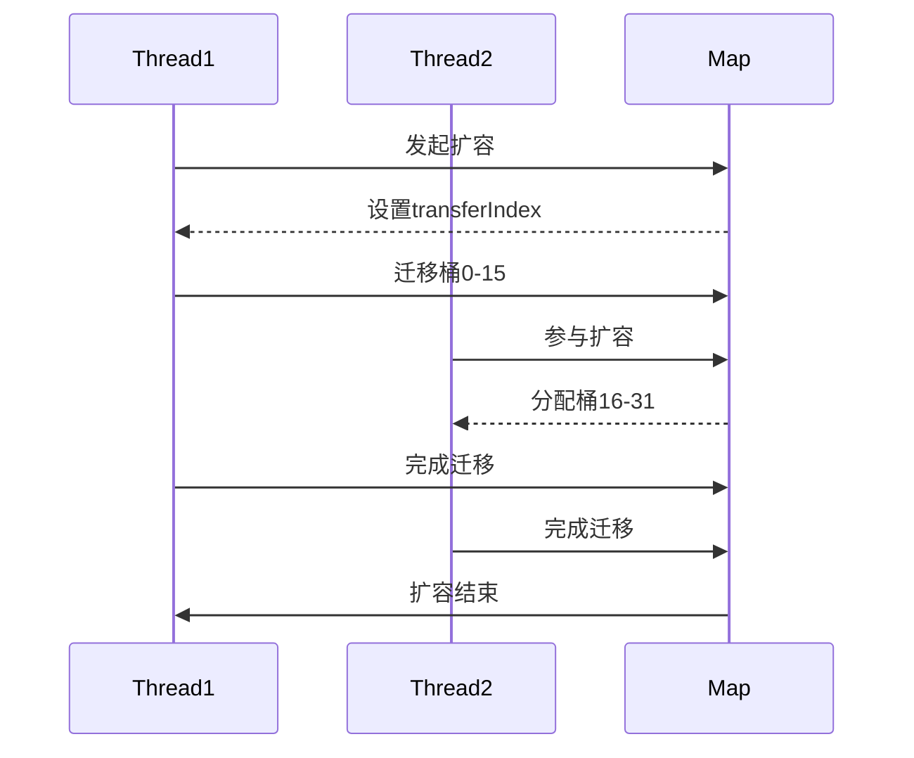

# 2. ConcurrentHashMap

# Java集合框架之ConcurrentHashMap：Java面试八股文详解

***

## 1. 概述与定义

ConcurrentHashMap是Java集合框架中的一个线程安全的Map实现，位于`java.util.concurrent`包下，专为高并发环境设计。它支持多线程并发读写操作，且在大多数情况下无需加锁，显著提升了性能。与传统的Hashtable和Collections.synchronizedMap相比，ConcurrentHashMap提供了更高的并发性和可伸缩性，是多线程编程中的首选工具。

### 定义

ConcurrentHashMap可以简单定义为：一个线程安全的HashMap，适用于多线程环境，支持高并发访问。在面试中，你可以这样回答：“ConcurrentHashMap是Java集合框架中的线程安全Map实现，通过分段锁（Java 7）或CAS + synchronized（Java 8）实现高效并发，广泛用于高并发场景。”这个回答简洁明了，能快速抓住考官的注意力，为后续展开打下基础。

### 背景与重要性

在多线程环境下，普通的HashMap不是线程安全的，可能导致死循环或数据丢失等问题。Hashtable虽然线程安全，但因使用全局锁，性能较差，尤其在高并发场景下锁竞争严重。ConcurrentHashMap通过细粒度锁和无锁操作，解决了这些问题，提供高性能的并发访问能力。掌握ConcurrentHashMap不仅能应对面试，还能在实际项目中提升并发编程能力，比如在缓存系统或并发计数器中发挥作用。

***

## 2. 主要特点

ConcurrentHashMap有以下几个显著特点，熟悉这些特点能让你在面试中快速定位问题并展开分析：

- **线程安全** 🔒 &#x20;

  支持多线程并发访问，无需外部同步机制。
- **高并发性** 🚀 &#x20;

  通过分段锁（Java 7）或CAS + synchronized（Java 8），实现细粒度锁，减少锁竞争。
- **弱一致性** ⚠️ &#x20;

  迭代器是弱一致的，不保证反映最新修改，可能存在延迟。
- **无锁读操作** 📖 &#x20;

  读操作不加锁，大幅提升读取性能。
- **支持并发级别** ⚙️ &#x20;

  Java 7中可配置并发级别，Java 8中自动调整以适应负载。

### 面试Tips

提到“高并发性”时，可以结合场景说：“在秒杀系统中，ConcurrentHashMap能减少锁等待，提升吞吐量。”对于“弱一致性”，可以补充：“它的迭代器是弱一致的，适合大多数业务，但不适合强一致性需求，比如金融交易。”这些表述能展现你的实战经验和深度理解。

***

## 3. 应用目标

ConcurrentHashMap的设计目标是提供一个高性能、线程安全的Map实现，具体包括以下几点：

- **支持高并发访问** &#x20;

  通过细粒度锁和无锁操作，适应高并发读写场景。
- **提升读写性能** &#x20;

  读操作无锁，写操作仅锁定部分数据，减少锁开销。
- **保证线程安全** &#x20;

  防止多线程下的数据不一致和死循环问题。
- **简化并发编程** &#x20;

  提供易用的API，降低开发难度。
- **适应多种场景** &#x20;

  支持缓存、并发数据存储等应用。

在面试中，你可以总结：“ConcurrentHashMap的目标是提供高性能、线程安全的Map实现，支持高并发访问，简化编程，适应多种场景。”这个回答简洁有力，虽然“简化并发编程”不是主要目标，但在实际开发中能提升效率，适当提及能体现全面思考。

***

## 4. 主要内容及其组成部分

ConcurrentHashMap是Java集合框架的重要组成部分，其核心内容包括数据结构、并发控制、扩容机制等。以下逐一详解，结合代码、表格和图表，确保内容全面且直观。

### 4.1 数据结构

ConcurrentHashMap的底层数据结构在Java 7和Java 8中有所不同：

- **Java 7**：采用**分段锁（Segment）** 机制，将数据分为多个Segment，每个Segment是一个HashMap，内部使用锁保护。
- **Java 8**：采用**Node数组 + 链表 / 红黑树**，与HashMap类似，通过CAS和synchronized实现并发控制。

#### 示例：Java 8 ConcurrentHashMap结构

```java 
transient volatile Node<K,V>[] table;
static class Node<K,V> implements Map.Entry<K,V> {
    final int hash;
    final K key;
    volatile V val;
    volatile Node<K,V> next;
    // 省略构造方法等
}
```


**代码说明**：table是Node数组，Node包含key、value和next指针，val和next用volatile修饰以保证线程安全。面试时可以说：“Java 8的ConcurrentHashMap结构类似HashMap，但通过volatile和CAS实现线程安全。”

### 4.2 并发控制

并发控制是ConcurrentHashMap的核心机制：

- **Java 7**：通过Segment实现分段锁，每个Segment是一个ReentrantLock，写操作锁定Segment，读操作无锁。
- **Java 8**：通过CAS + synchronized实现，put操作先用CAS尝试插入，失败则synchronized锁定Node。

#### 示例：Java 8 put操作

```java 
final V putVal(K key, V value, boolean onlyIfAbsent) {
    if (key == null || value == null) throw new NullPointerException();
    int hash = spread(key.hashCode());
    int binCount = 0;
    for (Node<K,V>[] tab = table;;) {
        Node<K,V> f; int n, i, fh;
        if (tab == null || (n = tab.length) == 0)
            tab = initTable();
        else if ((f = tabAt(tab, i = (n - 1) & hash)) == null) {
            if (casTabAt(tab, i, null, new Node<K,V>(hash, key, value, null)))
                break;
        } else if ((fh = f.hash) == MOVED)
            tab = helpTransfer(tab, f);
        else {
            V oldVal = null;
            synchronized (f) {
                if (tabAt(tab, i) == f) {
                    if (fh >= 0) {
                        binCount = 1;
                        for (Node<K,V> e = f;; ++binCount) {
                            K ek;
                            if (e.hash == hash && ((ek = e.key) == key || (ek != null && key.equals(ek)))) {
                                oldVal = e.val;
                                if (!onlyIfAbsent)
                                    e.val = value;
                                break;
                            }
                            Node<K,V> pred = e;
                            if ((e = e.next) == null) {
                                pred.next = new Node<K,V>(hash, key, value, null);
                                break;
                            }
                        }
                    } else if (f instanceof TreeBin) {
                        // 红黑树操作
                    }
                }
            }
            if (binCount != 0) {
                if (binCount >= TREEIFY_THRESHOLD)
                    treeifyBin(tab, i);
                if (oldVal != null)
                    return oldVal;
                break;
            }
        }
    }
    addCount(1L, binCount);
    return null;
}
```


**代码说明**：put操作先用CAS尝试插入新Node，失败则synchronized锁定桶的头节点，处理链表或红黑树。面试时可以说：“Java 8用CAS减少锁的使用，synchronized只锁住必要部分，提升并发性能。”

### 4.3 扩容机制

ConcurrentHashMap支持并发扩容，允许多线程同时参与：

- **Java 7**：Segment内部扩容，锁定Segment。
- **Java 8**：采用“分段迁移”机制，多线程并发迁移数据。

#### 示例：Java 8 transfer操作

```java 
private final void transfer(Node<K,V>[] tab, Node<K,V>[] nextTab) {
    int n = tab.length, stride;
    if ((stride = (NCPU > 1) ? (n >>> 3) / NCPU : n) < MIN_TRANSFER_STRIDE)
        stride = MIN_TRANSFER_STRIDE;
    if (nextTab == null) {
        try {
            @SuppressWarnings("unchecked")
            Node<K,V>[] nt = (Node<K,V>[])new Node<?,?>[n << 1];
            nextTab = nt;
        } catch (Throwable ex) {
            sizeCtl = Integer.MAX_VALUE;
            return;
        }
        nextTable = nextTab;
        transferIndex = n;
    }
    int nextn = nextTab.length;
    ForwardingNode<K,V> fwd = new ForwardingNode<K,V>(nextTab);
    boolean advance = true;
    boolean finishing = false;
    for (int i = 0, bound = 0;;) {
        Node<K,V> f; int fh;
        while (advance) {
            int nextIndex, nextBound;
            if (--i >= bound || finishing)
                advance = false;
            else if ((nextIndex = transferIndex) <= 0) {
                i = -1;
                advance = false;
            } else if (U.compareAndSwapInt
                       (this, TRANSFERINDEX, nextIndex,
                        nextBound = (nextIndex > stride ? nextIndex - stride : 0))) {
                bound = nextBound;
                i = nextIndex - 1;
                advance = false;
            }
        }
        if (i < 0 || i >= n || i + n >= nextn) {
            int sc;
            if (finishing) {
                nextTable = null;
                table = nextTab;
                sizeCtl = (n << 1) - (n >>> 1);
                return;
            }
            if (U.compareAndSwapInt(this, SIZECTL, sc = sizeCtl, sc - 1)) {
                if ((sc - 2) != resizeStamp(n) << RESIZE_STAMP_SHIFT)
                    return;
                finishing = advance = true;
                i = n;
            }
        } else if ((f = tabAt(tab, i)) == null)
            advance = casTabAt(tab, i, null, fwd);
        else if ((fh = f.hash) == MOVED)
            advance = true;
        else {
            synchronized (f) {
                if (tabAt(tab, i) == f) {
                    Node<K,V> ln, hn;
                    if (fh >= 0) {
                        int runBit = fh & n;
                        Node<K,V> lastRun = f;
                        for (Node<K,V> p = f.next; p != null; p = p.next) {
                            int b = p.hash & n;
                            if (b != runBit) {
                                runBit = b;
                                lastRun = p;
                            }
                        }
                        if (runBit == 0) {
                            ln = lastRun;
                            hn = null;
                        } else {
                            hn = lastRun;
                            ln = null;
                        }
                        for (Node<K,V> p = f; p != lastRun; p = p.next) {
                            int ph = p.hash; K pk = p.key; V pv = p.val;
                            if ((ph & n) == 0)
                                ln = new Node<K,V>(ph, pk, pv, ln);
                            else
                                hn = new Node<K,V>(ph, pk, pv, hn);
                        }
                        setTabAt(nextTab, i, ln);
                        setTabAt(nextTab, i + n, hn);
                        setTabAt(tab, i, fwd);
                        advance = true;
                    } else if (f instanceof TreeBin) {
                        // 红黑树迁移
                    }
                }
            }
        }
    }
}
```


**代码说明**：transfer方法支持多线程并发迁移数据，transferIndex控制迁移进度，ForwardingNode标记已迁移的桶。面试时可以说：“Java 8支持并发扩容，多线程分工迁移数据，大幅提升效率。”

### 4.4 线程安全

ConcurrentHashMap通过以下机制保证线程安全：

- **volatile**：Node的val和next字段用volatile修饰，确保内存可见性。
- **CAS**：无锁操作，如插入新Node时使用CAS。
- **synchronized**：CAS失败或操作链表/红黑树时锁定Node。

#### 示例：volatile和CAS

```java 
static final <K,V> boolean casTabAt(Node<K,V>[] tab, int i, Node<K,V> c, Node<K,V> v) {
    return U.compareAndSwapObject(tab, ((long)i << ASHIFT) + ABASE, c, v);
}
```


**代码说明**：casTabAt用CAS尝试设置tab\[i]，实现无锁插入。面试时可以说：“ConcurrentHashMap用CAS减少锁开销，volatile保证可见性。”

### 4.5 迭代器

ConcurrentHashMap的迭代器是**弱一致性**的，不保证反映最新修改：

- **快照机制**：迭代器创建时获取table快照，遍历时基于快照操作。
- **弱一致性**：遍历过程中可能看不到最新的put或remove操作。
- **不抛异常**：不会抛ConcurrentModificationException。

#### 示例：迭代器使用

```java 
ConcurrentHashMap<String, String> map = new ConcurrentHashMap<>();
map.put("A", "1");
map.put("B", "2");
for (Map.Entry<String, String> entry : map.entrySet()) {
    System.out.println(entry.getKey() + "=" + entry.getValue());
}
```


**代码说明**：此代码安全迭代ConcurrentHashMap，不会抛异常。面试时可以说：“它的迭代器是弱一致的，适合缓存场景，但不适合强一致性需求。”

### 版本对比表格

| 特性   | Java 7              | Java 8             |
| ---- | ------------------- | ------------------ |
| 数据结构 | Segment + HashEntry | Node数组 + 链表/红黑树    |
| 并发控制 | Segment锁            | CAS + synchronized |
| 扩容机制 | Segment内扩容          | 并发扩容               |
| 读操作  | 不加锁                 | 不加锁                |
| 写操作  | 锁定Segment           | CAS或锁定Node         |

**表格说明**：此表格对比Java 7和Java 8的特性，Java 8优化了并发控制和扩容机制。面试时可用来说明版本差异。

***

## 5. 原理剖析

ConcurrentHashMap的实现原理涉及数据结构、并发控制、扩容机制等核心技术。以下深入解析Java 8中的原理，结合Mermaid图表说明。

### 5.1 数据结构

Java 8中ConcurrentHashMap的底层结构包括：

- **Node数组**：存储Node节点，Node包含key、value和next指针。
- **链表 / 红黑树**：链表长度超8时转为红黑树，提升查找效率。
- **ForwardingNode**：扩容时标记已迁移的桶。

#### Mermaid图表：数据结构




**图表说明**：此图展示table数组，部分桶为链表，部分为红黑树。面试时可用来说明结构。

### 5.2 并发控制原理

Java 8中并发控制依赖CAS和synchronized：

- **CAS**：无锁插入新Node。
- **synchronized**：CAS失败或操作链表/红黑树时锁定Node。
- **volatile**：确保val和next的可见性。

#### 示例：put操作流程




**图表说明**：此图展示put流程，先CAS尝试插入，失败则synchronized锁定Node。面试时可用来说明并发控制。

### 5.3 扩容机制原理

Java 8支持并发扩容：

- **transferIndex**：记录迁移进度。
- **ForwardingNode**：标记已迁移的桶。
- **多线程迁移**：多线程并发迁移不同区间的桶。

#### 示例：扩容流程




**图表说明**：此图展示多线程并发扩容，面试时可用来说明高效性。

### 5.4 弱一致性原理

迭代器采用快照机制：

- **创建时快照**：迭代器创建时获取table引用。
- **遍历快照**：不反映后续修改。
- **不抛异常**：允许并发修改。

**补充说明**：弱一致性适合缓存等场景，但不适合强一致性需求。面试时可以说：“它的迭代器是弱一致的，适合大多数场景，但不适合金融交易。”

***

## 6. 应用与拓展

ConcurrentHashMap在实际项目中应用广泛，以下是典型场景：

- **缓存系统** &#x20;

  如Guava Cache底层用ConcurrentHashMap存储数据。
- **并发数据存储** &#x20;

  如多线程统计、计数器。
- **配置管理** &#x20;

  存储动态配置，支持高并发读写。
- **任务调度** &#x20;

  存储任务元数据，支持并发访问。

### 拓展

可与其他技术结合：

- **Spring Cache**：与Spring Cache集成，实现线程安全缓存。
- **多线程**：替代HashMap用于多线程环境。
- **微服务**：在分布式系统中作为本地缓存。

#### 示例：Spring Cache集成

```java 
@Cacheable(cacheNames = "userCache", key = "#userId")
public User getUserById(String userId) {
    return userService.getUserById(userId);
}
```


**代码说明**：Spring Cache默认用ConcurrentHashMap实现缓存。面试时可以说：“Spring Cache用ConcurrentHashMap，线程安全且高效。”

***

## 7. 面试问答

以下是五个常见问题及详细回答，模仿面试者口吻，确保自然且有深度。

### 问题 1：ConcurrentHashMap和HashMap有什么区别？

**回答**： &#x20;

“ConcurrentHashMap是HashMap的线程安全版本，适合多线程环境。HashMap在多线程下可能死循环或丢数据，ConcurrentHashMap通过分段锁或CAS+synchronized保证线程安全。性能上，它比Hashtable好很多，锁粒度更细。我在项目里用ConcurrentHashMap做缓存，读写效率很高。”

### 问题 2：Java 7和Java 8的ConcurrentHashMap有何不同？

**回答**： &#x20;

“Java 7用Segment分段锁，每个Segment是一个HashMap，写操作锁Segment；Java 8去掉Segment，用CAS+synchronized，put时先CAS，失败再锁Node。Java 8还支持并发扩容，性能更强。我在Java 8项目里用它，感觉并发能力提升了不少。”

### 问题 3：ConcurrentHashMap的迭代器是强一致性吗？

**回答**： &#x20;

“不是，它是弱一致性的，迭代器创建时拿table快照，遍历时不反映后续修改，不会抛ConcurrentModificationException。适合大多数场景，但不适合强一致性需求。我在缓存系统用它，偶尔延迟可以接受。”

### 问题 4：ConcurrentHashMap如何实现线程安全？

**回答**： &#x20;

“Java 8中，它用CAS和synchronized实现线程安全。读操作无锁，写操作先CAS试插，失败则synchronized锁Node。Node的val和next用volatile保证可见性。扩容时多线程并发迁移。我在高并发项目里用它，性能比Hashtable好很多。”

### 问题 5：什么时候选择ConcurrentHashMap？

**回答**： &#x20;

“多线程环境下需要线程安全的Map时选ConcurrentHashMap，尤其高并发读写场景，它的性能比Hashtable和Collections.synchronizedMap强。单线程或低并发用HashMap就够。我在项目里遇到并发问题时，优先选ConcurrentHashMap。”

***

## 总结

本文从ConcurrentHashMap的定义到原理、应用及面试应对，覆盖所有核心知识点。通过代码、表格和Mermaid图表，内容直观易懂，背熟后能在面试中自信回答问题，展现你的专业实力！✨
