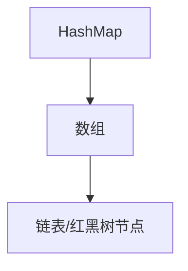

# 二. Map

## 1. 概述与定义

在 Java 集合框架中，Map 接口是一个非常重要的数据结构，用于存储“键值对”（Key-Value）的映射关系。与 Collection 不同，Map 并不是 Collection 的子接口，它独立存在，专注于将每个键与一个值关联起来，保证键的唯一性，同时允许值的重复。常见的 Map 实现类包括 HashMap、LinkedHashMap、TreeMap、Hashtable、ConcurrentHashMap 等。

Map 的设计思想在于：

- 提供快速的键值查找功能；
- 通过唯一的键标识一个映射，保证数据的一一对应关系；
- 支持灵活的数据操作，如添加、删除、修改和查找映射；
- 在多线程场景下，通过并发实现类确保线程安全。

Map 接口广泛应用于各种业务场景中，如配置参数存储、缓存实现、数据统计、数据库结果映射等。在面试中，考官往往会深入探讨 Map 的工作原理、性能优化以及与其他集合（如 List、Set）的区别。📌

## 2. 主要特点

Map 接口具有以下主要特点，这些特点在实际开发和面试中都是重点考察内容：

1. **键值对存储** &#x20;

   Map 中的每个元素都是一组键值对，键（Key）用于唯一标识映射，值（Value）可以重复。通过键可以快速定位到对应的值。这一特性使得 Map 非常适合于需要根据标识符快速查找数据的场景。🔑➡️💎
2. **键的唯一性** &#x20;

   在 Map 中，键必须是唯一的。若向 Map 中添加一个已存在的键，则会覆盖原有的映射。这样可以避免数据冲突，确保每个键对应唯一的数据。 &#x20;
3. **无序或有序存储** &#x20;

   不同的 Map 实现类对存储顺序有不同要求： &#x20;
   - **HashMap**：不保证映射的顺序，底层采用哈希表实现，查找速度非常快。 &#x20;
   - **LinkedHashMap**：在 HashMap 基础上维护了插入顺序或访问顺序，适用于需要顺序遍历的场景。 &#x20;
   - **TreeMap**：基于红黑树实现，自动按键的自然顺序或自定义顺序排序。 &#x20;
     不同实现提供了灵活性，使得开发人员可以根据业务需求选择最合适的 Map 实现。⚙️
4. **高效查找与操作** &#x20;

   Map 通过键快速定位对应的值，常用操作如 put、get、remove、containsKey 等在大多数实现中都具有较高的效率。HashMap 的查找操作在平均情况下时间复杂度为 O(1)，TreeMap 的查找操作为 O(log n)。⚡
5. **线程安全与并发支持** &#x20;

   默认情况下，HashMap 和 TreeMap 并不是线程安全的。在多线程环境下，可以使用 Hashtable 或 ConcurrentHashMap 来保证线程安全，同时 Collections.synchronizedMap() 也能提供包装后的同步 Map。🚦

下面的表格对 Map 接口的主要特点及常见实现类进行了归纳说明：

| 特点        | 说明                                                     | 代表实现类                                       | 适用场景              |
| --------- | ------------------------------------------------------ | ------------------------------------------- | ----------------- |
| 键值对存储     | 每个元素以键值对形式存储，键唯一，值可以重复                                 | HashMap、TreeMap、LinkedHashMap               | 配置存储、数据缓存、数据库结果映射 |
| 键的唯一性     | 每个键在 Map 中只能出现一次，重复键会覆盖原值                              | 所有 Map 实现类                                  | 保证数据不冲突、快速查找      |
| 存储顺序灵活    | 部分实现类不保证顺序（HashMap），部分维护插入或排序顺序（LinkedHashMap、TreeMap） | HashMap、LinkedHashMap、TreeMap               | 无序存储或顺序遍历需求       |
| 高效查找与操作   | 通过键快速定位值，操作效率高                                         | HashMap（O(1)）、TreeMap（O(log n)）             | 频繁查找、数据更新         |
| 线程安全与并发支持 | 默认不安全，可采用同步包装或并发实现类保证线程安全                              | Hashtable、ConcurrentHashMap、synchronizedMap | 多线程并发场景           |

## 3. 应用目标

Java Map 接口及其实现类在项目开发中的应用目标主要体现在以下几个方面：

1. **高效数据查找** &#x20;

   通过键值对的形式存储数据，Map 能够在常数级或对数级时间内快速查找所需数据。这在业务场景中，如缓存系统、数据库结果映射等，都能显著提高响应速度。🚀
2. **数据去重与映射关系建立** &#x20;

   Map 保证键的唯一性，使得它非常适合用于数据去重、统计计数、建立对象之间的映射关系。例如，在统计用户访问量时，可以使用 Map 将用户标识与访问次数对应起来。🎯
3. **灵活的数据存储与管理** &#x20;

   通过不同的 Map 实现，可以根据业务需求选择无序存储、顺序存储或排序存储，从而灵活满足各种数据管理场景。 &#x20;
4. **支持并发处理** &#x20;

   在高并发系统中，采用 ConcurrentHashMap 等线程安全的 Map 实现，能够保证数据一致性和系统稳定性，为多线程数据共享提供了坚实保障。🔒
5. **便于业务逻辑扩展** &#x20;

   Map 接口常用于传递参数、返回结果以及构建复杂业务逻辑中的数据结构。通过统一的接口设计，开发人员可以灵活扩展业务功能，并与其他集合（如 List、Set）协同工作。🤝

总体而言，Map 接口的应用目标在于实现高性能数据存储、快速查找与高并发支持，从而提升整个系统的运行效率和可维护性。

## 4. 主要内容及其组成部分

Map 接口包含丰富的操作方法和多种实现方式，其主要组成部分可归纳为以下几个方面：

### 4.1 基本操作方法

Map 接口定义了众多常用操作方法，包括但不限于：

- **put(K key, V value)**：将指定键值对存入 Map。如果键已存在，则覆盖原值。
- **get(Object key)**：根据键获取对应的值；若键不存在，则返回 null。
- **remove(Object key)**：删除指定键的映射关系，返回被删除的值。
- **containsKey(Object key)**：判断 Map 是否包含指定的键。
- **containsValue(Object value)**：判断 Map 是否包含指定的值。
- **size()**：返回映射中的键值对个数。
- **clear()**：清空 Map 中所有映射关系。
- **keySet()**：返回所有键组成的 Set 集合。
- **values()**：返回所有值组成的 Collection。
- **entrySet()**：返回所有映射关系（键值对）组成的 Set。

示例代码（基本操作）：

```java 
Map<String, Integer> scoreMap = new HashMap<>();
scoreMap.put("Alice", 90);
scoreMap.put("Bob", 85);
scoreMap.put("Charlie", 92);

System.out.println("Alice 的成绩：" + scoreMap.get("Alice"));

scoreMap.remove("Bob");

if (scoreMap.containsKey("Charlie")) {
    System.out.println("Charlie 的成绩：" + scoreMap.get("Charlie"));
}

System.out.println("总共有 " + scoreMap.size() + " 个学生的成绩。");
```


### 4.2 主要实现类

Map 接口有多种具体实现，每种实现类都有其特点：

- **HashMap** &#x20;

  基于哈希表实现，不保证存储顺序，查找、插入和删除操作速度快。适用于大部分无序数据存储需求。
- **LinkedHashMap** &#x20;

  在 HashMap 基础上使用链表维护插入顺序或访问顺序，适合需要顺序遍历的场景。
- **TreeMap** &#x20;

  基于红黑树实现，能够对键进行排序，适用于需要按键自然顺序或自定义排序的场景。
- **Hashtable** &#x20;

  早期实现的线程安全 Map，但性能相对较低，现多被 ConcurrentHashMap 替代。
- **ConcurrentHashMap** &#x20;

  针对多线程并发场景设计的 Map 实现，采用分段锁机制，能够高效保证线程安全。

下表归纳了各个实现类的特点：

| 实现类               | 数据结构   | 顺序特性       | 线程安全性 | 主要特点                |
| ----------------- | ------ | ---------- | ----- | ------------------- |
| HashMap           | 哈希表    | 无序         | 非线程安全 | 高效的查找和插入操作，常用于大部分场景 |
| LinkedHashMap     | 哈希表+链表 | 保持插入/访问顺序  | 非线程安全 | 顺序遍历，适合缓存或日志记录等需求   |
| TreeMap           | 红黑树    | 自然排序或自定义排序 | 非线程安全 | 自动排序，支持范围查询         |
| Hashtable         | 哈希表    | 无序         | 线程安全  | 老版本线程安全实现，已较少使用     |
| ConcurrentHashMap | 分段锁哈希表 | 无序         | 线程安全  | 高并发环境下性能优异          |

### 4.3 键值对视图

Map 提供了多种视图方法，用于方便操作和遍历映射：

- **keySet()**：返回包含所有键的 Set 集合，便于遍历或查找。
- **values()**：返回包含所有值的 Collection，适用于数据统计等场景。
- **entrySet()**：返回包含所有映射关系的 Set，每个元素是 Map.Entry 类型，提供 getKey() 和 getValue() 方法，用于同时访问键和值。

示例代码（遍历 entrySet）：

```java 
for (Map.Entry<String, Integer> entry : scoreMap.entrySet()) {
    System.out.println("学生：" + entry.getKey() + "，成绩：" + entry.getValue());
}
```


### 4.4 辅助工具

Java 提供了丰富的工具类来辅助 Map 操作，例如：

- **Collections.synchronizedMap(Map m)**：对非线程安全的 Map 进行包装，获得线程安全的 Map。
- **Map 的 putIfAbsent()、compute()、merge() 等新方法**：Java 8 提供了更多实用方法，使得 Map 操作更加简洁和高效。

示例代码（使用 putIfAbsent）：

```java 
scoreMap.putIfAbsent("Daisy", 88);
```


## 5. 原理剖析

深入剖析 Map 接口的底层原理，有助于理解其高效性能和扩展性。以下为 Map 的主要原理解析：

### 5.1 键值对存储原理

Map 中每个键值对存储在内部数据结构中，不同实现采用不同存储结构：

- **HashMap**：内部通过数组加链表（或红黑树，JDK 1.8 以后）实现。 &#x20;
  - 当元素较多时，链表会转化为红黑树以提高查找效率。 &#x20;
  - 插入时，根据键的 hashCode() 计算索引，若冲突则在链表或树中添加。 &#x20;
- **TreeMap**：基于红黑树实现，每个节点存储一个键值对，并通过比较器（或键的自然顺序）维持树的平衡，从而保证排序和高效查找。 &#x20;
- **LinkedHashMap**：除了内部哈希表存储外，还维护一个双向链表记录元素的插入顺序或访问顺序，实现有序遍历。

### 5.2 哈希冲突与扩容

在 HashMap 中，哈希冲突是不可避免的。为了解决冲突：

- 首先通过链表将冲突的元素链接在同一数组槽中； &#x20;
- 当链表长度超过一定阈值（默认 8）时，链表会转化为红黑树，减少查找时间； &#x20;
- 同时，当 HashMap 的负载因子达到阈值（默认 0.75）时，会自动扩容，重新分配数组，降低冲突概率。

### 5.3 并发机制

由于默认 Map 实现类（如 HashMap、TreeMap）都不是线程安全的，所以在多线程环境下：

- 可以使用 Hashtable 或 ConcurrentHashMap。 &#x20;
- ConcurrentHashMap 采用分段锁技术，将数据分成多个段，实现局部同步，大大提高并发性能。 &#x20;
- Collections.synchronizedMap() 通过在每个方法上加锁来保证线程安全，但性能开销较大。

### 5.4 内存与性能

Map 的内存占用和性能取决于内部实现：

- HashMap 通过数组存储键值对，因而内存利用率较高，但过度扩容可能造成内存浪费。 &#x20;
- TreeMap 因为维护红黑树，节点开销较大，适用于数据量较小且要求排序的场景。 &#x20;
- LinkedHashMap 在 HashMap 基础上额外维护链表，内存开销略增，但便于遍历顺序保持。

下面使用 Mermaid 图表展示 HashMap 的内部结构示意：




图中展示了 HashMap 内部由数组构成，数组每个位置存储链表或红黑树节点，当发生哈希冲突时，多个键值对在同一数组索引上形成链表或树结构。

## 6. 应用与拓展

在实际项目中，Map 的应用十分广泛，下面列举几种典型应用场景及扩展方向：

### 6.1 数据缓存

Map 常用于构建内存缓存，如利用 HashMap 存储临时数据，或采用 ConcurrentHashMap 构建线程安全缓存，常见应用有本地缓存、会话存储、配置参数缓存等。

### 6.2 配置管理

利用 Map 存储配置参数，可以方便地实现键值对形式的配置管理。许多开源框架（如 Spring）都采用 Map 存储配置信息，并通过动态更新保证系统灵活性。

### 6.3 数据统计与分组

Map 的 keySet()、values()、entrySet() 等方法使得对数据进行分组、统计和分析变得非常便捷。例如，根据用户 ID 统计访问次数，根据产品编号统计销售数据等，均可以利用 Map 高效实现。

### 6.4 业务逻辑处理

在实际业务逻辑中，Map 常用于传递参数、返回结果以及构建对象关系映射（ORM）等。利用 Map 可以灵活构造多层次、复杂的数据结构，并与 JSON、XML 等格式进行互转。

### 6.5 并发扩展

在高并发系统中，通过使用 ConcurrentHashMap 可以构建高性能的数据共享平台。此外，还可以结合 Guava Cache、Caffeine 等开源缓存框架，在 Map 的基础上构建更高级的缓存机制，实现数据自动过期、负载均衡等功能。

下面的表格展示了 Map 在不同业务场景下的应用案例：

| 应用场景    | 主要用途            | 代表实现类                     |
| ------- | --------------- | ------------------------- |
| 数据缓存    | 临时存储数据，快速查找     | HashMap、ConcurrentHashMap |
| 配置管理    | 存储配置信息，键值对形式    | HashMap、Properties        |
| 数据统计与分组 | 根据特定键统计或分组数据    | HashMap、TreeMap           |
| 业务参数传递  | 构建参数对象，灵活传递多个参数 | HashMap、LinkedHashMap     |
| 并发数据共享  | 多线程环境下高效安全的数据存储 | ConcurrentHashMap         |

## 7. 面试问答

下面从面试者角度出发，整理了五个常见面试问题及详细回答，帮助你在面试中从容应对关于 Map 接口的考察。

### 问题1：请介绍 Java 中 Map 接口及其主要特点？

答： &#x20;

Map 接口是 Java 集合框架中用于存储键值对映射的核心接口，其主要特点在于： &#x20;

- 键值对存储，每个元素由唯一的键和对应的值组成； &#x20;
- 键的唯一性保证了数据不会重复； &#x20;
- 提供高效的查找、添加、删除等操作（HashMap 的平均时间复杂度为 O(1)）； &#x20;
- 支持不同存储顺序的实现，如无序的 HashMap、保持插入顺序的 LinkedHashMap、以及排序的 TreeMap。 &#x20;

这些特点使得 Map 成为各种业务场景（如缓存、配置管理、数据统计等）的首选数据结构。

### 问题2：HashMap 与 TreeMap 有什么区别？请说明各自的内部实现原理及适用场景。

答： &#x20;

HashMap 基于哈希表实现，其内部通过数组加链表（或红黑树）结构存储键值对，查找、插入速度极快，但不保证顺序；适用于需要快速查找和更新的场景。 &#x20;

TreeMap 则基于红黑树实现，保证键的有序性，查找和插入操作时间复杂度为 O(log n)；适用于需要排序和范围查询的场景。 &#x20;

面试中我会强调两者的内部数据结构及性能特点，说明如何根据业务需求进行选择。

### 问题3：如何确保自定义对象可以作为 Map 的键？请说明需要重写哪些方法。

答： &#x20;

为了确保自定义对象在 Map 中能正确使用，必须重写 equals() 和 hashCode() 方法。 &#x20;

- hashCode() 用于计算对象的哈希值，决定对象在哈希表中的存储位置。 &#x20;
- equals() 则用于判断两个对象是否相等，从而防止重复插入。 &#x20;

只有正确重写这两个方法，才能保证 Map 存储时不会出现重复键，从而保证数据一致性。

### 问题4：请说明 ConcurrentHashMap 的工作原理及在高并发场景下的优势？

答： &#x20;

ConcurrentHashMap 是 Java 提供的线程安全 Map 实现，其主要原理是采用分段锁（在 JDK 1.7 中）或基于 CAS（Compare-And-Swap）与 synchronized 结合（在 JDK 1.8 中）的方式进行并发控制。 &#x20;

- 它将数据分为多个段（或采用节点级别锁定），每个段独立加锁，从而大大降低锁竞争，提高并发性能。 &#x20;
- 同时，通过无锁读操作和局部更新，保证了在高并发场景下数据一致性和高效性。 &#x20;

这种设计使得 ConcurrentHashMap 在多线程环境下比 Hashtable 或同步包装的 HashMap 表现更优，是高并发系统的理想选择。

### 问题5：在实际项目中，你如何选择合适的 Map 实现类？请结合具体场景说明你的决策依据。

答： &#x20;

选择 Map 实现类主要依据业务需求、性能要求及线程安全性： &#x20;

- 若对存储顺序无要求且追求高性能，通常选择 HashMap； &#x20;
- 若需要保持插入顺序或访问顺序，则使用 LinkedHashMap； &#x20;
- 若需要键自动排序或支持范围查询，则选择 TreeMap； &#x20;
- 在多线程环境中，若读写并发较高，则应使用 ConcurrentHashMap； &#x20;
- 如果需要保证线程安全且数据量不大，也可以使用 Hashtable 或通过 Collections.synchronizedMap() 包装。 &#x20;

例如，在开发缓存模块时，我通常会采用 ConcurrentHashMap 以满足高并发访问需求，而在处理配置参数时，HashMap 已能很好地满足性能要求。

## 总结

本文从概述与定义、主要特点、应用目标、主要内容及其组成部分、原理剖析、应用与拓展以及面试问答七个部分，全面解析了 Java Map 接口的各项知识。 &#x20;

我们介绍了 Map 接口的基本概念、键值对存储方式、主要实现类（如 HashMap、LinkedHashMap、TreeMap、ConcurrentHashMap 等）的特点以及各自的内部实现原理。同时，通过代码示例、详细的归纳表格和 Mermaid 图表，阐述了 Map 在实际开发中如何实现高效数据查找、数据去重、并发控制等功能。 &#x20;

在面试问答部分，我们从面试者角度出发，详细回答了有关 Map 的常见问题，涵盖了内部机制、线程安全以及如何根据业务需求选择合适实现等关键内容。 &#x20;

希望这篇文章能为各位 Java 工程师在面试复习和实际项目开发中提供充分支持，帮助大家构建高性能、高可靠的系统。加油！🚀

[0. HashTable](<0. HashTable/0. HashTable.md> "0. HashTable")

[1. HashMap](<1. HashMap/1. HashMap.md> "1. HashMap")

[2. ConcurrentHashMap](<2. ConcurrentHashMap/2. ConcurrentHashMap.md> "2. ConcurrentHashMap")
