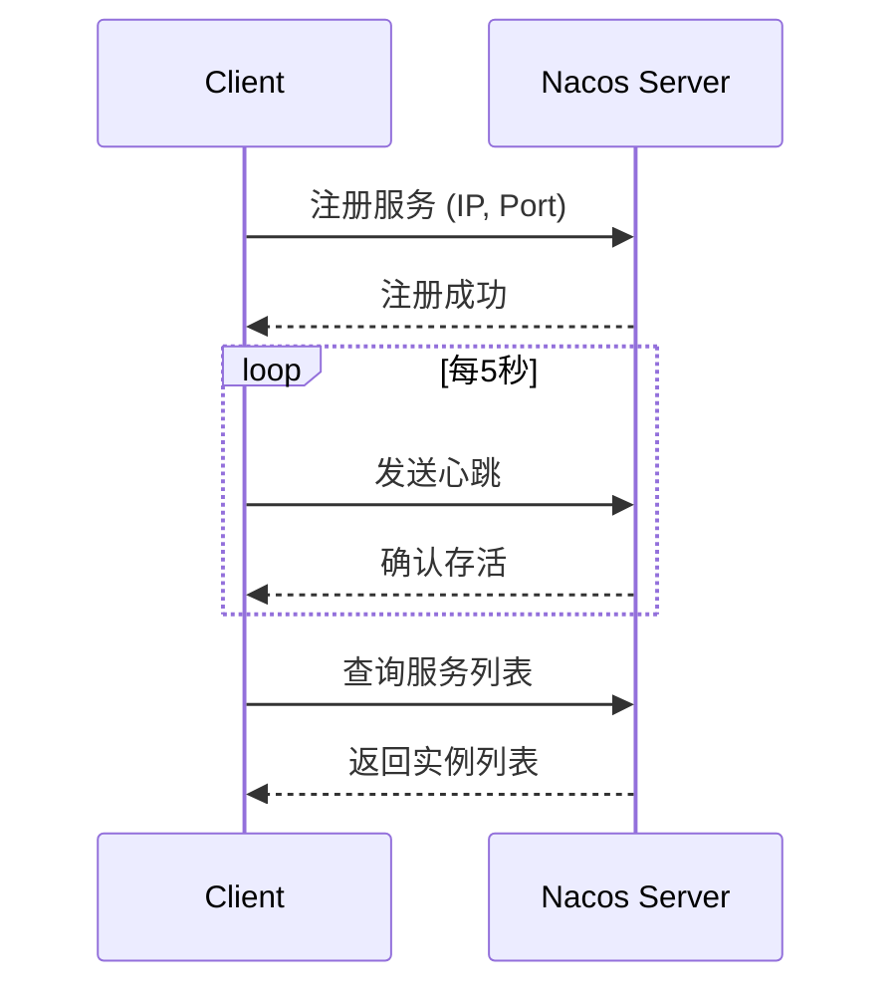
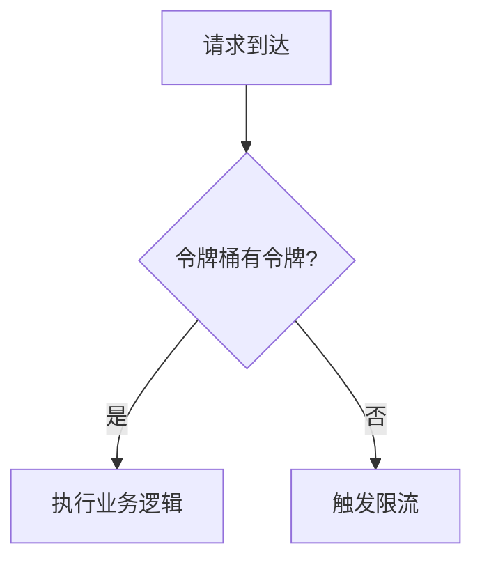
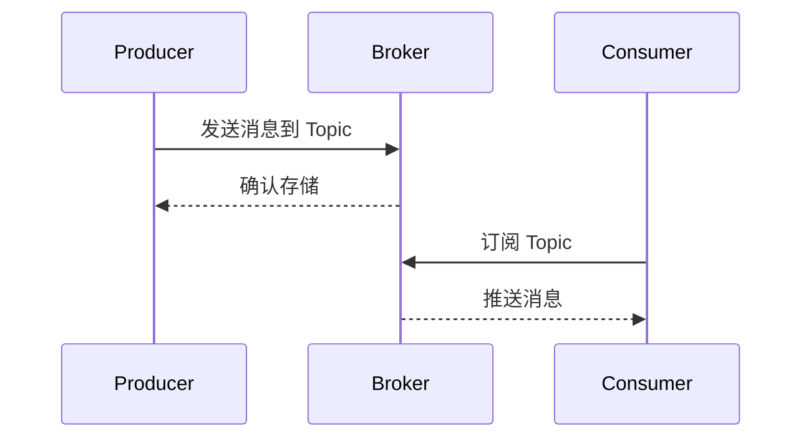

# 0. SpringCloudAlibaba

***

# Spring Cloud Alibaba 面试八股文

## 1. 概述与定义

Spring Cloud Alibaba 是一个开源的微服务框架，作为 Spring Cloud 的子项目，它深度整合了阿里巴巴的微服务技术栈，为开发者提供了一套高效、可靠的分布式应用解决方案。它通过将阿里巴巴的开源组件（如 Nacos、Sentinel、RocketMQ 等）与 Spring Cloud 无缝结合，提供了服务注册与发现、配置管理、流量控制、熔断降级、消息驱动等功能，特别适用于构建高性能、高可用的微服务系统。

**定义**：Spring Cloud Alibaba 是一个基于 Spring Cloud 的微服务开发框架，集成了阿里巴巴的微服务组件，提供从服务治理到分布式事务的全栈解决方案，帮助开发者快速构建健壮的分布式应用。

从面试角度看，理解 Spring Cloud Alibaba 的定位很重要：它不仅仅是一个工具集，更是阿里巴巴在大规模分布式系统实践中的经验结晶。它与 Spring Cloud 的核心理念一致，但通过引入阿里系组件，增强了在生产环境中的适用性。

***

## 2. 主要特点

Spring Cloud Alibaba 的特点是面试中常被问到的“亮点”，以下是其核心特性：

- **无缝集成** 🌐：与 Spring Cloud 高度兼容，开发者只需少量配置即可将 Nacos、Sentinel 等组件融入现有项目。
- **高性能** ⚡：得益于阿里巴巴在大规模电商场景（如双11）的验证，其组件在高并发、高可用性场景下表现优异。
- **功能丰富** 🛠️：涵盖服务注册与发现、动态配置、流量控制、熔断降级、消息驱动等微服务核心需求。
- **社区支持** 👥：拥有活跃的开源社区，版本迭代快，与云原生技术（如 Kubernetes）保持同步。
- **易用性** ✨：提供 Spring Boot Starter，简化依赖管理和配置。

**面试Tips**：提到“高性能”时，可以结合“阿里巴巴双11”场景，体现你对技术的实际应用理解。

***

## 3. 应用目标

Spring Cloud Alibaba 的设计目标是为微服务架构提供全面支持，具体包括：

- **服务注册与发现**：通过 Nacos 实现服务的动态管理和调用。
- **配置管理**：利用 Nacos 提供集中式配置和动态刷新能力。
- **流量控制与熔断降级**：借助 Sentinel 保障系统稳定性。
- **消息驱动**：集成 RocketMQ，实现异步通信和业务解耦。
- **分布式事务**：通过 Seata 解决微服务间数据一致性问题。

这些目标直接对应微服务架构中的痛点，面试中若被问到“为什么用 Spring Cloud Alibaba”，可以从这些目标切入，展现你对微服务的理解。

***

## 4. 主要内容及其组成部分

Spring Cloud Alibaba 由多个核心组件构成，以下逐一详细讲解，每部分都附带代码示例和应用场景。

### 4.1 Nacos - 服务注册与配置管理

**功能**：Nacos 是一个动态服务发现和配置管理平台，提供服务注册与发现、配置管理两大核心能力。

- **服务注册与发现**：服务启动时自动注册到 Nacos，消费者通过 Nacos 获取服务列表。
- **配置管理**：支持集中式配置存储和动态更新。

**代码示例**：

```java 
// 服务注册配置
@Configuration
public class NacosConfig {
    @Bean
    public NacosServiceRegistry nacosServiceRegistry() {
        return new NacosServiceRegistry();
    }
}

// 服务发现与调用
@RestController
public class HelloController {
    @Autowired
    private DiscoveryClient discoveryClient;

    @GetMapping("/hello")
    public String hello() {
        List<ServiceInstance> instances = discoveryClient.getInstances("service-name");
        if (!instances.isEmpty()) {
            ServiceInstance instance = instances.get(0);
            return "Hello from " + instance.getHost() + ":" + instance.getPort();
        }
        return "No service found";
    }
}
```


**配置管理示例**：

```yaml 
# application.yml
spring:
  cloud:
    nacos:
      config:
        server-addr: 127.0.0.1:8848
        file-extension: yaml
```


通过 `@RefreshScope` 注解，配置变更时无需重启服务即可生效。

### 4.2 Sentinel - 流量控制与熔断降级

**功能**：Sentinel 是一个轻量级的流量治理组件，提供流量控制、熔断降级和系统保护。

- **流量控制**：限制 QPS 或线程数，防止服务过载。
- **熔断降级**：当故障率超标时自动熔断。
- **系统保护**：根据 CPU、内存等指标动态调整流量。

**代码示例**：

```java 
@RestController
public class DemoController {
    @GetMapping("/test")
    public String test() {
        try (Entry entry = SphU.entry("test-resource")) {
            return "Success";
        } catch (BlockException e) {
            return "Blocked by Sentinel";
        }
    }
}
```


**配置规则**（通过 Sentinel 控制台或代码）：

```java 
FlowRule rule = new FlowRule();
rule.setResource("test-resource");
rule.setGrade(RuleConstant.FLOW_GRADE_QPS);
rule.setCount(10); // QPS限制为10
FlowRuleManager.loadRules(Collections.singletonList(rule));
```


### 4.3 RocketMQ - 消息驱动

**功能**：RocketMQ 是一个分布式消息中间件，支持发布-订阅模式，实现异步通信。

**代码示例**：

```java 
// 发送消息
@Service
public class MessageService {
    @Autowired
    private RocketMQTemplate rocketMQTemplate;

    public void sendMessage(String msg) {
        rocketMQTemplate.convertAndSend("test-topic", msg);
    }
}

// 消费消息
@RocketMQMessageListener(topic = "test-topic", consumerGroup = "test-group")
@Service
public class MessageConsumer implements RocketMQListener<String> {
    @Override
    public void onMessage(String message) {
        System.out.println("Received: " + message);
    }
}
```


### 4.4 Seata - 分布式事务

**功能**：Seata 提供分布式事务支持，支持 AT、TCC、SAGA 等模式。

**代码示例**：

```java 
@Service
public class OrderService {
    @GlobalTransactional
    public void createOrder() {
        // 调用库存服务
        stockService.reduceStock();
        // 调用支付服务
        paymentService.pay();
    }
}
```


### 4.5 Dubbo - RPC 通信

**功能**：Dubbo 是一个高性能 RPC 框架，支持服务治理和负载均衡。

**代码示例**：

```java 
// 服务提供者
@Service
public class HelloServiceImpl implements HelloService {
    @Override
    public String sayHello(String name) {
        return "Hello, " + name;
    }
}

// 服务消费者
@RestController
public class HelloController {
    @Reference
    private HelloService helloService;

    @GetMapping("/hello")
    public String hello() {
        return helloService.sayHello("World");
    }
}
```


**组件对比表格**：

| 组件       | 主要功能      | 使用场景        | 优点        |
| -------- | --------- | ----------- | --------- |
| Nacos    | 服务注册与配置管理 | 服务动态发现、配置刷新 | 简单易用、动态性强 |
| Sentinel | 流量控制与熔断降级 | 高并发流量治理     | 轻量级、规则灵活  |
| RocketMQ | 消息驱动      | 异步解耦、事件驱动   | 高吞吐量、可靠性高 |
| Seata    | 分布式事务     | 跨服务数据一致性    | 支持多种事务模式  |
| Dubbo    | RPC 通信    | 高性能服务调用     | 负载均衡、容错性强 |

**表格说明**：此表格总结了各组件的核心作用，面试时可用来快速回答“Spring Cloud Alibaba 有哪些组件及其作用”。

***

## 5. 原理剖析

深入理解原理是面试中的加分项，以下是对主要组件的剖析。

### 5.1 Nacos 服务注册与发现原理

Nacos 采用客户端-服务器架构：

- **服务注册**：服务启动时，通过 Nacos Client 将 IP、端口等信息发送到 Nacos Server，注册表更新。
- **服务发现**：消费者通过 Nacos Client 查询服务列表，结合负载均衡选择实例。
- **心跳机制**：客户端每隔 5 秒发送心跳，若超时，Nacos Server 将实例标记为不可用。

**Mermaid 图表**：




**图表说明**：此图展示了服务注册、心跳和发现的流程，面试时可用来说明 Nacos 的动态性。

### 5.2 Sentinel 流量控制原理

Sentinel 使用令牌桶算法：

- **令牌生成**：为每个资源设置令牌桶，按固定速率生成令牌。
- **请求处理**：请求到来时，若令牌足够则通过，否则拒绝。

**流程图**：




### 5.3 RocketMQ 消息传递原理

RocketMQ 基于发布-订阅模型：

- **生产者**：发送消息到 Topic。
- **Broker**：存储消息并转发。
- **消费者**：订阅 Topic，拉取消息。

**时序图**：




***

## 6. 应用与拓展

Spring Cloud Alibaba 在实际项目中有广泛应用：

- **电商系统**：Nacos 管理服务，Sentinel 限流，RocketMQ 处理订单异步消息，Seata 确保支付一致性。
- **金融系统**：Dubbo 实现高效 RPC 调用，Sentinel 保障稳定性。

**拓展**：它支持与 Kubernetes 集成，可通过 Nacos 的多集群功能实现跨地域服务治理。

***

## 7. 面试问答

以下是常见的面试问题及详细回答：

### 问题 1：什么是 Spring Cloud Alibaba？

**回答**：Spring Cloud Alibaba 是一个基于 Spring Cloud 的微服务框架，它整合了阿里巴巴的微服务组件，比如 Nacos、Sentinel、RocketMQ 等，提供服务注册与发现、配置管理、流量控制等功能。它的核心目标是帮助开发者快速构建高性能的分布式系统。比如，我在项目中用 Nacos 做服务注册，Sentinel 做限流，感觉它特别适合高并发场景。

### 问题 2：Nacos 在 Spring Cloud Alibaba 中有什么作用？

**回答**：Nacos 主要负责服务注册与发现和配置管理。服务注册方面，它就像一个“服务电话簿”，服务启动时把自己注册上去，其他服务通过它找到调用目标；配置管理方面，它支持集中存储配置，还能动态刷新。比如，我用过 Nacos 配置数据库连接，改个参数不用重启服务，直接生效，特别方便。

### 问题 3：Sentinel 如何实现流量控制？

**回答**：Sentinel 用令牌桶算法来做流量控制。它给每个资源设一个令牌桶，按固定速率生成令牌。请求来的时候，有令牌就放行，没令牌就拒绝。还支持 QPS、线程数等多种策略。我在项目里用它限制接口 QPS，遇到突发流量时能有效保护后端服务。

### 问题 4：如何在 Spring Cloud Alibaba 中实现消息驱动？

**回答**：可以用 RocketMQ 来实现消息驱动。Spring Cloud Alibaba 集成了 RocketMQ，我一般通过 RocketMQTemplate 发送消息，用 @RocketMQMessageListener 监听消息。比如，我做过一个订单系统，支付成功后用 RocketMQ 异步通知库存服务，解耦效果很好。

### 问题 5：Seata 在分布式事务中怎么用？

**回答**：Seata 是用来解决分布式事务的，支持 AT、TCC 等模式。我用过 AT 模式，通过 @GlobalTransactional 注解标记全局事务。比如，下单时要扣库存和支付，Seata 能保证两步要么都成功，要么都回滚，很适合微服务场景。

***

这篇文章涵盖了 Spring Cloud Alibaba 的方方面面，背熟后能在面试中游刃有余！祝你面试顺利！💪
