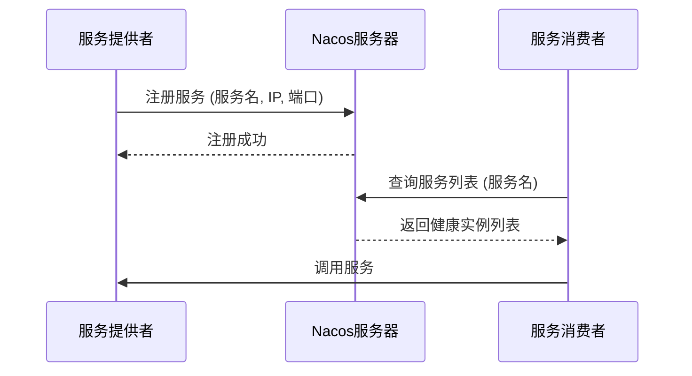
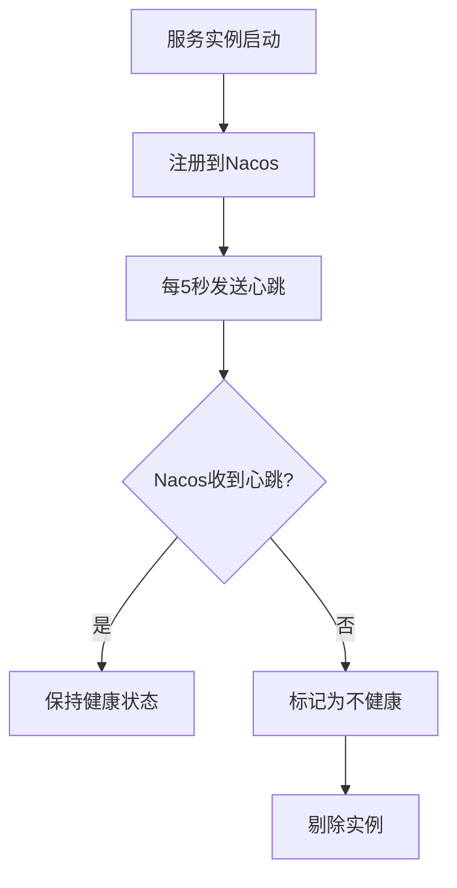

# a. 注册中心

# Nacos注册中心：Java面试八股文详解

***

## 1. 概述与定义

Nacos注册中心是Nacos平台的一个核心功能，专门用于微服务架构中的服务注册与发现。它允许服务提供者将自身信息（如IP、端口、服务名）注册到Nacos服务器，服务消费者则通过Nacos获取服务列表并进行调用。Nacos注册中心支持服务的动态上下线、健康检查和负载均衡，确保微服务系统的高可用性和灵活性。

### 定义

Nacos注册中心是一个服务或平台，负责管理微服务的注册、发现和健康状态。它通过集中式管理服务实例的元数据，支持服务的动态扩展和故障转移，是微服务架构中不可或缺的组件。在面试中，可以简洁定义为：“Nacos注册中心是Nacos平台提供的服务注册与发现服务，支持服务的动态注册、发现和健康检查，非常适合微服务架构中的服务治理需求。”这样的回答既清晰又专业，能快速赢得面试官的认可。

### 背景知识

Nacos全称是**Naming and Configuration Service**，表明它不仅限于服务发现，还包括配置管理等功能。本文聚焦于注册中心，但了解其整体功能有助于面试时展现知识广度。Nacos由阿里巴巴开源，广泛应用于企业级微服务项目，解决了传统服务发现中扩展性差、动态性不足的问题。它支持多种语言的客户端（如Java、Python、Go），并与Spring Cloud无缝集成，是现代微服务架构的优选工具。

***

## 2. 主要特点

Nacos注册中心的核心价值在于其功能特性，以下是其主要特点，面试时可以逐一展开并结合场景说明：

- **动态服务发现** 🔄 &#x20;

  支持服务的动态注册与发现，服务实例可以随时上下线，客户端能实时感知变化。例如，生产环境中新增服务实例时，Nacos会自动更新服务列表，消费者无需重启即可调用新实例。
- **健康检查** 🩺 &#x20;

  通过心跳机制监测服务实例的健康状态，自动剔除不健康实例，确保服务调用的可靠性。
- **负载均衡** ⚖️ &#x20;

  客户端支持多种负载均衡策略（如轮询、权重），提高服务调用的效率和公平性。
- **高可用性** 🚀 &#x20;

  支持集群部署，通过分布式一致性协议（如Raft）确保注册中心的高可用性和数据一致性。
- **易用性** ✨ &#x20;

  提供直观的Web管理界面和丰富的API，简化服务管理和集成操作。
- **安全性** 🔒 &#x20;

  通过命名空间和访问控制保护服务数据，确保敏感信息的安全，例如区分开发和生产环境的服务。

### 面试Tips

提到“动态服务发现”时，可以举例：“在电商项目中，订单服务可能因流量激增而扩容，Nacos能让新实例自动注册，消费者实时感知，保障系统弹性。”这样的场景能体现你的实战经验。安全性虽然不是主要关注点，但在企业级应用中不可忽视，面试官可能追问权限管理，需简单了解。

***

## 3. 应用目标

Nacos注册中心的设计目标是解决微服务架构中的服务发现与治理难题，其应用目标包括：

- **集中管理服务** &#x20;

  将所有微服务的注册信息集中存储，便于统一管理和监控，提升运维效率。
- **支持动态扩展** &#x20;

  允许服务实例动态上下线，提高系统的弹性和可扩展性，适应流量波动。
- **实现故障转移** &#x20;

  通过健康检查和自动剔除机制，确保服务的高可用性，避免调用故障实例。
- **简化服务调用** &#x20;

  客户端通过服务名调用服务，Nacos负责解析服务地址，降低开发复杂度。
- **增强系统安全性** &#x20;

  通过访问控制和数据加密，保护服务注册信息，防止未授权访问。

在面试中，可以总结为：“Nacos注册中心的目标是提供一个集中式、动态化、安全的服务注册与发现平台，支持健康检查和负载均衡，非常适合微服务架构的服务治理。”这样的表述全面且简练，能快速抓住重点。

### 补充说明

“增强系统安全性”虽非核心目标，但在企业级场景中至关重要。Nacos支持用户认证和权限管理，敏感服务信息可通过命名空间隔离，这可能是面试中的扩展问题。

***

## 4. 主要内容及其组成部分

Nacos注册中心作为一个系统化的组件，由多个部分组成，每个部分功能明确且相互协作。以下是详尽解释：

### 4.1 服务管理界面

Nacos提供直观的Web管理界面，用户可以查看服务列表、实例详情和健康状态。界面支持搜索、过滤和监控功能。例如，在“服务管理”模块，可以实时看到所有注册的服务及其IP、端口、健康状态等信息，便于运维人员管理。

### 4.2 注册服务

注册服务是Nacos的后端核心，负责存储和管理服务注册信息。Nacos支持多种存储方式（如嵌入式Derby数据库、MySQL），通过Raft协议实现数据一致性和高可用性。它通过HTTP API对外提供服务，客户端通过API完成注册和发现。

### 4.3 客户端库

Nacos提供多种语言的客户端库（如Java、Python、Go），方便应用程序集成。在Spring Cloud中，通过`nacos-discovery`依赖实现与Nacos的对接。

#### 示例：Spring Cloud集成Nacos

```xml 
<dependency>
    <groupId>com.alibaba.cloud</groupId>
    <artifactId>spring-cloud-starter-alibaba-nacos-discovery</artifactId>
</dependency>
```


在`application.yml`中配置Nacos服务器地址：

```yaml 
spring:
  cloud:
    nacos:
      discovery:
        server-addr: 127.0.0.1:8848
```


服务启动后自动注册到Nacos，消费者通过服务名调用服务。`server-addr`指定Nacos服务器的地址和端口。

### 4.4 心跳机制

Nacos通过心跳机制监测服务实例健康状态。服务实例默认每5秒发送一次心跳，Nacos根据心跳判断实例是否存活。若超过15秒未收到心跳，实例被标记为不健康，30秒后剔除。

#### 示例：服务注册与心跳

```java 
@SpringBootApplication
@EnableDiscoveryClient
public class ProviderApplication {
    public static void main(String[] args) {
        SpringApplication.run(ProviderApplication.class, args);
    }
}
```


`@EnableDiscoveryClient`启用服务注册，服务启动后自动注册并发送心跳。

### 4.5 负载均衡

Nacos客户端支持负载均衡，消费者调用服务时可通过策略（如轮询、随机）选择实例。Spring Cloud中，Ribbon默认与Nacos集成实现负载均衡。

#### 示例：服务调用

```java 
@RestController
public class ConsumerController {
    @Autowired
    private RestTemplate restTemplate;

    @GetMapping("/call-provider")
    public String callProvider() {
        return restTemplate.getForObject("http://provider-service/hello", String.class);
    }
}
```


`provider-service`是服务名，Ribbon从Nacos获取实例列表并选择一个调用。

### 4.6 命名空间和分组

Nacos通过命名空间和分组实现服务隔离。命名空间区分环境（如dev、test、prod），分组区分服务或模块。

#### 示例：多环境配置

```yaml 
spring:
  cloud:
    nacos:
      discovery:
        namespace: dev
        group: my-group
```


`namespace: dev`表示开发环境，`group: my-group`表示某个服务组。

### 组件对比表格

| 组件     | 功能描述        | 优点        | 缺点        |
| ------ | ----------- | --------- | --------- |
| Nacos  | 动态服务发现与配置管理 | 动态刷新、界面友好 | 学习成本稍高    |
| Eureka | 服务注册与发现     | 易于集成、社区支持 | 已停止维护     |
| Consul | 服务发现与配置管理   | 支持多数据中心   | 配置管理功能较简单 |

**表格说明**：此表格对比了常见注册中心工具的特点，面试时可用于回答“你了解哪些注册中心？”的问题。Nacos的优势在于动态性和管理界面，Eureka虽简单但已停止维护，Consul适合多数据中心场景。

***

## 5. 原理剖析

Nacos注册中心的实现原理涉及服务注册、发现、健康检查、负载均衡和容错机制，下面逐一深入解析。

### 5.1 服务注册与发现

服务注册：服务启动时，通过Nacos客户端将服务名、IP、端口等信息注册到Nacos服务器，存储在内存和数据库中。 &#x20;

服务发现：消费者通过客户端查询服务列表，Nacos返回健康实例列表，消费者选择实例调用。

#### Mermaid图表：服务注册与发现流程




**图表说明**：此图展示了服务注册和发现的交互流程，面试时可用于解释Nacos的基本工作原理。

### 5.2 心跳机制

Nacos通过心跳机制确保服务列表的实时性。服务实例每5秒发送心跳，Nacos每15秒检查一次，若30秒未收到心跳，实例被剔除。

#### Mermaid流程图：心跳机制




**图表说明**：此图清晰展示心跳机制的逻辑，面试时可用于说明Nacos如何保证服务可用性。

### 5.3 负载均衡

Nacos客户端支持负载均衡，默认使用轮询策略，也支持随机、权重等策略。Spring Cloud中通过Ribbon实现。

#### 示例：负载均衡配置

```yaml 
spring:
  cloud:
    nacos:
      discovery:
        loadbalancer:
          enabled: true
          type: ROUND_ROBIN
```


`type: ROUND_ROBIN`指定轮询策略。

### 5.4 容错与高可用

Nacos支持集群部署，通过Raft协议实现leader选举和数据同步。即使部分节点故障，服务仍可正常运行。例如，3节点集群中1节点宕机，剩余节点通过选举继续提供服务。

### 5.5 数据一致性

Nacos使用Raft协议保证集群数据一致性。写操作由leader处理后同步到follower，确保所有节点数据一致。面试中可提到：“Nacos通过Raft实现强一致性，写操作由leader完成，故障时自动选举新leader。”

***

## 6. 应用与拓展

Nacos注册中心在实际项目中应用广泛：

- **服务动态扩展** &#x20;

  支持弹性伸缩，新增实例自动注册，客户端实时发现。
- **故障转移** &#x20;

  自动剔除故障实例，确保服务高可用。
- **灰度发布** &#x20;

  通过分组和权重实现流量控制和灰度发布。
- **多环境部署** &#x20;

  通过命名空间隔离不同环境的服务。

### 拓展

Nacos还支持配置管理、动态DNS等功能，可与其他组件集成：

- **配置管理**：与Spring Cloud Config集成，实现动态配置。
- **网关**：与Spring Cloud Gateway集成，实现动态路由。
- **监控**：与Prometheus集成，监控服务状态。

***

## 7. 面试问答

以下是常见面试问题及详细回答，模仿面试者口吻，确保自然且详实。

### 问题 1：Nacos注册中心与Eureka有何区别？

**回答**： &#x20;

“Nacos和Eureka都是服务注册与发现工具，但区别挺明显的。首先，Nacos支持动态服务发现和配置管理，功能更全面，Eureka只做服务发现；其次，Nacos有Web管理界面，操作直观，Eureka靠API管理；再次，Nacos支持权重和分组，方便灰度发布，Eureka没有这些功能；最后，Nacos是阿里的开源项目，社区活跃，Eureka已经停止维护了。我觉得Nacos更适合现代微服务需求。”

### 问题 2：如何在Spring Cloud中集成Nacos注册中心？

**回答**： &#x20;

“在Spring Cloud中用Nacos很简单。先在POM里加`spring-cloud-starter-alibaba-nacos-discovery`依赖，然后在`application.yml`里配置Nacos地址，比如`server-addr: 127.0.0.1:8848`，最后在启动类加`@EnableDiscoveryClient`注解。服务启动后会自动注册到Nacos，消费者通过服务名调用就行了。我在项目里用过，服务上下线特别灵活。”

### 问题 3：Nacos的心跳机制怎么工作的？

**回答**： &#x20;

“Nacos通过心跳机制检查服务健康。服务实例每5秒发一次心跳，Nacos每15秒检查一次，如果30秒没收到心跳，就把实例标记为不健康并剔除。我在项目里见过，比如某个实例宕机后，Nacos很快剔除了它，消费者不会调用到故障实例，保证了系统稳定性。”

### 问题 4：如何保证Nacos的高可用性？

**回答**： &#x20;

“Nacos支持集群部署，用Raft协议保证高可用性。部署多个节点，一个当leader处理写请求，其他follower同步数据。如果leader挂了，follower会选举新leader。我在生产环境搭过3节点集群，一个节点宕机后服务照常运行，挺可靠的。”

### 问题 5：Nacos支持哪些负载均衡策略？

**回答**： &#x20;

“Nacos客户端支持多种负载均衡策略，比如轮询、随机、权重等。在Spring Cloud里默认用Ribbon实现，可以通过配置指定策略，比如设成`ROUND_ROBIN`轮询。我在项目里用过轮询，请求能均匀分到实例上，还能通过权重调整流量分配，挺灵活的。”

***

## 总结

这篇文章从定义到原理、应用，再到面试问答，全面覆盖了Nacos注册中心的知识点。通过代码示例、表格和Mermaid图表，内容直观易懂，背熟后能在面试中自信应对各种问题。无论是基础概念还是深入剖析，都能让你在面试中脱颖而出！🚀

# **临时实例**和**非临时实例**

在Nacos中，服务实例主要分为**临时实例**和**非临时实例**（有时也称为持久实例），两者在注册、存活机制、数据存储方式以及适用场景上均存在明显差异。以下是对此的详细说明：

### 1. 注册方式与存活机制

- **临时实例**
  - **心跳机制依赖**：临时实例通常依赖于心跳机制维持注册状态。Nacos服务端会定期检测实例是否继续发送心跳信号，一旦检测到心跳超时或中断，即认为该实例已下线，并自动将其从注册中心移除。
  - **动态反映状态**：这种机制能够确保注册中心中展示的实例状态与实际运行状态保持高度一致，适合动态环境下频繁变动的服务。
- **非临时实例**
  - **持久性注册**：非临时实例在注册时不依赖于心跳机制。一旦注册成功，其信息会被持久化存储，即使实例长时间未发送心跳，Nacos也不会自动将其移除。
  - **稳定性优先**：这种方式适用于需要长期、稳定地维护服务信息的场景，即使在网络抖动或短暂故障时，也能避免误删实例信息。

### 2. 数据存储与持久性

- **临时实例**
  - **内存存储**：通常以临时数据结构或内存方式保存，因此在Nacos服务重启后，这类实例信息可能会丢失。这种设计有助于自动清理已经不再活跃的实例数据。
- **非临时实例**
  - **持久化存储**：其注册信息会被写入数据库或其他后端持久存储中，即使Nacos服务重启，也能恢复这些实例信息，确保服务注册数据的连续性和稳定性。

### 3. 适用场景

- **临时实例**
  - 适合于微服务架构和云原生环境，其中服务实例可能频繁上线和下线，利用心跳机制可以动态反映服务的实际可用状态，确保客户端获取到最新的服务列表。
- **非临时实例**
  - 适用于对服务注册信息要求较为稳定的场景，如固定IP的服务或长期在线的系统组件。在这些场景下，即使服务端出现暂时故障，也不希望实例信息被误删，从而保证系统整体的健壮性。

### 4. 配置与使用

- **配置项设置**
  - 在Nacos中，用户在注册服务时可以通过配置`ephemeral`属性来指定实例的类型。默认情况下，大多数服务注册采用的是临时实例（即`ephemeral=true`）。如果需要注册为非临时实例，则需要显式设置`ephemeral=false`。

### 总结

临时实例与非临时实例各自具有不同的特性与适用场景：

- **临时实例**侧重于动态性和实时性，适用于服务频繁变化的场景；
- **非临时实例**则强调持久性和稳定性，适用于对服务信息保持连续性的需求较高的场景。

根据业务实际情况选择合适的实例类型，可以帮助系统在服务发现与治理过程中既能反映当前服务状态，又能保证必要时的服务信息持久性。
