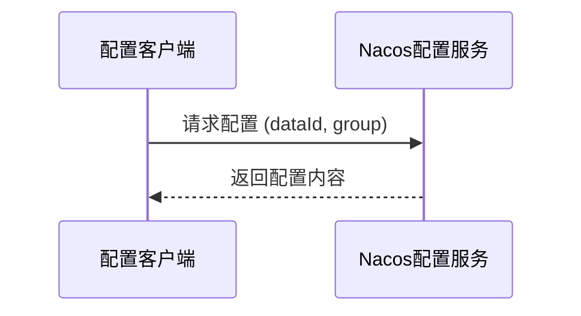
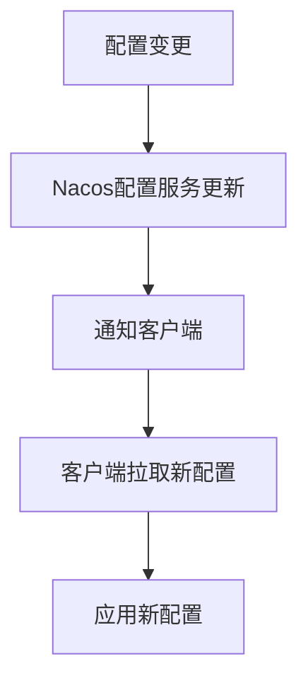

# b. 配置中心

# Nacos配置中心：Java面试八股文详解

***

## 1. 概述与定义

Nacos配置中心是Nacos平台的一个核心功能，专门用于集中管理应用程序的配置信息。它允许开发者将配置信息从代码中分离出来，实现配置的动态更新、版本控制和多环境管理。Nacos配置中心支持多种配置格式，如properties、yaml等，并提供了丰富的API和客户端库，方便与Spring Cloud等框架无缝集成。

### 定义

Nacos配置中心是一个服务或平台，负责存储、管理和分发应用程序的配置信息。它支持配置的版本管理、动态刷新和多环境切换，确保微服务在运行时能够灵活适应配置变更，而无需重启服务。

在面试场景中，可以这样简洁定义：“Nacos配置中心是Nacos平台提供的集中式配置管理服务，支持动态配置更新、版本控制和多环境管理，特别适合微服务架构中的配置管理需求。”这样的回答既简洁又体现了技术点，适合快速建立面试官的信任。

### 背景知识

Nacos（Naming and Configuration Service）的全称表明它不仅限于配置管理，还包括服务发现等功能。本文聚焦于配置中心，但了解其整体功能有助于面试时展现广度。例如，Nacos由阿里巴巴开源，广泛应用于企业级微服务项目，解决了传统配置文件分散、难以动态调整的问题。

***

## 2. 主要特点

Nacos配置中心的核心价值在于其功能特性，以下是其主要特点，面试时可以逐一展开：

- **动态配置** 🔄 &#x20;

  支持配置的实时更新，服务无需重启即可应用新配置，提升系统的灵活性和可用性。
- **版本管理** 📚 &#x20;

  提供配置的版本控制和历史记录，支持配置的回滚和审计。
- **多环境支持** 🌍 &#x20;

  支持开发、测试、生产等多种环境的配置管理，通过命名空间和分组实现隔离。
- **高可用性** 🚀 &#x20;

  支持集群部署，确保配置服务的高可用性和数据一致性。
- **易用性** ✨ &#x20;

  提供直观的Web管理界面和丰富的API，简化配置管理操作。
- **安全性** 🔒 &#x20;

  通过命名空间和访问控制保护配置数据，确保敏感信息的安全。

### 面试Tips

提到“动态配置”时，可以结合场景：“比如在生产环境，我们需要临时调整某个服务的日志级别，直接在Nacos控制台修改配置，服务会自动拉取新配置并应用，无需重启。”这样的例子能让面试官感受到你的实战经验。

### 补充说明

虽然“安全性”不是主要关注点，但不能省略。Nacos支持用户认证和权限管理，敏感配置（如数据库密码）可以通过访问控制保护，这在面试中可能作为扩展问题出现。

***

## 3. 应用目标

Nacos配置中心的设计目标是为了解决微服务架构中的配置管理难题，其应用目标包括：

- **集中管理配置** &#x20;

  将所有微服务的配置集中存储，便于统一管理和维护。
- **支持动态更新** &#x20;

  允许运行时修改配置，提高系统的响应速度和灵活性。
- **实现配置版本控制** &#x20;

  通过版本管理，确保配置变更的可追溯性和可回滚性。
- **支持多环境配置** &#x20;

  通过命名空间和分组，实现开发、测试、生产等环境的配置隔离。
- **增强系统安全性** &#x20;

  通过访问控制和数据加密，保护敏感配置信息。

在面试中，可以这样总结：“Nacos配置中心的目标是提供一个集中式、动态化、安全的配置管理平台，支持多环境和版本控制，特别适合微服务架构中的配置管理需求。”这样的表述既全面又简练，适合面试场景。

***

## 4. 主要内容及其组成部分

Nacos配置中心作为一个系统化的组件，由多个部分组成，每个部分都有明确的功能。以下是对其组成部分的详尽解释：

### 4.1 配置管理界面

Nacos提供了一个直观的Web管理界面，允许用户查看、编辑、发布和回滚配置。界面支持配置的搜索、比较和历史记录查看，极大地方便了配置管理。例如，点击“配置管理”模块，可以看到所有配置列表，支持按命名空间和分组过滤。

### 4.2 配置服务

配置服务是Nacos配置中心的后端服务，负责存储和管理配置数据。Nacos支持多种存储方式，如嵌入式数据库（Derby）、MySQL等，并通过Raft协议实现数据一致性和高可用性。配置服务通过HTTP API对外提供服务，客户端通过这些API获取配置。

### 4.3 客户端库

Nacos提供了Java、Python、Go等多种语言的客户端库，方便应用程序与配置中心交互。在Spring Cloud中，可以通过`nacos-config`依赖集成Nacos配置中心。

#### 示例：Spring Cloud集成Nacos配置中心

```xml 
<dependency>
    <groupId>com.alibaba.cloud</groupId>
    <artifactId>spring-cloud-starter-alibaba-nacos-config</artifactId>
</dependency>
```


在`bootstrap.yml`中配置Nacos服务器地址：

```yaml 
spring:
  cloud:
    nacos:
      config:
        server-addr: 127.0.0.1:8848
        file-extension: yaml
```


这样，服务启动时会从Nacos拉取配置。`server-addr`指定Nacos服务器地址，`file-extension`指定配置格式。

### 4.4 监听机制

Nacos配置中心支持配置的动态刷新，客户端通过长轮询机制监听配置变更，一旦配置更新，客户端会自动拉取最新配置并应用。

#### 示例：Spring Cloud中监听配置变更

```java 
@RefreshScope
@RestController
public class ConfigController {
    @Value("${message}")
    private String message;

    @GetMapping("/message")
    public String getMessage() {
        return message;
    }
}
```


通过`@RefreshScope`注解，配置变更时，Spring会自动刷新bean，确保新配置生效。例如，修改Nacos中的`message`值，接口返回值会立即更新。

### 4.5 命名空间和分组

Nacos通过命名空间和分组实现配置的隔离和分类。命名空间常用于区分不同环境（如dev、test、prod），分组则用于区分不同服务或模块。

#### 示例：多环境配置

```yaml 
spring:
  cloud:
    nacos:
      config:
        namespace: dev
        group: my-group
```


这样，不同环境的配置可以存储在不同的命名空间中，确保隔离。例如，`namespace: dev`表示开发环境配置，`group: my-group`表示某个服务组的配置。

### 4.6 配置格式支持

Nacos支持多种配置格式，包括properties、yaml、json等。开发者可以根据习惯选择格式。例如，yaml格式因其层级结构清晰，常用于复杂配置。

#### 示例：Nacos中的yaml配置

```yaml 
server:
  port: 8080
database:
  url: jdbc:mysql://localhost:3306/test
  username: root
  password: 123456
```


在Nacos控制台创建此配置，客户端即可读取并应用。

### 组件对比表格

| 组件                  | 功能描述       | 优点          | 缺点        |
| ------------------- | ---------- | ----------- | --------- |
| Nacos               | 动态配置与服务发现  | 动态刷新、界面友好   | 学习成本稍高    |
| Spring Cloud Config | 基于Git的配置管理 | 支持版本控制、易于集成 | 刷新需要手动触发  |
| Consul              | KV存储与配置管理  | 支持多数据中心     | 配置管理功能较简单 |

**表格说明**：这个表格总结了常见配置中心工具的特点，面试时可以用来说明“你了解哪些配置中心实现？”并展开优缺点对比。例如，Nacos的动态刷新是其核心优势，而Spring Cloud Config依赖Git，适合习惯版本控制的团队。

***

## 5. 原理剖析

Nacos配置中心的实现原理涉及配置的存储、读取、刷新和安全性，下面逐一深入解析。

### 5.1 配置存储与读取

Nacos配置中心将配置数据存储在内存和数据库中。默认使用嵌入式数据库Derby，生产环境推荐使用MySQL。配置服务通过Raft协议实现数据的一致性和高可用性。客户端通过HTTP API与配置服务交互，获取配置信息。

#### Mermaid图表：配置读取流程




**图表说明**：此图展示了客户端从Nacos配置服务拉取配置的简单流程，`dataId`和`group`用于唯一标识配置。例如，`dataId: application.yaml`和`group: DEFAULT_GROUP`表示默认分组的应用配置。

### 5.2 配置刷新机制

Nacos配置中心采用长轮询机制实现配置的动态刷新。客户端与配置服务建立长连接，服务器在配置变更时通知客户端，客户端收到通知后拉取最新配置并应用。这种机制避免了频繁的轮询请求，提高了效率。

#### Mermaid流程图：配置刷新流程




**图表说明**：此图展示了配置变更触发刷新的完整流程，面试时可以用来说明动态刷新的原理。例如，修改日志级别后，服务无需重启即可生效。

### 5.3 安全性

Nacos配置中心通过命名空间和访问控制保护配置数据。可以通过Nacos控制台设置用户和权限，确保只有授权用户才能访问和修改配置。此外，Nacos支持配置数据的加密存储（如对数据库密码加密），增强安全性。

#### 示例：Nacos访问控制

在Nacos控制台创建用户和角色，分配配置权限：

- 用户：admin
- 角色：config-admin
- 权限：读写配置

### 5.4 容错与高可用

Nacos支持集群部署，通过Raft协议实现leader选举和数据同步，确保配置服务的高可用性。即使部分节点故障，服务仍能正常运行。例如，部署3个Nacos节点，一个节点宕机后，剩余节点通过选举继续提供服务。

### 5.5 数据一致性

Nacos使用Raft协议（一种分布式一致性算法）保证配置数据在集群中的一致性。Raft通过日志复制和leader选举，确保所有节点的数据同步。面试中若被问及一致性问题，可以提到：“Nacos通过Raft协议实现强一致性，写操作由leader处理后同步到follower。”

***

## 6. 应用与拓展

Nacos配置中心在实际项目中有广泛应用场景：

- **多环境配置** &#x20;

  通过命名空间隔离开发、测试、生产环境的配置，简化环境切换。例如，开发环境使用`namespace: dev`，生产环境使用`namespace: prod`。
- **灰度发布** &#x20;

  通过配置控制功能的开启和关闭，实现部分用户先行体验。例如，配置一个开关`feature.enabled=true`，仅对部分服务生效。
- **动态调整** &#x20;

  运行时调整日志级别、线程池大小等参数，提升系统灵活性。例如，临时将日志级别从INFO改为DEBUG，便于排查问题。

### 拓展

Nacos不仅支持配置管理，还提供了服务发现、动态DNS等功能，可以与其他微服务组件集成：

- **服务发现**：与Spring Cloud Gateway集成，实现动态路由。
- **监控**：与Prometheus集成，监控配置变更和性能指标。
- **CI/CD**：结合Jenkins等工具，实现配置的自动化部署。

***

## 7. 面试问答

以下是常见的面试问题及详细回答，模仿面试者口吻，确保内容详实且自然。

### 问题 1：Nacos配置中心与Spring Cloud Config有何区别？

**回答**： &#x20;

“Nacos配置中心和Spring Cloud Config都是配置管理工具，但有几个关键区别：首先，Nacos支持动态配置刷新，配置变更后客户端自动更新，而Spring Cloud Config需要手动触发刷新；其次，Nacos提供了Web管理界面，操作更直观，Spring Cloud Config则依赖Git管理配置；再次，Nacos支持配置的版本管理和历史记录，Spring Cloud Config通过Git实现版本控制；最后，Nacos还集成了服务发现功能，一站式解决微服务需求。总体来说，Nacos更适合需要动态配置和易用性的场景。”

### 问题 2：如何在Spring Cloud项目中使用Nacos配置中心？

**回答**： &#x20;

“在Spring Cloud项目中集成Nacos配置中心很简单。首先，添加`spring-cloud-starter-alibaba-nacos-config`依赖；然后，在`bootstrap.yml`中配置Nacos服务器地址、命名空间和分组；最后，在需要使用配置的类上使用`@Value`注解注入配置。服务启动时会自动从Nacos拉取配置，如果配置变更，客户端会自动刷新。举个例子，我在项目里用Nacos管理数据库连接配置，改个密码不用重启服务，直接生效。”

### 问题 3：Nacos配置中心的动态刷新机制是如何实现的？

**回答**： &#x20;

“Nacos配置中心的动态刷新基于长轮询机制。客户端与Nacos服务器建立长连接，服务器在配置变更时通知客户端，客户端收到通知后拉取最新配置并应用。Spring Cloud中，通过`@RefreshScope`注解实现bean的动态刷新。我在项目里用过这个功能，比如调整某个接口的超时时间，直接在Nacos控制台改，服务立马应用新配置，非常方便。”

### 问题 4：如何保证Nacos配置中心的高可用性？

**回答**： &#x20;

“Nacos配置中心支持集群部署，通过Raft协议实现数据一致性和高可用性。部署多个Nacos节点，其中一个节点作为leader，负责处理写请求，其他节点作为follower同步数据。如果leader故障，follower会选举新的leader，确保服务不中断。我在生产环境部署过Nacos集群，配置了3个节点，即使一个节点挂了，配置服务依然可用。”

### 问题 5：Nacos配置中心支持哪些配置格式？

**回答**： &#x20;

“Nacos配置中心支持多种配置格式，包括properties、yaml、json等。用户可以根据需求选择合适的格式。比如，我在项目中用yaml格式管理配置，因为yaml更易读，支持层级结构。Nacos还支持配置的导入和导出，方便批量管理。”

***

## 总结

这篇文章从定义到原理、应用，再到面试问答，全面覆盖了Nacos配置中心的知识点。通过代码示例、表格和Mermaid图表，内容直观易懂，背熟后能在面试中自信应对各种问题。无论是基础概念还是深入剖析，都能让你在面试中脱颖而出！🚀
