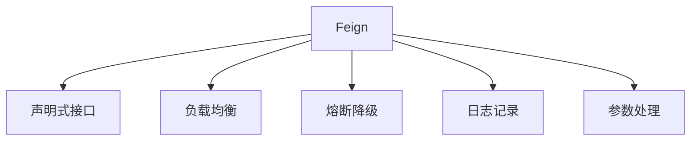
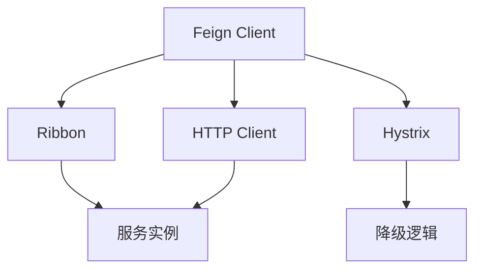
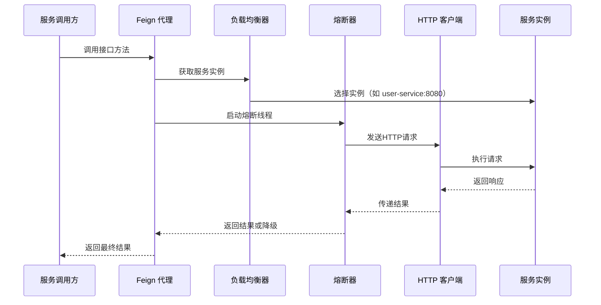
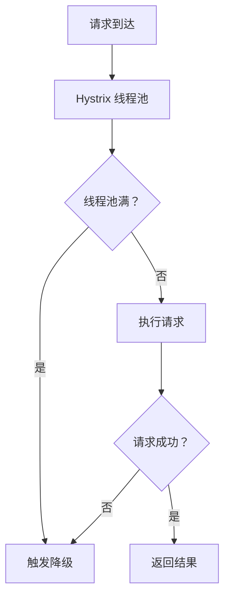

# c. 服务调用

***

# Java面试八股——Spring Cloud Feign 核心知识点详解

***

## 1. 概述与定义

**Feign** 是一个声明式的 **HTTP 客户端**，通过注解简化了 RESTful API 的调用。它与 **Spring Cloud** 整合后，可无缝集成服务发现（如 Eureka）、负载均衡（Ribbon）和熔断（Hystrix），成为微服务间通信的核心组件。




***

## 2. 主要特点

### 2.1 Feign 核心功能对比表

| **功能**​    | **描述**​                           | **示例**​                                                       |
| ---------- | --------------------------------- | ------------------------------------------------------------- |
| **声明式接口**​ | 通过接口定义 REST API，无需手动构建请求。         | \`@FeignClient\` 注解定义服务调用接口。                                  |
| **负载均衡**​  | 集成 Ribbon，自动选择服务实例。               | 调用 \`@FeignClient(name = "user-service")\` 时，Ribbon 选择实例。     |
| **熔断降级**​  | 支持 Hystrix 或 Resilience4J 实现故障隔离。 | \`@FeignClient(fallback = UserClientFallback.class)\` 指定降级逻辑。 |
| **日志增强**​  | 可配置请求/响应日志，方便调试。                  | \`feign.Logger.Level=FULL\` 显示完整日志。                           |

***

## 3. 应用目标

### 3.1 典型应用场景

| **场景**​    | **描述**​             | **示例**​                                    |
| ---------- | ------------------- | ------------------------------------------ |
| **跨服务调用**​ | 订单服务调用用户服务查询用户信息。   | \`userClient.findUserById(1L)\`            |
| **负载均衡**​  | 自动将请求分发到多个用户服务实例。   | Ribbon 根据策略（如轮询）选择后端实例。                    |
| **熔断降级**​  | 当用户服务不可用时，返回默认用户信息。 | \`fallback\` 方法返回 \`new User("default")\`。 |

***

## 4. 主要内容及其组成部分

***

### 4.1 核心组件详解

#### **4.1.1 声明式接口定义**

- **示例代码**： &#x20;
  ```java 
  @FeignClient(name = "user-service", fallback = UserClientFallback.class)
  public interface UserClient {
      @GetMapping("/users/{id}")
      User findUserById(@PathVariable("id") Long id);

      @PostMapping("/users")
      User createUser(@RequestBody User user);
  }
  ```


#### **4.1.2 负载均衡集成**

- **Ribbon 集成原理**： &#x20;
  ```mermaid 
  graph TD
      A[Feign Client] --> B[Ribbon LoadBalancer]
      B --> C[服务实例列表]
      C --> D[选择实例]
      D --> E[发送HTTP请求]
  ```

- **配置示例**： &#x20;
  ```yaml 
  feign:
    client:
      config:
        default:
          connectTimeout: 5000
          readTimeout: 3000
  ```


#### **4.1.3 熔断与降级**

- **Hystrix 集成**： &#x20;
  ```java 
  @FeignClient(name = "user-service", fallback = UserClientFallback.class)
  public interface UserClient {
      // 接口定义
  }

  @Component
  class UserClientFallback implements UserClient {
      @Override
      public User findUserById(Long id) {
          return new User("fallback-user");
      }
  }
  ```


#### **4.1.4 日志配置**

- **日志级别**： &#x20;
  ```yaml 
  logging:
    level:
      com.example.client.UserClient: TRACE
  feign:
    loggerLevel: FULL
  ```

- **日志输出示例**： &#x20;
  ```http 
  [UserClient#findUserById] ---> GET http://user-service/users/1
  [UserClient#findUserById] <--- 200 OK
  ```


#### **4.1.5 参数处理**

- **复杂参数支持**： &#x20;
  ```java 
  @FeignClient(name = "order-service")
  public interface OrderClient {
      @PostMapping("/orders")
      Order createOrder(@RequestBody OrderRequest request);
  }
  ```


***

### 4.2 核心组件协作关系图




***

## 5. 原理剖析

### 5.1 Feign 调用流程

#### **5.1.1 调用流程图**




#### **5.1.2 关键步骤解析**

1. **接口代理**：Spring 通过动态代理生成 `UserClient` 的实现类。 &#x20;
2. **Ribbon 选择实例**：根据服务名（如 `user-service`）从 Eureka 获取实例列表，并选择一个实例。 &#x20;
3. **Hystrix 熔断**：包装请求到 Hystrix 线程，超时或异常时触发 `fallback` 方法。 &#x20;
4. **HTTP 请求执行**：通过 `Apache HttpClient` 或 `OkHttp` 发送请求。 &#x20;

***

### 5.2 负载均衡策略

#### **5.2.1 Ribbon 轮询算法示例**

```java 
public class RoundRobinRule extends AbstractLoadBalancerRule {
    private AtomicInteger counter = new AtomicInteger(0);

    @Override
    public Server choose(Object key) {
        List<Server> servers = getLoadBalancer().getReachableServers();
        if (servers.isEmpty()) {
            return null;
        }
        int index = counter.getAndIncrement() % servers.size();
        return servers.get(index);
    }
}
```


#### **5.2.2 自定义策略**

```java 
@Configuration
public class RibbonConfig {
    @Bean
    public IRule ribbonRule() {
        return new RandomRule(); // 随机策略
    }
}
```


***

### 5.3 熔断降级机制

#### **5.3.1 Hystrix 熔断流程**




#### **5.3.2 核心配置**

```yaml 
hystrix:
  command:
    default:
      execution:
        isolation:
          thread:
            timeoutInMilliseconds: 2000 # 超时时间
      circuitBreaker:
        errorThresholdPercentage: 50 # 失败率超过50%触发熔断
        requestVolumeThreshold: 20 # 至少20次请求才触发熔断
```


***

## 6. 应用与拓展

### 6.1 自定义组件

#### **6.1.1 自定义拦截器**

```java 
@FeignClient(name = "user-service")
public interface UserClient {
    @GetMapping("/users/{id}")
    User findUserById(@PathVariable("id") Long id);

    @Configuration
    class CustomInterceptorConfig {
        @Bean
        public RequestInterceptor interceptor() {
            return template -> template.header("X-Custom-Header", "value");
        }
    }
}
```


#### **6.1.2 自定义编码器**

```java 
@Configuration
public class FeignConfig {
    @Bean
    public Encoder feignFormEncoder() {
        return new SpringFormEncoder();
    }
}
```


***

### 6.2 与 Spring Cloud 集成

#### **6.2.1 启用 Feign**

```java 
@SpringBootApplication
@EnableFeignClients // 启用 Feign 客户端
public class OrderApplication {
    public static void main(String[] args) {
        SpringApplication.run(OrderApplication.class, args);
    }
}
```


#### **6.2.2 集成 OpenFeign**

```xml 
<dependency>
    <groupId>org.springframework.cloud</groupId>
    <artifactId>spring-cloud-starter-openfeign</artifactId>
</dependency>
```


***

## 7. 面试问答

### 问题1：Feign 和 RestTemplate 的区别？

**回答**： &#x20;

核心区别如下： &#x20;

1. **声明式 vs 代码式**： &#x20;
   - **Feign**：通过接口定义 REST API，代码简洁。 &#x20;
   - **RestTemplate**：需手动构建请求（如 `getForEntity()`）。 &#x20;
2. **集成能力**： &#x20;
   - **Feign**：天然集成 Ribbon、Hystrix，支持负载均衡和熔断。 &#x20;
   - **RestTemplate**：需手动整合，如通过 `@LoadBalanced` 实现负载均衡。 &#x20;
3. **日志能力**： &#x20;
   - **Feign**：内置日志级别配置（`Logger.Level`）。 &#x20;
   - **RestTemplate**：需自定义拦截器或日志处理器。 &#x20;

***

### 问题2：Feign 如何实现负载均衡？

**回答**： &#x20;

步骤如下： &#x20;

1. **依赖注入**：Feign 默认集成 Ribbon。 &#x20;
2. **服务发现**：通过 Eureka 获取可用实例列表。 &#x20;
3. **选择实例**：Ribbon 根据策略（如轮询）选择一个实例。 &#x20;
4. **发送请求**：Feign 将请求发送到选择的实例。 &#x20;

- **示例配置**： &#x20;
  ```java 
  @FeignClient(name = "user-service")
  public interface UserClient {
      // 接口定义
  }
  ```


***

### 问题3：如何配置 Feign 的超时时间？

**回答**： &#x20;

通过以下方式配置： &#x20;

1. **全局配置**： &#x20;
   ```yaml 
   feign:
     client:
       config:
         default:
           connectTimeout: 5000 # 连接超时（毫秒）
           readTimeout: 3000   # 读取超时（毫秒）
   ```

2. **客户端级配置**： &#x20;
   ```java 
   @FeignClient(name = "user-service", configuration = UserClientConfig.class)
   public interface UserClient {
       // 接口定义
   }

   @Configuration
   class UserClientConfig {
       @Bean
       public Client feignClient() {
           return Feign.client().options(new Request.Options(5000, 3000));
       }
   }
   ```


***

### 问题4：Feign 如何实现熔断降级？

**回答**： &#x20;

步骤如下： &#x20;

1. **依赖引入**：添加 `spring-cloud-starter-netflix-hystrix`。 &#x20;
2. **定义降级类**： &#x20;
   ```java 
   @Component
   class UserClientFallback implements UserClient {
       @Override
       public User findUserById(Long id) {
           return new User("fallback-user");
       }
   }
   ```

3. **关联 Feign Client**： &#x20;
   ```java 
   @FeignClient(name = "user-service", fallback = UserClientFallback.class)
   public interface UserClient {
       // 接口定义
   }
   ```

4. **熔断配置**：通过 `hystrix.command.default` 调整超时和阈值。 &#x20;

***

### 问题5：Feign 的日志级别如何配置？

**回答**： &#x20;

支持 4 种日志级别： &#x20;

| **级别**​      | **描述**​                |
| ------------ | ---------------------- |
| **NONE**​    | 不记录日志（默认）。             |
| **BASIC**​   | 记录请求方法、URL、状态码和执行时间。   |
| **HEADERS**​ | 包含 BASIC 的内容，附加请求和响应头。 |
| **FULL**​    | 记录完整请求和响应数据（包括 body）。  |

- **配置示例**： &#x20;
  ```yaml 
  feign:
    loggerLevel: FULL
  logging:
    level:
      com.example.client.UserClient: TRACE
  ```


***

## 结语

Feign 通过声明式接口和与 Spring Cloud 的深度整合，极大简化了微服务间的调用。面试中需重点掌握 **声明式接口定义、负载均衡原理、熔断降级配置**，并能结合实际场景（如订单服务调用用户服务）说明其优势。理解 Feign 与 RestTemplate 的区别、Ribbon 的选择策略、Hystrix 的熔断逻辑，是应对复杂问题的核心。
