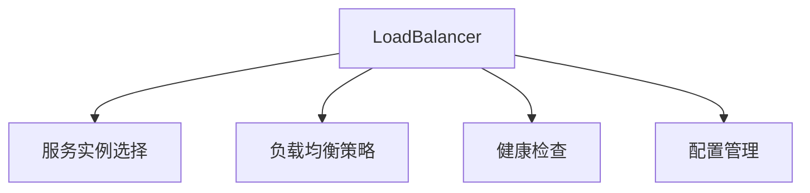
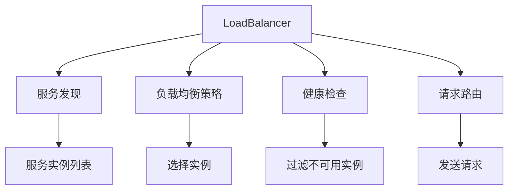
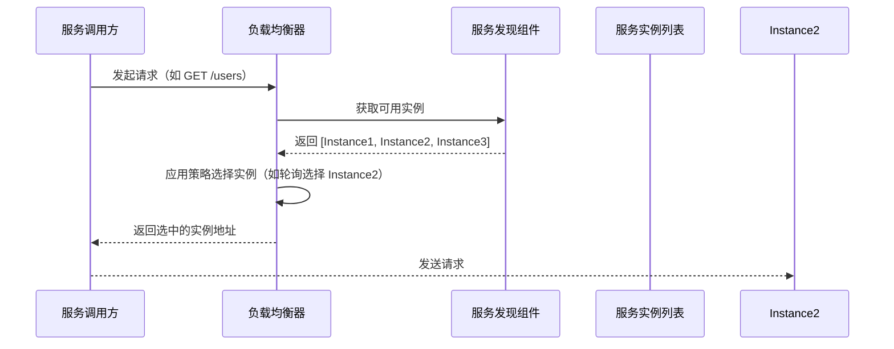
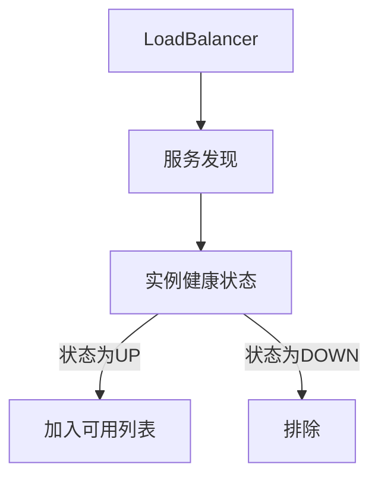

# d. 负载均衡

***

# Java面试八股——Spring Cloud LoadBalancer 核心知识点详解

***

## 1. 概述与定义

**Spring Cloud LoadBalancer** 是 **Spring Cloud** 官方提供的 **负载均衡组件**，用于替代旧版的 **Netflix Ribbon**，简化了微服务间的服务调用流量分发逻辑。它通过动态选择可用服务实例，确保请求均匀分发到多个服务节点，提升系统的可用性和扩展性。




***

## 2. 主要特点

### 2.1 LoadBalancer 与 Ribbon 对比表

| **特性**​    | **Spring Cloud LoadBalancer**​               | **Netflix Ribbon**​                        |
| ---------- | -------------------------------------------- | ------------------------------------------ |
| **架构**​    | Spring Cloud 官方组件，与服务发现（如 Eureka/Nacos）深度集成。 | 独立组件，需额外配置服务发现（如 Eureka）。                  |
| **配置复杂度**​ | 简单，基于 \`spring.cloud.loadbalancer\` 配置前缀。    | 需通过 \`RibbonClientConfiguration\` 配置，较为复杂。 |
| **策略扩展性**​ | 通过 \`ServiceInstanceChooser\` 接口扩展策略。        | 通过 \`IRule\` 接口扩展策略。                       |
| **健康检查**​  | 内置健康检查，依赖服务发现组件的状态。                          | 需依赖服务自身的健康检查（如 \`/health\` 接口）。            |
| **支持环境**​  | Spring Cloud 2.x+，推荐用于新项目。                   | Spring Cloud 1.x，逐步被 LoadBalancer 替代。      |

***

## 3. 应用目标

### 3.1 核心应用场景

| **场景**​     | **描述**​                    | **示例**​                                                               |
| ----------- | -------------------------- | --------------------------------------------------------------------- |
| **动态流量分发**​ | 当用户服务扩容时，订单服务自动将请求分发到新增实例。 | 通过 \`@LoadBalanced\` 注入的 \`RestTemplate\` 或 Feign 客户端调用服务。            |
| **故障隔离**​   | 当某个实例不可用时，自动跳过该实例，避免请求失败。  | 通过健康检查过滤故障实例。                                                         |
| **策略定制**​   | 根据业务需求配置加权轮询或随机策略。         | 设置 \`spring.cloud.loadbalancer.ribbon.enabled=false\` 禁用 Ribbon 兼容模式。 |

***

## 4. 主要内容及其组成部分

***

### 4.1 核心组件详解

#### **4.1.1 服务实例选择器**

- **作用**：根据负载均衡策略选择目标实例。 &#x20;
- **实现类**： &#x20;
  ```java 
  @Component
  public class CustomServiceInstanceChooser implements ServiceInstanceChooser {
      private final List<ServiceInstance> instances;

      public CustomServiceInstanceChooser(List<ServiceInstance> instances) {
          this.instances = instances;
      }

      @Override
      public ServiceInstance choose() {
          // 自定义策略：随机选择
          return instances.get(new Random().nextInt(instances.size()));
      }
  }
  ```


#### **4.1.2 负载均衡策略**

- **内置策略**： &#x20;
  - **轮询（Round Robin）**：默认策略，依次选择实例。 &#x20;
  - **随机（Random）**：`spring.cloud.loadbalancer.ribbon.enabled=false` 后生效。 &#x20;
- **自定义策略**： &#x20;
  ```java 
  @Bean
  public ILoadBalancer loadBalancer(List<ServiceInstance> serviceInstances) {
      return new CustomLoadBalancer(serviceInstances);
  }

  class CustomLoadBalancer implements ILoadBalancer {
      @Override
      public Server chooseServer(Object key) {
          // 自定义逻辑，如加权轮询
          return servers.get(weightedIndex);
      }
  }
  ```


#### **4.1.3 配置管理**

- **全局配置**： &#x20;
  ```yaml 
  spring:
    cloud:
      loadbalancer:
        retry:
          enabled: true # 启用重试
          max-attempts: 3 # 最大重试次数
        prefer-ip-address: true # 使用 IP 而非主机名
        timeout: 5000 # 选择实例的超时时间（毫秒）
  ```


#### **4.1.4 健康检查集成**

- **依赖服务发现**： &#x20;

  LoadBalancer 自动过滤状态为 `DOWN` 的实例（如 Eureka 中标记为下线的实例）。 &#x20;
- **强制检查**： &#x20;
  ```yaml 
  eureka:
    client:
      healthcheck:
        enabled: true # 开启健康检查
  ```


***

### 4.2 核心组件协作关系图




***

## 5. 原理剖析

### 5.1 负载均衡流程

#### **5.1.1 请求处理流程图**




#### **5.1.2 关键步骤解析**

1. **服务发现**：通过 Eureka/Nacos 获取服务实例列表。 &#x20;
2. **健康过滤**：移除状态为 `DOWN` 的实例。 &#x20;
3. **策略选择**：根据配置（如轮询、随机）选择目标实例。 &#x20;
4. **路由请求**：将请求发送到选中的实例。 &#x20;

***

### 5.2 策略实现原理

#### **5.2.1 轮询策略实现**

```java 
public class RoundRobinLoadBalancer implements ILoadBalancer {
    private AtomicInteger currentIndex = new AtomicInteger(0);
    private final List<Server> servers;

    public RoundRobinLoadBalancer(List<ServiceInstance> instances) {
        this.servers = instances.stream()
            .map(i -> new Server(i.getHost(), i.getPort()))
            .collect(Collectors.toList());
    }

    @Override
    public Server chooseServer(Object key) {
        int index = currentIndex.getAndIncrement() % servers.size();
        return servers.get(index);
    }
}
```


#### **5.2.2 随机策略实现**

```java 
public class RandomLoadBalancer implements ILoadBalancer {
    private final List<Server> servers;

    public RandomLoadBalancer(List<ServiceInstance> instances) {
        this.servers = instances.stream()
            .map(i -> new Server(i.getHost(), i.getPort()))
            .collect(Collectors.toList());
    }

    @Override
    public Server chooseServer(Object key) {
        Random random = new Random();
        return servers.get(random.nextInt(servers.size()));
    }
}
```


***

### 5.3 健康检查机制

#### **5.3.1 健康检查流程**




#### **5.3.2 配置健康检查**

```yaml 
# Eureka 客户端配置
eureka:
  client:
    healthcheck:
      enabled: true # 开启健康检查
      # 指定健康检查路径
      healthcheck-url-path: "/actuator/health"
```


***

## 6. 应用与拓展

### 6.1 自定义负载均衡器

#### **6.1.1 自定义轮询策略**

```java 
@Configuration
public class CustomLoadBalancerConfig {
    @Bean
    public IRule customRule() {
        return new WeightedResponseTimeRule(); // 基于响应时间的加权策略
    }
}
```


#### **6.2.2 与 Feign 集成**

```java 
@FeignClient(name = "user-service")
public interface UserClient {
    @GetMapping("/users/{id}")
    User findUserById(@PathVariable("id") Long id);
}

// 启用 LoadBalancer
@Configuration
public class FeignConfig {
    @Bean
    public Client feignClient() {
        return new LoadBalancerFeignClient();
    }
}
```


***

### 6.2 与 Spring Cloud 整合

#### **6.2.1 启用 LoadBalancer**

```xml 
<!-- pom.xml -->
<dependency>
    <groupId>org.springframework.cloud</groupId>
    <artifactId>spring-cloud-starter-loadbalancer</artifactId>
</dependency>
```


#### **6.2.2 配置 RestTemplate**

```java 
@Configuration
public class RestTemplateConfig {
    @Bean
    public RestTemplate restTemplate(LoadBalancerClient loadBalancerClient) {
        return new LoadBalancerRestTemplate(loadBalancerClient);
    }
}
```


***

## 7. 面试问答

### 问题1：LoadBalancer 和 Ribbon 的区别？

**回答**： &#x20;

核心区别如下： &#x20;

1. **架构定位**： &#x20;
   - **LoadBalancer**：Spring Cloud 官方组件，与服务发现深度集成。 &#x20;
   - **Ribbon**：独立组件，需额外配置服务发现（如 Eureka）。 &#x20;
2. **配置复杂度**： &#x20;
   - **LoadBalancer**：通过 `spring.cloud.loadbalancer` 简单配置。 &#x20;
   - **Ribbon**：需通过 `@RibbonClient` 和自定义配置类实现。 &#x20;
3. **策略扩展**： &#x20;
   - **LoadBalancer**：通过 `ServiceInstanceChooser` 接口扩展。 &#x20;
   - **Ribbon**：通过 `IRule` 接口扩展。 &#x20;

- **示例**： &#x20;
  ```yaml 
  # LoadBalancer 配置轮询策略
  spring:
    cloud:
      loadbalancer:
        ribbon:
          enabled: false # 禁用 Ribbon 兼容模式
        retry:
          enabled: true
  ```


***

### 问题2：如何实现自定义负载均衡策略？

**回答**： &#x20;

步骤如下： &#x20;

1. **实现策略接口**： &#x20;
   ```java 
   public class CustomStrategy implements ILoadBalancer {
       @Override
       public Server chooseServer(Object key) {
           // 实现自定义逻辑，如加权轮询
           return servers.get(weightedIndex);
       }
   }
   ```

2. **注册策略 Bean**： &#x20;
   ```java 
   @Configuration
   public class LoadBalancerConfig {
       @Bean
       public ILoadBalancer customLoadBalancer() {
           return new CustomStrategy();
       }
   }
   ```

3. **配置生效**： &#x20;
   ```yaml 
   spring:
     cloud:
       loadbalancer:
         strategy: custom # 指定自定义策略
   ```


***

### 问题3：如何确保负载均衡的高可用？

**回答**： &#x20;

方案如下： &#x20;

1. **依赖服务发现高可用**： &#x20;
   - 使用 Eureka 集群或 Nacos 集群，确保服务实例列表的可靠性。 &#x20;
2. **健康检查**： &#x20;
   - 定期检查实例状态，剔除故障实例。 &#x20;
   ```yaml 
   eureka:
     client:
       healthcheck:
         enabled: true
   ```

3. **重试机制**： &#x20;
   - 配置 `spring.cloud.loadbalancer.retry.enabled=true`，失败后重试其他实例。 &#x20;

***

### 问题4：负载均衡如何与 Feign 集成？

**回答**： &#x20;

步骤如下： &#x20;

1. **添加依赖**： &#x20;
   ```xml 
   <dependency>
       <groupId>org.springframework.cloud</groupId>
       <artifactId>spring-cloud-starter-openfeign</artifactId>
   </dependency>
   ```

2. **启用 Feign 和 LoadBalancer**： &#x20;
   ```java 
   @SpringBootApplication
   @EnableFeignClients
   public class Application {
       public static void main(String[] args) {
           SpringApplication.run(Application.class, args);
       }
   }
   ```

3. **定义 Feign Client**： &#x20;
   ```java 
   @FeignClient(name = "user-service")
   public interface UserClient {
       @GetMapping("/users/{id}")
       User findUserById(@PathVariable("id") Long id);
   }
   ```


***

### 问题5：负载均衡策略如何选择？

**回答**： &#x20;

根据场景选择策略： &#x20;

1. **轮询（默认）**：适合流量均匀分布的场景。 &#x20;
2. **随机**：`spring.cloud.loadbalancer.ribbon.enabled=false` 后生效，适合高并发场景。 &#x20;
3. **加权轮询**：根据实例性能分配权重，如数据库节点性能差异。 &#x20;

- **配置示例**： &#x20;
  ```yaml 
  spring:
    cloud:
      loadbalancer:
        retry:
          enabled: true
        # 指定轮询策略
        strategy: round_robin
  ```


***

## 结语

LoadBalancer 是微服务架构中流量分发的核心组件，面试中需重点掌握 **负载均衡策略实现、与 Feign/OpenFeign 集成、健康检查机制**，并能结合实际场景（如订单服务调用用户服务）说明其作用。理解 LoadBalancer 与 Ribbon 的差异、自定义策略的扩展方式、高可用保障措施，是应对进阶问题的关键。
