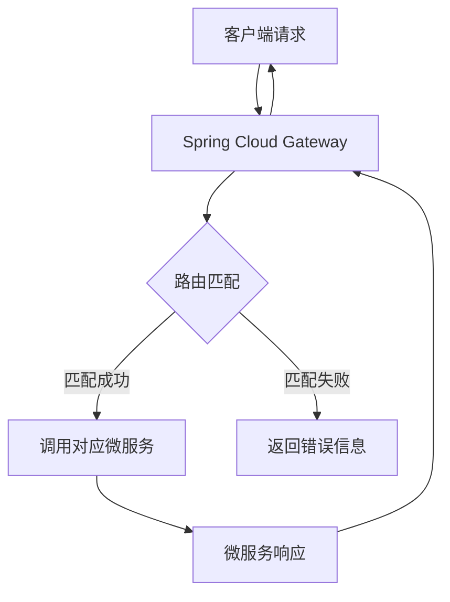
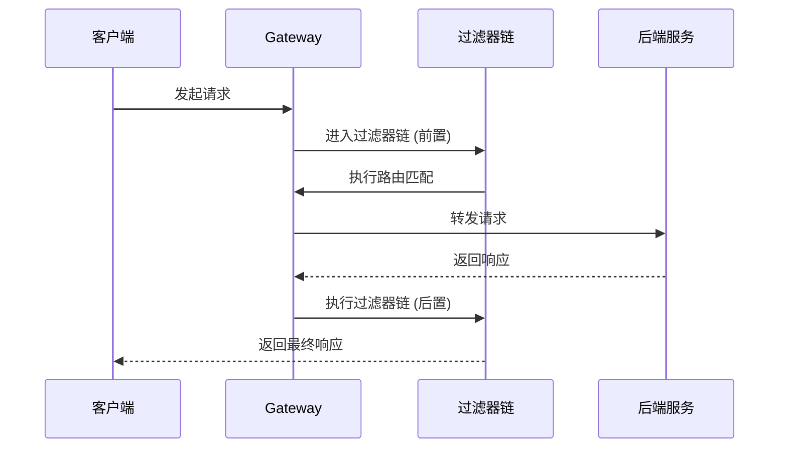

# e. 服务网关

# 1. 概述与定义

Spring Cloud Gateway 作为微服务架构中的核心组件之一，主要用于充当客户端与后端服务之间的统一入口。其主要职责包括请求路由、流量控制、鉴权与安全、负载均衡以及监控日志等。简单来说，Gateway 在整个微服务架构中相当于一座“中转站”，它将外部请求按照预定规则分发给对应的微服务，同时在分发过程中对请求进行统一的过滤与处理。

在微服务架构中，每个后端服务都应当专注于业务逻辑，而所有与外部交互的通道则由 Gateway 来统一管理。这种设计模式有助于降低客户端的复杂度，同时集中管理安全、限流、熔断等通用功能。通过 Spring Cloud Gateway，我们能够利用基于 Reactor 的响应式编程模型，实现高并发场景下的非阻塞 I/O 操作，从而提高系统的整体吞吐量和稳定性。🚀

为了便于理解，下图以 Mermaid 语法展示了一个典型的微服务架构中 Gateway 的工作流程：




图中展示了客户端请求首先进入 Gateway，由 Gateway 根据预设的路由规则判断转发目标，成功匹配后调用具体的微服务并将响应返回给客户端。这种架构设计使得系统具有良好的扩展性和灵活性。

# 2. 主要特点

Spring Cloud Gateway 拥有如下几个主要特点，能够有效解决微服务架构中的诸多问题：

- 🌟 **动态路由** &#x20;

  根据请求中的 URI、头信息、参数等条件动态匹配路由，实现灵活的请求分发。
- 🔄 **过滤器机制** &#x20;

  采用全局过滤器和路由级过滤器，对请求和响应进行前置和后置处理，如鉴权、日志记录、限流、重试等。
- 🚀 **响应式编程** &#x20;

  基于 Spring WebFlux 和 Reactor，支持非阻塞 I/O 处理，提高系统的并发性能和吞吐量。
- 🛡 **安全性保障** &#x20;

  支持 OAuth2、JWT 等安全认证方式，能够有效防范常见的安全威胁。
- 📊 **监控与日志** &#x20;

  集成了分布式追踪（如 Sleuth）与监控系统，帮助开发者实时掌握网关的运行状态与性能指标。

此外，Spring Cloud Gateway 还支持与服务发现组件（如 Eureka、Consul）无缝集成，实现自动路由注册与发现，从而进一步简化了微服务系统的部署和维护工作。

# 3. 应用目标

Spring Cloud Gateway 的主要应用目标集中在以下几个方面：

1. **统一入口管理** &#x20;

   在微服务系统中，通过集中化管理入口请求，可以降低各个服务独立实现路由和安全策略的复杂度，使得整个系统更易于维护和扩展。
2. **安全防护** &#x20;

   通过统一的鉴权、授权、限流、熔断、降级等机制，为后端服务构建一层坚固的安全屏障，从而防止恶意攻击和异常流量。
3. **负载均衡与高可用性** &#x20;

   通过与负载均衡器（如 Ribbon、Nginx）的结合，实现请求的动态分发，从而保证系统在高并发情况下的稳定性和高可用性。
4. **服务治理** &#x20;

   通过对请求进行统计和监控，帮助运维人员及时发现系统瓶颈与故障点，进而实现精准的服务治理和问题排查。

下面的表格列出了 Gateway 在微服务系统中的应用目标及其对应的作用说明：

| 应用目标      | 作用说明                    |
| --------- | ----------------------- |
| 统一入口管理    | 集中处理请求路由、鉴权和日志等，降低系统复杂度 |
| 安全防护      | 提供统一的安全策略，防止非法请求和恶意攻击   |
| 负载均衡与高可用性 | 根据实时负载情况进行请求分发，确保系统稳定运行 |
| 服务治理      | 实时监控和统计请求信息，帮助快速定位系统问题  |

# 4. 主要内容及其组成部分

Spring Cloud Gateway 作为一个服务网关，其主要组成部分包括以下几个方面，每个部分都有不可或缺的作用：

1. **路由配置 (Route Configuration)** &#x20;

   路由是 Gateway 的核心，负责将请求根据一定规则转发到后端服务。主要由以下两个概念构成：
   - **路由规则**：定义请求匹配的条件（如路径、请求头、查询参数等）以及目标服务。
   - **路由定位器 (RouteLocator)**：负责扫描并加载所有路由规则，支持配置文件、注册中心等多种方式。
     示例配置（基于 YAML 文件）：
   ```yaml 
   spring:
     cloud:
       gateway:
         routes:
           - id: user-service
             uri: lb://USER-SERVICE
             predicates:
               - Path=/user/**
             filters:
               - AddRequestHeader=X-Request-Foo, Bar
   ```

   上述配置中，当请求路径以 `/user/` 开头时，Gateway 将请求转发至名为 `USER-SERVICE` 的服务，并在请求头中添加自定义信息。
2. **断言 (Predicate)** &#x20;

   断言是用于判断请求是否符合某一条件的逻辑组件，如路径匹配、请求参数、头信息等。常见的断言包括：
   - Path：根据请求路径匹配。
   - Header：根据请求头匹配。
   - Query：根据查询参数匹配。
   - Method：根据 HTTP 请求方法匹配。
     使用断言可以实现灵活的路由匹配逻辑，确保每个请求都能准确地找到对应的后端服务。
3. **过滤器 (Filter)** &#x20;

   过滤器用于对请求和响应进行处理，可分为全局过滤器和路由级过滤器。主要功能包括：
   - **前置过滤器**：在请求转发前执行，如日志记录、鉴权、限流等。
   - **后置过滤器**：在响应返回后执行，如数据处理、返回格式统一等。
     示例代码展示了如何编写自定义过滤器：
   ```java 
   @Component
   public class CustomGatewayFilter implements GatewayFilter, Ordered {
       @Override
       public Mono<Void> filter(ServerWebExchange exchange, GatewayFilterChain chain) {
           // 前置处理
           System.out.println("自定义过滤器 - 前置逻辑");
           return chain.filter(exchange).then(Mono.fromRunnable(() -> {
               // 后置处理
               System.out.println("自定义过滤器 - 后置逻辑");
           }));
       }

       @Override
       public int getOrder() {
           return -1; // 优先级设置
       }
   }
   ```

   上述示例中，自定义过滤器在请求转发前后分别执行特定逻辑，为系统提供灵活的扩展能力。
4. **服务发现与注册** &#x20;

   Gateway 支持与 Eureka、Consul 等服务发现组件无缝集成，能够动态获取后端服务的实例信息，实现动态路由和负载均衡，提升系统的容错能力和扩展性。
5. **限流与熔断** &#x20;

   限流可以有效防止突发流量导致系统过载，熔断机制则在某个服务异常时及时切断请求，保护整体系统稳定运行。Spring Cloud Gateway 通常通过 Hystrix、Resilience4j 等组件实现熔断降级策略。

# 5. 原理剖析

深入剖析 Spring Cloud Gateway 的工作原理，有助于我们在面试中展示对该技术的深刻理解。下面从请求流转、过滤器链以及响应处理三个方面进行详细解析。

## 5.1 请求流转机制

当一个请求到达 Gateway 时，首先会经过以下几个步骤：

1. **接收请求** &#x20;

   Gateway 基于 Reactor Netty 构建，采用异步、非阻塞 I/O 模型，高效处理大量并发请求。
2. **路由匹配** &#x20;

   通过 RouteLocator 加载所有路由配置，利用定义的断言规则对请求进行匹配，确定目标服务。如果匹配失败，则返回错误响应。
3. **过滤器链执行** &#x20;

   请求进入过滤器链，由全局过滤器和路由级过滤器依次处理。过滤器链中的每个过滤器可以对请求进行修改或进行预处理，最后将请求转发到后端服务。
4. **调用后端服务** &#x20;

   使用负载均衡器（如 Ribbon）或与服务发现组件（如 Eureka）结合，将请求分发给具体的微服务实例。
5. **响应处理** &#x20;

   后端服务返回响应后，再次经过过滤器链中后置过滤器进行处理，最后将响应返回给客户端。

下面的 Mermaid 时序图展示了上述请求流转的过程：




该图示说明了 Gateway 如何利用过滤器链对请求和响应进行逐层处理，从而实现灵活、可扩展的请求管理。

## 5.2 过滤器链机制

过滤器链是 Spring Cloud Gateway 的核心扩展机制之一，其内部实现基于响应式编程思想。每个过滤器都是一个可组合的处理单元，它们之间通过链式调用完成整体流程。 &#x20;

具体而言，过滤器链在请求前后分别执行不同的逻辑，例如： &#x20;

- 前置逻辑：日志记录、身份验证、参数校验、限流控制等。 &#x20;
- 后置逻辑：响应数据处理、结果缓存、监控数据采集等。

通过自定义过滤器，开发者可以轻松地对 Gateway 的行为进行扩展，以满足业务需求。在实践中，不同的过滤器可以按照优先级进行排序，确保关键操作（如鉴权）能够最先执行，从而保障整个系统的安全与稳定。

## 5.3 响应式编程与性能优化

Spring Cloud Gateway 充分利用了 Spring WebFlux 提供的响应式编程模型，采用 Reactor 作为基础框架，实现了高并发下的非阻塞 I/O 处理。主要优势包括：

- **低资源消耗**：相比传统线程模型，响应式编程可以大幅降低线程切换带来的性能损耗。
- **高吞吐量**：非阻塞模型可以更好地利用系统资源，应对瞬时高并发请求。 &#x20;
- **灵活扩展**：通过异步回调与响应式流式处理，系统具备更高的可扩展性和容错能力。

下表总结了响应式与传统阻塞模型在性能上的主要区别：

| 特性     | 响应式编程 | 传统阻塞模型  |
| ------ | ----- | ------- |
| 资源占用   | 较低    | 较高      |
| 并发处理能力 | 高     | 受限于线程数量 |
| 扩展性    | 高     | 较低      |
| 响应延迟   | 较低    | 可能较高    |

通过这种设计，Spring Cloud Gateway 能够在大规模分布式系统中发挥重要作用，成为连接各微服务的高效“中枢神经”。

# 6. 应用与拓展

在实际项目中，Spring Cloud Gateway 常用于以下几种应用场景：

1. **API 网关** &#x20;

   将各微服务统一暴露给外部，集中管理请求路由、安全认证、限流、监控等功能，极大简化了客户端调用逻辑。例如，在互联网企业中，前端请求经过 API 网关后分发至各个业务微服务。
2. **服务聚合** &#x20;

   对多个微服务的调用结果进行聚合处理，返回统一数据格式，提升客户端体验。对于移动端或前端应用来说，减少多次请求次数和数据处理复杂度具有显著优势。
3. **安全防护** &#x20;

   通过统一的身份认证、权限校验、请求过滤等策略，为后端服务提供一层安全防护，防止 SQL 注入、XSS 等常见攻击。借助 OAuth2、JWT 等技术，能够构建健全的安全防线。
4. **流量控制与熔断降级** &#x20;

   在面对高并发访问或异常流量时，通过限流、熔断、降级策略及时保护后端服务，确保整个系统的稳定性。Gateway 与 Hystrix、Resilience4j 等组件结合，能够实现细粒度的流控策略。
5. **定制化扩展** &#x20;

   开发者可以根据业务需求，自定义过滤器、断言等扩展组件，实现个性化的路由逻辑、日志记录、数据处理等功能。例如，通过编写自定义 Filter 实现对敏感数据的脱敏处理，保护用户隐私。

下表概述了 Spring Cloud Gateway 在实际项目中的常见应用场景及其主要功能：

| 应用场景    | 主要功能描述              | 拓展优势                |
| ------- | ------------------- | ------------------- |
| API 网关  | 统一请求入口，集中管理路由、安全与监控 | 降低客户端复杂度，提升安全性与可维护性 |
| 服务聚合    | 聚合多个服务返回结果，返回统一数据格式 | 简化前端调用逻辑，优化用户体验     |
| 安全防护    | 实现统一身份认证与权限校验       | 防止常见安全漏洞，构建完善的安全架构  |
| 流量控制与熔断 | 限流、熔断、降级策略，有效保护后端服务 | 提高系统容错性，保证高并发下的稳定性  |
| 定制化扩展   | 自定义过滤器、断言，满足特殊业务需求  | 灵活适配业务变化，快速响应市场需求   |

此外，Spring Cloud Gateway 还支持与日志系统、分布式追踪系统（如 Sleuth、Zipkin）集成，从而使得系统的运行状态能够被实时监控和追踪，为后续故障定位和性能调优提供数据支持。

# 7. 面试问答

以下是模拟面试场景中常见的五个问题及详细回答，旨在帮助面试者全面展示对 Spring Cloud Gateway 的理解与应用能力。

## 问题1：请简述 Spring Cloud Gateway 的基本概念以及它在微服务架构中的作用？

【回答】 &#x20;

Spring Cloud Gateway 是一个基于 Spring WebFlux 的 API 网关解决方案，主要负责对外提供统一入口，实现请求路由、过滤、限流、安全认证等功能。在微服务架构中，它将客户端与各个后端微服务隔离开来，客户端只需要访问 Gateway，而无需直接了解内部微服务的具体实现。这样不仅简化了客户端调用，也使得后端服务可以专注于业务逻辑，同时 Gateway 统一处理跨服务的通用功能，提高了系统的安全性和可维护性。

## 问题2：Spring Cloud Gateway 如何实现动态路由？请详细说明其工作原理。

【回答】 &#x20;

Spring Cloud Gateway 采用动态路由机制来将请求转发到不同的后端服务。其核心在于配置路由规则，定义好路由断言（如路径、请求头、参数等），并通过 RouteLocator 加载这些规则。请求到达时，Gateway 会依次检查每个断言，匹配成功后将请求转发到对应的目标服务。动态路由支持与服务发现组件（例如 Eureka）集成，使得当后端服务实例变化时，路由能够自动更新，确保请求始终能够正确到达目标服务。此外，还可以通过自定义过滤器对路由规则进行扩展，满足更加复杂的业务需求。

## 问题3：请解释一下 Gateway 中的过滤器机制，以及如何编写自定义过滤器？

【回答】 &#x20;

过滤器机制是 Spring Cloud Gateway 中的核心扩展点之一，它将请求和响应处理分为前置过滤器和后置过滤器。前置过滤器主要用于处理请求前的逻辑，如日志记录、身份认证、参数校验和限流控制；后置过滤器则在响应返回时对数据进行统一处理。开发者可以通过实现 GatewayFilter 接口，编写自定义过滤器，从而插入特定的业务逻辑。示例代码如下：

```java 
@Component
public class CustomGatewayFilter implements GatewayFilter, Ordered {
    @Override
    public Mono<Void> filter(ServerWebExchange exchange, GatewayFilterChain chain) {
        // 前置处理逻辑
        System.out.println("CustomGatewayFilter 前置处理开始");
        return chain.filter(exchange).then(Mono.fromRunnable(() -> {
            // 后置处理逻辑
            System.out.println("CustomGatewayFilter 后置处理结束");
        }));
    }
    @Override
    public int getOrder() {
        return -1; // 设置过滤器优先级
    }
}
```


通过该自定义过滤器，可以在请求转发前后分别执行特定操作，从而实现对请求和响应的灵活处理。

## 问题4：在高并发场景下，Spring Cloud Gateway 如何保证系统的性能和稳定性？

【回答】 &#x20;

在高并发场景下，Spring Cloud Gateway 依托于 Spring WebFlux 提供的响应式编程模型，使用非阻塞 I/O 模型高效处理请求。首先，通过 Reactor Netty 框架降低线程消耗，实现高并发请求的快速响应。其次，采用动态路由和服务发现机制，确保请求能够均衡分发到各个后端实例，避免单点故障。同时，内置的限流、熔断和降级机制能够在面对突发流量或后端服务异常时，及时切断异常请求，保护整体系统稳定运行。此外，与分布式追踪系统集成，可以实时监控系统状态，快速定位性能瓶颈和故障点，进一步保障系统在高负载下的稳定性。

## 问题5：请谈谈你对 Spring Cloud Gateway 与其他网关（如 Zuul）的比较与看法？

【回答】 &#x20;

从技术实现角度来看，Spring Cloud Gateway 基于响应式编程模型，能够更好地支持高并发场景，其非阻塞 I/O 处理方式相比传统的阻塞式 Zuul 有明显优势。Zuul 作为较早的网关解决方案，虽然在功能上也支持路由、过滤、熔断等，但在性能和资源利用率上较为逊色。另一方面，Spring Cloud Gateway 与 Spring 生态无缝集成，对于已经采用 Spring Boot、Spring Cloud 的项目来说，上手更为便捷，配置与扩展也更加灵活。此外，Gateway 在设计上更注重模块化，支持自定义扩展和复杂业务逻辑处理，因此在当下分布式系统快速发展和微服务架构普及的背景下，具有更高的发展潜力和应用价值。

# 总结

本文详细阐述了 Spring Cloud Gateway 的概念、特点、应用目标、主要组成部分及其原理剖析，并通过图表、代码示例和详细问答，全面展示了该组件在微服务架构中的关键作用。无论是在统一入口管理、请求过滤、安全防护还是性能优化方面，Spring Cloud Gateway 都能够发挥举足轻重的作用。同时，通过与服务发现、分布式追踪、限流熔断等技术的结合，进一步提高了整个系统的可靠性和扩展性。对于面试者而言，深入理解这些核心概念和原理，不仅有助于回答相关面试问题，更能在实际项目中灵活应用，构建高效、稳定的微服务系统。💼

通过本文的详细解析，相信读者能够对 Spring Cloud Gateway 有一个全方位的认识，为面试和实际开发提供坚实的理论与实践基础。
