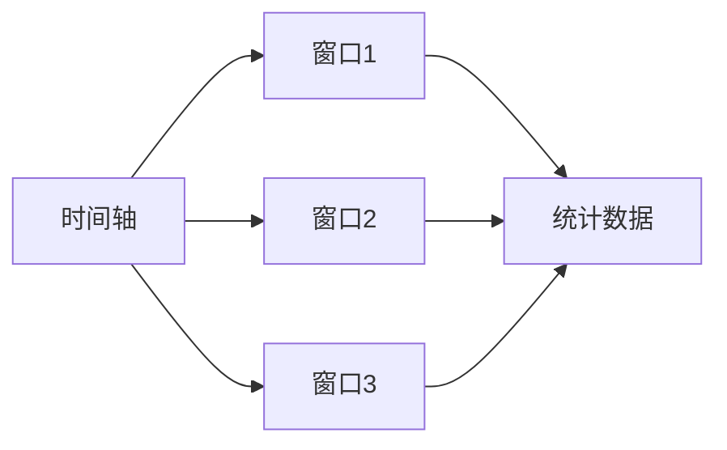
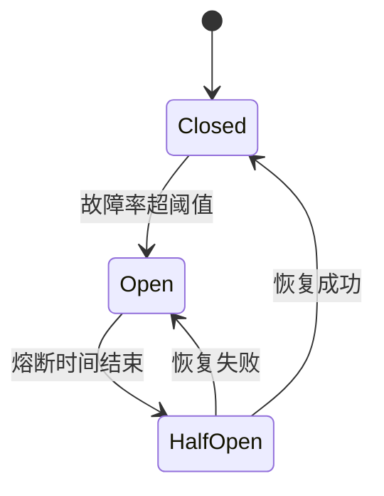

# 2. 熔断降级

# Sentinel：Java面试八股文详解

***

## 1. 概述与定义

Sentinel是阿里巴巴开源的轻量级流量控制和熔断降级组件，专为微服务架构设计，旨在通过流量控制、熔断降级、系统负载保护等手段，保障系统的稳定性和高可用性。它在Spring Cloud中作为熔断降级的核心解决方案，可以替代Hystrix，提供更丰富的功能和更高的性能。

### 定义

简单来说，Sentinel是一个面向分布式服务架构的高可用流量防护组件，以流量为切入点，通过限流、熔断降级和流量整形等功能，防止服务因过载或故障导致雪崩效应。在面试中，你可以这样定义：“Sentinel是Spring Cloud中的熔断降级组件，通过流量控制和熔断机制保护微服务，避免局部故障引发系统崩溃。”这个回答简洁明了，突出核心功能，能快速让面试官抓住重点。

### 背景与定位

Sentinel起源于阿里巴巴内部的流量控制系统，经过双11等高并发场景的锤炼，具备极高的稳定性。它支持多种配置方式（如代码埋点、注解、Dashboard动态配置），与Spring Cloud生态无缝集成。相比Hystrix，Sentinel不仅提供熔断功能，还增加了流量控制和系统保护，功能更全面，性能更优，是现代微服务架构中的优选工具。

***

## 2. 主要特点

Sentinel的核心价值体现在其丰富特性上，以下是其主要特点，面试时可以逐一展开并结合场景说明：

- **流量控制** 🚦 &#x20;

  支持多种限流策略，如QPS（每秒查询率）、线程数、关联流量等，防止服务过载。
- **熔断降级** ⚡ &#x20;

  当服务故障或响应时间超阈值时，自动熔断并降级，保护系统稳定性。
- **系统保护** 🛡️ &#x20;

  根据系统负载、CPU使用率等指标，动态调整流量，防止系统崩溃。
- **热点参数限流** 🔥 &#x20;

  针对请求中的热点参数（如商品ID）进行限流，缓解热点数据压力。
- **实时监控** 📊 &#x20;

  提供Dashboard控制台，实时展示流量、熔断状态等，便于运维管理。
- **易用性** ✨ &#x20;

  支持注解、API和控制台配置，集成简单，开发友好。
- **高性能** ⚡ &#x20;

  基于滑动窗口和令牌桶算法，性能开销低，适合高并发场景。

### 面试Tips

提到“流量控制”时，可以举例：“在秒杀场景中，Sentinel可以限制接口QPS为1000，防止数据库被打垮。”这样的场景化描述能体现实战经验。热点参数限流和系统保护虽非所有项目常用，但在高并发场景下很关键，面试官可能追问原理，需有所准备。

***

## 3. 应用目标

Sentinel的设计目标是解决微服务架构中的稳定性问题，其主要应用目标包括：

- **保护服务稳定性** &#x20;

  通过限流和熔断，防止服务因过载或故障崩溃。
- **提高系统可用性** &#x20;

  自动降级故障服务，确保整体系统可用。
- **简化故障处理** &#x20;

  提供统一的熔断降级机制，降低开发和运维成本。
- **支持高并发场景** &#x20;

  通过细粒度流量控制和系统保护，应对突发流量。
- **提供实时监控** &#x20;

  通过Dashboard监控流量和熔断状态，及时发现问题。

在面试中，可以总结为：“Sentinel的目标是通过流量控制和熔断降级，保护微服务稳定性，提高系统在高并发和故障场景下的可用性。”这个表述简洁全面，能快速传递核心信息。

### 补充说明

“实时监控”虽不是主要目标，但在企业级应用中不可或缺。Sentinel Dashboard能实时展示QPS、熔断状态等，面试官可能问及如何使用，需了解基本配置。

***

## 4. 主要内容及其组成部分

Sentinel是一个功能丰富的组件，由多个模块组成，下面逐一详细解释其功能，并结合代码示例说明。

### 4.1 流量控制

流量控制是Sentinel的基础功能，通过限制QPS或并发线程数，防止服务过载。支持以下策略：

- **QPS控制**：限制每秒请求数。
- **线程数控制**：限制并发线程数。
- **关联流量控制**：当关联资源达到阈值时，限制当前资源。
- **链路流量控制**：针对调用链路限流。

#### 示例：QPS流量控制

```java 
// 定义流量控制规则
FlowRule rule = new FlowRule();
rule.setResource("test-resource"); // 资源名
rule.setGrade(RuleConstant.FLOW_GRADE_QPS); // 基于QPS
rule.setCount(10); // QPS限制为10
FlowRuleManager.loadRules(Collections.singletonList(rule));

// 保护资源
try (Entry entry = SphU.entry("test-resource")) {
    System.out.println("业务逻辑执行");
} catch (BlockException e) {
    System.out.println("被限流了");
}
```


**代码说明**：此代码为资源`test-resource`设置QPS上限为10，超过时触发限流，打印“被限流了”。

### 4.2 熔断降级

熔断降级在服务故障或响应超时时，自动熔断并执行降级逻辑。支持以下策略：

- **慢调用比例**：慢调用比例超阈值时熔断。
- **异常比例**：异常比例超阈值时熔断。
- **异常数**：异常数超阈值时熔断。

#### 示例：熔断降级

```java 
// 定义熔断规则
DegradeRule rule = new DegradeRule();
rule.setResource("test-resource");
rule.setGrade(RuleConstant.DEGRADE_GRADE_RT); // 基于响应时间
rule.setCount(100); // RT阈值100ms
rule.setTimeWindow(10); // 熔断持续时间10s
DegradeRuleManager.loadRules(Collections.singletonList(rule));

// 保护资源
try (Entry entry = SphU.entry("test-resource")) {
    Thread.sleep(150); // 模拟慢调用
} catch (BlockException e) {
    System.out.println("熔断降级");
}
```


**代码说明**：当响应时间超过100ms的比例超阈值时，熔断10秒，触发降级逻辑。

### 4.3 系统保护

系统保护根据系统负载、CPU使用率、QPS等指标，动态调整流量，防止系统过载。

#### 示例：系统保护

```java 
SystemRule rule = new SystemRule();
rule.setHighestSystemLoad(10); // 最大负载
rule.setAvgRt(100); // 平均响应时间
rule.setMaxThread(100); // 最大线程数
rule.setQps(1000); // 最大QPS
SystemRuleManager.loadRules(Collections.singletonList(rule));
```


**代码说明**：此配置限制系统负载、响应时间、线程数和QPS，保护系统稳定性。

### 4.4 热点参数限流

热点参数限流针对请求中的参数（如商品ID）进行限制，适用于秒杀等场景。

#### 示例：热点参数限流

```java 
// 定义热点规则
ParamFlowRule rule = new ParamFlowRule("test-resource")
    .setParamIdx(0) // 第一个参数
    .setCount(5); // 限流阈值
ParamFlowRuleManager.loadRules(Collections.singletonList(rule));

// 保护资源
String param = "item1";
try (Entry entry = SphU.entry("test-resource", param)) {
    System.out.println("访问成功");
} catch (BlockException e) {
    System.out.println("热点限流");
}
```


**代码说明**：对资源`test-resource`的第一个参数限流，阈值为5，超出时触发限流。

### 4.5 Dashboard控制台

Sentinel Dashboard是一个Web应用，提供实时监控、规则配置和集群管理功能，支持动态调整规则。

#### 示例：Dashboard配置

```.properties 
spring.cloud.sentinel.transport.dashboard=localhost:8080
```


**配置说明**：在Spring Boot应用中配置Dashboard地址，启动后即可监控服务。

### 组件对比表格

| 组件           | 功能描述           | 优点           | 缺点         |
| ------------ | -------------- | ------------ | ---------- |
| Sentinel     | 流量控制、熔断降级、系统保护 | 功能全面、性能高、易集成 | 学习成本稍高     |
| Hystrix      | 熔断降级、线程隔离      | 社区成熟、简单易用    | 已停止维护、功能单一 |
| Resilience4j | 熔断降级、限流、重试     | 轻量级、模块化      | 监控功能较弱     |

**表格说明**：此表格对比了主流熔断降级工具，Sentinel功能最丰富，Hystrix已停止维护，Resilience4j轻量但监控不足。面试时可用此表格回答“Sentinel与其他工具的区别”。

***

## 5. 原理剖析

Sentinel的实现原理涉及流量统计、限流算法和熔断机制，下面深入解析。

### 5.1 流量统计：滑动窗口

Sentinel使用滑动窗口算法统计流量数据，将时间划分为多个小窗口，实时计算QPS、响应时间等指标。

#### Mermaid图表：滑动窗口




**图表说明**：滑动窗口将时间分段，每个窗口统计数据并汇总，用于实时监控流量，面试时可画此图解释。

### 5.2 限流算法：令牌桶与漏桶

Sentinel支持两种限流算法：

- **令牌桶**：以固定速率生成令牌，请求消耗令牌，适合突发流量。
- **漏桶**：请求以固定速率流出，适合平滑流量。

#### 示例：令牌桶限流

```java 
FlowRule rule = new FlowRule();
rule.setResource("test-resource");
rule.setGrade(RuleConstant.FLOW_GRADE_QPS);
rule.setCount(10);
rule.setControlBehavior(RuleConstant.CONTROL_BEHAVIOR_RATE_LIMITER); // 令牌桶
FlowRuleManager.loadRules(Collections.singletonList(rule));
```


**代码说明**：此配置使用令牌桶算法，允许短时突发流量。

### 5.3 熔断机制：状态机

Sentinel的熔断机制基于状态机，包含以下状态：

- **关闭（Closed）**：正常状态，请求通过。
- **打开（Open）**：熔断状态，请求降级。
- **半开（Half-Open）**：尝试恢复，允许少量请求测试。

#### Mermaid流程图：熔断状态转换




**图表说明**：此图展示熔断状态转换逻辑，面试时可用于解释熔断原理。

### 5.4 系统保护：自适应限流

系统保护基于系统负载、CPU使用率等指标，动态调整QPS阈值，使用自适应算法预测系统容量，防止过载。

***

## 6. 应用与拓展

Sentinel在实际项目中应用广泛：

- **流量控制**：限制接口QPS，防止服务过载。
- **熔断降级**：下游服务故障时自动降级。
- **热点参数限流**：秒杀场景中限制热点商品访问。
- **系统保护**：高负载时动态限流。

### 拓展

Sentinel可与其他组件集成：

- **Spring Cloud Gateway**：网关层流量控制。
- **Dubbo**：为Dubbo服务提供熔断。
- **Prometheus**：集成监控，收集指标。

***

## 7. 面试问答

以下是五个常见面试问题及详细回答，模仿面试者口吻，确保自然且详实。

### 问题 1：Sentinel和Hystrix有什么区别？

**回答**： &#x20;

“Sentinel和Hystrix都是熔断降级工具，但区别挺大的。首先，Sentinel功能更全，除了熔断还有流量控制、系统保护和热点限流，Hystrix主要做熔断和线程隔离；其次，Sentinel有Dashboard控制台，可以实时监控和动态调规则，Hystrix没有；再次，Sentinel性能更好，用滑动窗口统计数据，Hystrix用RxJava开销大；最后，Sentinel支持注解和API配置，集成更灵活。我觉得Sentinel更适合现在的高并发场景。”

### 问题 2：如何在Spring Cloud中集成Sentinel？

**回答**： &#x20;

“在Spring Cloud里集成Sentinel很简单。先加`spring-cloud-starter-alibaba-sentinel`依赖，然后在`application.yml`里配上Dashboard地址，比如`spring.cloud.sentinel.transport.dashboard=localhost:8080`；接着用`@SentinelResource`注解保护接口，指定blockHandler和fallback方法。我在项目里用过，保护支付接口不被高并发打垮，还能实时看QPS和熔断状态。”

### 问题 3：Sentinel的流量控制策略有哪些？

**回答**： &#x20;

“Sentinel的流量控制策略挺多的，有QPS控制、线程数控制、关联流量控制和链路流量控制。QPS控制限制每秒请求数，线程数控制限制并发线程，关联流量控制是当关联资源忙时限流当前资源，链路流量控制针对调用链路限流。我在项目里常用QPS控制，比如限制订单接口QPS为1000，防止数据库压力太大。”

### 问题 4：Sentinel的熔断机制怎么实现的？

**回答**： &#x20;

“Sentinel的熔断机制用状态机实现，有关闭、打开和半开三种状态。正常时是关闭状态，请求正常通过；当故障率超阈值，比如慢调用比例超50%，就进入打开状态，请求直接降级；熔断一段时间后，进入半开状态，放少量请求试探，成功就恢复到关闭状态，失败就继续熔断。我在项目里用过，下游服务挂了，Sentinel自动熔断，保护上游不崩。”

### 问题 5：如何用Sentinel Dashboard动态配置规则？

**回答**： &#x20;

“Sentinel Dashboard用起来很方便。连上Dashboard后，选服务，点‘流控规则’，就能加规则，比如设QPS为10，保存后立马生效。我试过在项目里动态调规则，接口QPS超了就加限流，效果实时可见，特别适合线上调整。”

***

## 总结

这篇八股文从Sentinel的定义到原理、应用，再到面试问答，覆盖了所有核心知识点。通过代码、表格和Mermaid图表，内容直观易懂，背熟后能在面试中自信应对问题，展现专业能力！🚀
