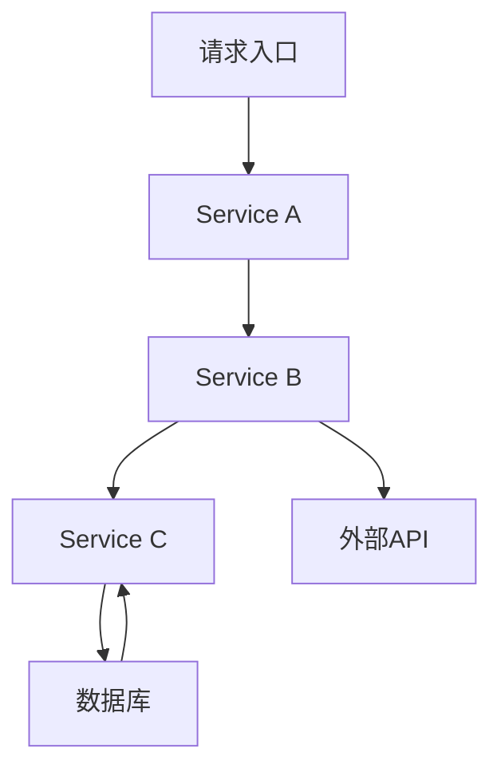
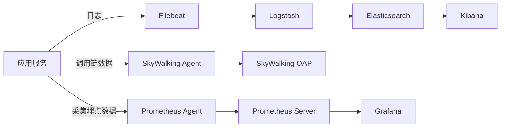

# 3. 监控

# Java面试八股 —— 微服务环境下的SpringCloud监控详解

监控体系是微服务架构中不可或缺的一部分，通过对服务的实时监控与分析，能够及时发现问题、优化性能，并保证系统高可用性和稳定性。本文将从多个角度详细讲解监控的各个组成部分，包括SkyWalking、Prometheus、Grafana和ELK，帮助你在面试中从容回答相关问题，并对知识点进行深入剖析。🚀

***

## 1. 概述与定义

在微服务架构下，各个服务往往采用分布式部署，系统运行状态、性能指标和日志信息分散在多个节点上。因此，建立一套完整的监控体系就显得尤为重要。监控主要包括以下几个方面：

- **分布式追踪（Distributed Tracing）**：用于追踪请求在各个服务之间的流转过程，快速定位问题来源。SkyWalking是这方面的代表工具。 &#x20;
- **指标监控（Metrics Monitoring）**：实时采集各个服务的性能数据，例如响应时间、吞吐量、错误率等。Prometheus作为时序数据库和监控系统在这方面应用广泛。 &#x20;
- **数据可视化（Visualization）**：通过图表和仪表盘将监控数据直观呈现，帮助运维人员迅速掌握系统运行状态。Grafana是目前非常流行的可视化工具。 &#x20;
- **日志管理与分析（Log Aggregation and Analysis）**：集中管理系统日志、搜索与分析日志数据，常见方案为ELK（Elasticsearch、Logstash、Kibana）。

在SpringCloud环境下，监控体系主要用于： &#x20;

- 保障服务的健康状态 &#x20;
- 实时发现并定位故障 &#x20;
- 提供性能优化的数据支撑 &#x20;
- 实现自动告警与智能分析 &#x20;

总之，监控不仅是系统运行的“健康体检”，更是保障业务连续性和快速响应异常的有力手段。

***

## 2. 主要特点

监控体系在微服务环境下具有以下主要特点：

1. **分布式与动态性** &#x20;

   微服务部署在不同的服务器或容器中，系统动态变化较大。监控工具需要支持分布式部署、自动发现服务，并能处理动态上下线的情况。 &#x20;
2. **实时性与高吞吐量** &#x20;

   监控系统需实时采集并处理海量数据，确保数据的时效性和准确性，支持高并发查询和展示。 &#x20;
3. **多维度数据采集** &#x20;

   除了传统的性能指标外，还需要采集日志、追踪信息、错误统计等多维数据，实现全方位监控。 &#x20;
4. **数据可视化与智能告警** &#x20;

   数据的直观展示与告警机制是监控的重要特点。Grafana等工具可以构建丰富的仪表盘，并结合Prometheus的告警规则实现异常通知。 &#x20;
5. **易扩展与兼容性** &#x20;

   微服务环境中的技术栈多样，监控系统应具备良好的扩展性，能够兼容不同的数据源和格式，适应业务需求的不断变化。

为便于理解，下面给出一个简单的表格对比各监控工具的特点：

| 工具         | 主要功能           | 关键特点               | 应用场景             |
| ---------- | -------------- | ------------------ | ---------------- |
| SkyWalking | 分布式追踪、链路监控     | 自动发现、调用链分析、链路追踪    | 分布式系统中定位慢请求、链路瓶颈 |
| Prometheus | 时序数据采集与监控告警    | 数据存储高效、灵活查询、多维数据分析 | 指标监控、自动告警、实时监控   |
| Grafana    | 数据可视化、仪表盘展示    | 丰富的图表组件、灵活的仪表盘配置   | 数据展示、监控数据的可视化分析  |
| ELK        | 日志收集、存储、分析与可视化 | 日志聚合、多维查询、全文检索     | 日志分析、故障排查、安全审计   |

*表中数据仅为示例说明，各工具在实际应用中往往会相互配合。* 😊

***

## 3. 应用目标

构建完善的监控体系主要是为了实现以下应用目标：

1. **服务可观察性** &#x20;

   通过全面监控服务状态，确保系统每个节点的运行状况都能被及时观察，方便运维人员快速定位异常问题。 &#x20;
2. **故障预警与快速响应** &#x20;

   当系统出现异常（如响应延迟、错误率上升）时，自动触发告警机制，使问题能够在早期阶段得到处理，避免事态扩大。 &#x20;
3. **性能优化与瓶颈分析** &#x20;

   通过采集各项指标数据，对系统进行性能分析，识别瓶颈并提出优化方案，从而提升整体服务性能和用户体验。 &#x20;
4. **日志分析与安全审计** &#x20;

   集中管理日志数据，快速定位故障根因，同时进行安全审计和数据溯源，保障系统安全稳定运行。 &#x20;
5. **业务决策支持** &#x20;

   监控数据还可为业务团队提供关键指标，辅助业务决策，帮助产品优化与市场调整。

通过构建这样一套监控体系，企业能够有效地掌握系统运行全貌，确保业务稳定，并为后续系统扩展与优化提供数据支持。

***

## 4. 主要内容及其组成部分

监控体系在SpringCloud环境下通常包括以下四个组成部分，每个部分都承担着独特的职责。下面将对每个组件进行详细解析，并结合示例进行说明。

### 4.1 SkyWalking —— 分布式追踪

**定义与作用** &#x20;

SkyWalking 是一款开源的分布式追踪系统，主要用于微服务系统的调用链监控、性能分析和故障诊断。它通过拦截服务调用，自动生成调用链数据，从而帮助开发者和运维人员快速定位问题根源。

**核心功能** &#x20;

- 分布式调用链追踪 &#x20;
- 性能指标统计 &#x20;
- 实时告警与诊断 &#x20;
- 服务拓扑图自动生成

**示例说明** &#x20;

在SpringCloud项目中，只需引入SkyWalking Agent并在启动参数中指定agent路径，即可自动完成监控数据的采集。例如，启动命令如下：

```bash 
java -javaagent:/path/to/skywalking-agent.jar -jar your-springcloud-app.jar
```


在配置完成后，SkyWalking会自动捕捉各个微服务之间的调用情况，并在控制台或Web界面上生成调用链图，方便排查服务延时或错误问题。

**架构图示** &#x20;

使用Mermaid语法可以描述SkyWalking在系统中的工作流程：




该图展示了一个典型的调用链，表明请求从入口经过多个服务，最终访问数据库或外部API，SkyWalking能够追踪整个调用路径。

***

### 4.2 Prometheus —— 指标监控与告警

**定义与作用** &#x20;

Prometheus 是一个开源的监控系统，主要负责采集和存储各项时序数据，并通过灵活的查询语言（PromQL）进行数据分析。它与SpringCloud服务无缝对接，通过暴露HTTP接口的方式让各个微服务输出监控数据。

**核心功能** &#x20;

- 时序数据存储 &#x20;
- 数据采集与查询 &#x20;
- 灵活的告警规则配置 &#x20;
- 多维度数据分析

**示例说明** &#x20;

在SpringCloud应用中，可以通过Spring Boot Actuator来暴露Prometheus监控端点，配置示例如下：

```yaml 
management:
  endpoints:
    web:
      exposure:
        include: prometheus
```


配置完成后，应用会在 `/actuator/prometheus` 路径上输出各项指标，Prometheus通过配置抓取任务（scrape job）自动采集数据。例如，Prometheus配置文件中的job示例如下：

```yaml 
scrape_configs:
  - job_name: 'springcloud-app'
    metrics_path: '/actuator/prometheus'
    static_configs:
      - targets: ['localhost:8080']
```


这样就可以实现对应用各项指标数据的实时采集，并基于PromQL进行告警规则设置。

***

### 4.3 Grafana —— 数据可视化

**定义与作用** &#x20;

Grafana 是一个功能强大的开源数据可视化平台，通过丰富的图表组件和灵活的仪表盘配置，能够将Prometheus等数据源中的监控数据以直观的方式展示出来，便于运维人员及时掌握系统运行状态。

**核心功能** &#x20;

- 支持多种数据源（Prometheus、Elasticsearch等） &#x20;
- 丰富的图表类型（折线图、饼图、热力图等） &#x20;
- 灵活的仪表盘布局 &#x20;
- 告警规则与通知配置

**示例说明** &#x20;

在Grafana中，可以创建一个仪表盘来展示各微服务的响应时间、错误率和吞吐量。下表展示了一个典型的仪表盘配置示例：

| 指标名称   | 数据来源       | 图表类型 | 说明            |
| ------ | ---------- | ---- | ------------- |
| 平均响应时间 | Prometheus | 折线图  | 展示服务请求平均响应时长  |
| 错误率    | Prometheus | 柱状图  | 展示请求错误率       |
| 吞吐量    | Prometheus | 折线图  | 展示单位时间内处理的请求数 |

Grafana不仅可以展示实时数据，还可以设置阈值告警，例如当错误率超过预设值时，通过邮件或短信通知运维人员，确保系统异常能被及时发现。

***

### 4.4 ELK —— 日志收集与分析

**定义与作用** &#x20;

ELK 指的是 Elasticsearch、Logstash 和 Kibana 的组合，是一个集日志收集、存储、搜索和可视化分析于一体的系统。它主要用于集中管理和分析分布在各个服务节点的日志数据，帮助快速定位问题和进行安全审计。

**核心功能** &#x20;

- 日志采集与过滤（Logstash/Beats） &#x20;
- 分布式全文检索（Elasticsearch） &#x20;
- 丰富的数据展示与交互分析（Kibana） &#x20;
- 可扩展的日志处理管道

**示例说明** &#x20;

在SpringCloud系统中，可以使用Filebeat收集各服务的日志，然后通过Logstash进行数据预处理，再将处理后的日志数据发送到Elasticsearch中。Kibana则通过查询Elasticsearch来展示日志分析结果。下面是一段Logstash的配置示例：

```text 
input {
  beats {
    port => 5044
  }
}

filter {
  grok {
    match => { "message" => "%{TIMESTAMP_ISO8601:timestamp} %{LOGLEVEL:loglevel} %{GREEDYDATA:msg}" }
  }
}

output {
  elasticsearch {
    hosts => ["localhost:9200"]
    index => "springcloud-logs-%{+YYYY.MM.dd}"
  }
}
```


该配置实现了对日志数据的解析，并将其存储到Elasticsearch中，方便后续在Kibana上进行搜索与分析。

***

## 5. 原理剖析

在微服务监控中，各组件通过分工协作共同构建了完整的监控闭环。下面我们对监控体系的原理进行深入剖析：

### 5.1 数据采集与埋点

监控的第一步是数据采集。在应用中，可以通过多种方式实现数据埋点： &#x20;

- **自动化Agent**：如SkyWalking Agent和Prometheus客户端库，通过字节码增强或拦截器自动采集监控数据，无需开发者手动埋点。 &#x20;
- **手动埋点**：在关键业务逻辑中，开发者可以手动记录日志和指标数据，以便进行精细化监控。

例如，在Java中使用Prometheus客户端进行手动埋点的代码示例：

```java 
import io.prometheus.client.Counter;

public class MetricsExample {
    static final Counter requests = Counter.build()
        .name("http_requests_total")
        .help("Total HTTP Requests.")
        .register();

    public void processRequest() {
        requests.inc();
        // 处理业务逻辑
    }
}
```


该示例展示了如何利用Prometheus计数器记录请求次数。

### 5.2 数据传输与存储

监控数据的传输与存储是监控体系的核心部分： &#x20;

- **传输方式**：一般采用HTTP协议、Push或Pull模式。Prometheus多采用Pull模式定时拉取监控数据，而SkyWalking则通过Agent自动发送数据到后端。 &#x20;
- **数据存储**：时序数据通常存储在Prometheus的时序数据库中，而日志数据则存储在Elasticsearch中。存储系统需要具备高可用、高扩展性，能够应对海量数据的写入与查询需求。

### 5.3 数据处理与告警

监控系统对采集到的数据进行实时处理： &#x20;

- **数据聚合与计算**：对原始数据进行汇总统计，如计算平均响应时间、最大值、最小值等指标。 &#x20;
- **规则引擎**：通过定义告警规则，当某个指标超过阈值时触发报警。例如，Prometheus支持基于PromQL的灵活告警规则配置。 &#x20;
- **告警通知**：当告警条件成立时，系统会通过邮件、短信、IM工具等方式通知相关人员，确保问题能够被及时处理。

### 5.4 可视化与数据展示

数据经过处理后，需要通过直观的方式展示给用户： &#x20;

- Grafana利用丰富的图表组件、交互式仪表盘，将数据以图形化形式呈现； &#x20;
- Kibana则为日志数据提供了强大的搜索和过滤功能，帮助用户快速定位关键信息。

下图使用Mermaid语法展示了整个监控系统的数据流动过程：




该图详细描述了从应用服务采集数据，到各个组件处理、存储，再到可视化展示的整个数据流向。

### 5.5 分布式追踪原理

分布式追踪系统（如SkyWalking）通过在各服务间传递唯一追踪ID，实现跨服务调用链的关联。基本原理如下： &#x20;

1. 请求进入系统时生成全局唯一ID； &#x20;
2. 每个服务在处理请求时，将该ID附加到后续调用中； &#x20;
3. 各服务记录调用日志及时间戳； &#x20;
4. 后端系统汇总各服务数据，重构完整调用链。 &#x20;

这种方式不仅能够定位延迟、错误发生点，还能分析调用过程中的瓶颈。

***

## 6. 应用与拓展

监控体系在实际生产环境中的应用非常广泛，以下是几个关键应用场景及扩展方式：

### 6.1 微服务生产环境中的部署

在SpringCloud环境中，通常采用Docker或Kubernetes部署各个服务。监控系统也可以容器化部署，形成完整的监控集群。常见实践包括： &#x20;

- 使用Helm Chart在Kubernetes中部署Prometheus、Grafana、ELK Stack。 &#x20;
- 利用自动发现功能，监控系统自动识别新上线的服务节点。 &#x20;

### 6.2 集成与兼容性扩展

监控系统在设计时应具备良好的扩展性： &#x20;

- **数据源扩展**：Grafana支持多种数据源，如InfluxDB、Graphite等，方便将其他监控数据接入。 &#x20;
- **告警插件扩展**：Prometheus支持与Alertmanager集成，通过插件扩展通知渠道，如Slack、钉钉、邮件等。 &#x20;
- **日志处理扩展**：ELK的Logstash可以灵活配置插件，实现自定义日志解析，满足各种业务需求。 &#x20;

### 6.3 实践案例分享

假设一个电商平台的SpringCloud架构，通过以上监控体系实现如下目标： &#x20;

- 利用SkyWalking追踪用户下单过程中各服务间调用链，及时发现某服务响应异常导致整体延时； &#x20;
- 利用Prometheus监控各个微服务的请求量、响应时间，自动触发告警； &#x20;
- 利用Grafana搭建仪表盘，实时展示关键指标； &#x20;
- 利用ELK对交易日志进行归集与搜索，排查订单处理中的问题。 &#x20;

下表总结了各组件在该案例中的作用：

| 组件         | 主要作用        | 实际应用举例                   |
| ---------- | ----------- | ------------------------ |
| SkyWalking | 分布式追踪、调用链分析 | 分析下单过程中各服务调用顺序，定位响应瓶颈    |
| Prometheus | 指标采集与告警     | 监控订单服务响应时间，设置超时告警        |
| Grafana    | 数据可视化       | 构建全局仪表盘，展示各服务实时状态及历史趋势   |
| ELK        | 日志收集与搜索     | 收集订单日志，分析错误日志，辅助快速定位异常情况 |

通过以上实践，企业能够实现对复杂系统的全链路监控，极大提升运维效率和业务稳定性。✨

***

## 7. 面试问答

以下是基于监控体系在SpringCloud环境下的几个常见面试问题及详细回答，回答内容均从面试者角度出发，以真实场景讲解实际应用及原理。

### 7.1 问题一：请简述在SpringCloud环境下监控体系的基本概念及作用？

【回答】 &#x20;

在SpringCloud环境下，监控体系主要用于实现服务可观察性。它包括分布式追踪、指标监控、日志分析和数据可视化四大方面。分布式追踪（如SkyWalking）可以捕捉跨服务的调用链，帮助定位性能瓶颈和异常问题；Prometheus负责采集各项时序数据并设置告警；Grafana则负责将这些数据以图形化方式展示；而ELK体系主要用于日志的集中处理与分析。这套体系使得系统各个环节均可被实时监控，有效保障系统高可用性和稳定性，是微服务架构中不可或缺的重要环节。

### 7.2 问题二：SkyWalking如何实现分布式追踪？请详细说明其原理。

【回答】 &#x20;

SkyWalking采用自动化Agent技术，在应用启动时通过字节码增强的方式注入监控逻辑。当请求进入系统时，生成全局唯一追踪ID，并在跨服务调用中传递该ID。各服务记录调用开始和结束时间，形成完整调用链数据。后端系统会根据这些数据构建出服务拓扑图，帮助开发者直观了解各环节的性能表现。这种方式不仅能够实时监控调用链，还可以为故障定位和性能优化提供准确依据。

### 7.3 问题三：如何使用Prometheus进行指标监控和告警？请结合实际配置说明。

【回答】 &#x20;

使用Prometheus进行监控时，我们通常先在SpringCloud应用中通过Spring Boot Actuator暴露监控端点（例如`/actuator/prometheus`），然后在Prometheus的配置文件中定义抓取任务。如下是一个配置示例：

```yaml 
scrape_configs:
  - job_name: 'springcloud-app'
    metrics_path: '/actuator/prometheus'
    static_configs:
      - targets: ['localhost:8080']
```


通过这种方式，Prometheus会定时采集各项指标数据，并根据预先定义的告警规则（使用PromQL语句）触发告警，确保系统异常能够及时被发现并通知相关人员。

### 7.4 问题四：Grafana在监控体系中的作用是什么？如何利用Grafana实现数据可视化？

【回答】 &#x20;

Grafana主要负责将监控数据以直观的图形化方式展示出来。通过连接Prometheus、Elasticsearch等数据源，Grafana允许用户构建自定义仪表盘，展示如响应时间、错误率、吞吐量等关键指标。用户可以通过配置图表、设定阈值告警等方式实现数据的实时监控，并通过历史数据分析趋势，从而为系统优化提供数据支持。仪表盘不仅便于运维人员实时查看系统状态，也方便向管理层展示系统运行情况。

### 7.5 问题五：ELK体系在日志管理中的优势是什么？请说明如何将ELK集成到SpringCloud系统中。

【回答】 &#x20;

ELK体系集日志收集、存储、检索和可视化于一体，能够高效处理分布式系统中海量日志数据。其优势在于： &#x20;

- Elasticsearch支持分布式存储和全文检索，查询速度快； &#x20;
- Logstash或Beats灵活解析与过滤日志数据，适应各种日志格式； &#x20;
- Kibana提供强大的交互式可视化功能，帮助快速定位问题。 &#x20;

在SpringCloud系统中，可以通过部署Filebeat在各服务节点上采集日志，并将日志发送到Logstash进行预处理，最终存储到Elasticsearch中。Kibana则连接Elasticsearch，提供图形化界面供运维人员查询和分析日志，从而大大提高故障排查效率。

***

## 总结

通过以上详细解析，我们可以看到，在微服务架构下构建一套完善的监控体系是实现系统高可用和稳定运行的重要保障。SkyWalking、Prometheus、Grafana和ELK各司其职，协同工作，共同构成了对分布式系统全链路监控的有力支撑。从数据采集、传输、处理到展示与告警，每个环节都经过精心设计，以适应复杂多变的业务场景。对于面试而言，理解这些核心原理与实际应用场景，不仅能够展示扎实的技术基础，也能体现出对系统稳定性和高可用性设计的深刻认识。通过本文的详细讲解，希望各位在面试中能够自信地回答相关问题，展现出作为一名优秀Java工程师的专业水平。💼

这篇文章不仅涵盖了监控各组件的基本定义和主要特点，还详细剖析了其工作原理、数据处理流程以及实际应用中的关键配置和扩展方案，同时通过丰富的示例代码、表格和Mermaid图展示了系统内部各环节的联系。对面试问答部分也给出了真实、详细的回答，帮助你在面试中从容应对各种问题。希望这份内容能够为你提供全方位的复习资料，并在面试中助你取得成功。
