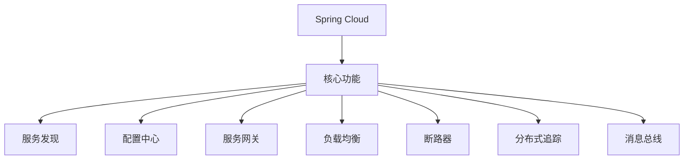
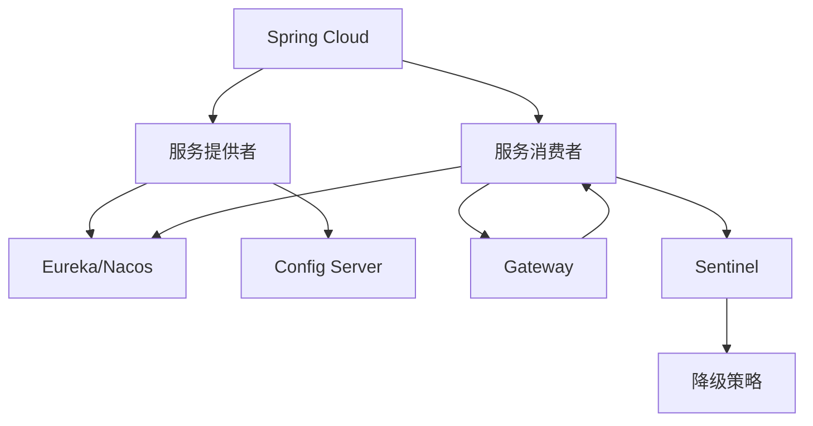
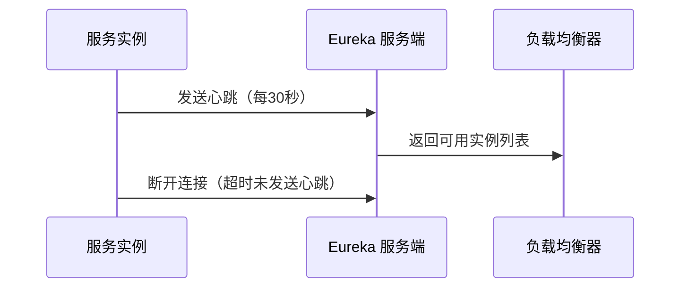
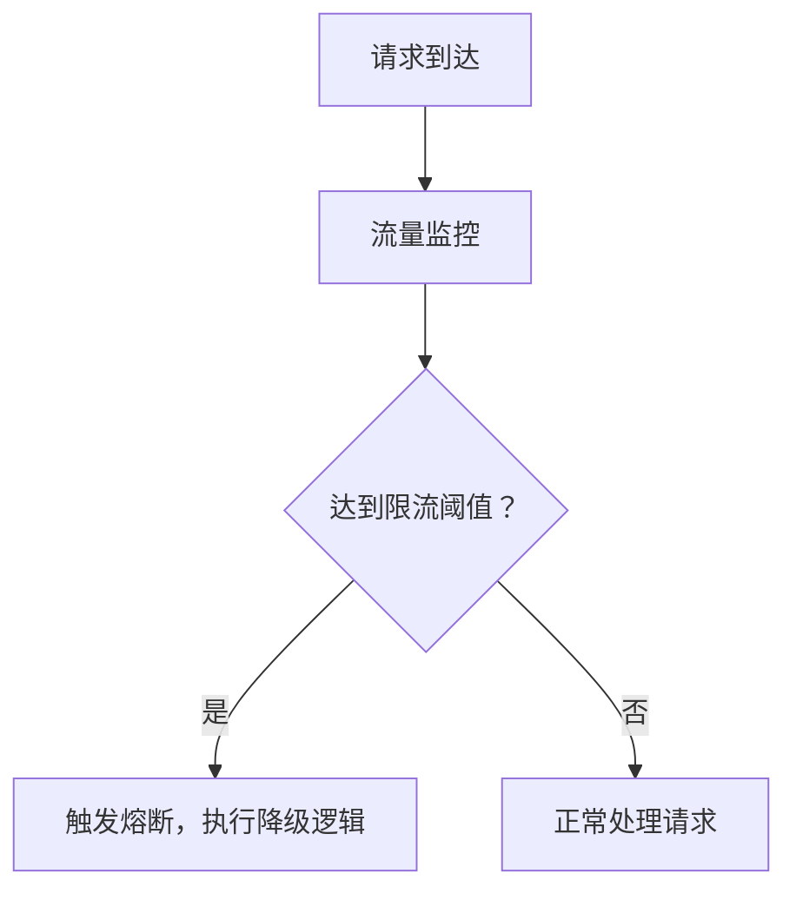

# 一. SpringCloud

***

# Java面试八股——Spring Cloud 核心知识点详解

***

## 1. 概述与定义

**Spring Cloud** 是基于 **Spring Boot** 的微服务框架集合，旨在简化分布式系统的开发，提供了一站式解决方案。它通过整合成熟的第三方框架（如 Netflix、Alibaba），封装复杂配置，实现服务发现、配置管理、断路器等微服务核心功能。




***

## 2. 主要特点

### 2.1 核心功能特性对比表

| **功能**​    | **作用**​             | **关键特性**​                                       |
| ---------- | ------------------- | ----------------------------------------------- |
| **服务发现**​  | 服务注册与发现，实现动态服务管理。   | Eureka、Nacos 支持高可用集群。                           |
| **配置中心**​  | 集中管理应用配置，支持动态刷新。    | Spring Cloud Config + Bus 实现配置热更新。              |
| **服务网关**​  | 统一入口，实现路由、鉴权、限流等功能。 | Spring Cloud Gateway 基于 WebFlux，支持非阻塞模式。        |
| **负载均衡**​  | 分配请求流量，提升系统可用性。     | Ribbon、Spring Cloud LoadBalancer 提供多种策略（轮询、随机）。 |
| **断路器**​   | 容错机制，防止服务雪崩。        | Hystrix（已弃用）、Sentinel、Resilience4J 支持熔断、降级。     |
| **分布式追踪**​ | 跟踪请求链路，分析性能瓶颈。      | Sleuth + Zipkin 实现全链路监控。                        |

***

## 3. 应用目标

### 3.1 核心功能的应用场景

| **功能**​   | **典型场景**​             | **示例**​                        |
| --------- | --------------------- | ------------------------------ |
| **服务发现**​ | 微服务实例动态注册与发现，避免硬编码地址。 | 电商系统中，订单服务通过 Eureka 发现库存服务。    |
| **配置中心**​ | 动态修改生产环境配置，无需重启服务。    | 调整商品折扣率配置，通过 Config 实现秒级生效。    |
| **服务网关**​ | 统一鉴权、限流，隐藏后端服务细节。     | 网关拦截未认证请求，转发 `/api/ **` 到对应服务。 |
| **断路器**​  | 在库存服务不可用时，返回默认值避免雪崩。  | 使用 Sentinel 对支付接口设置降级策略。       |

***

## 4. 主要内容及其组成部分

***

### 4.1 核心组件详解

#### **4.1.1 服务发现（Eureka & Nacos）**

- **Eureka**： &#x20;
  - **作用**：服务注册与发现，支持高可用集群。 &#x20;
  - **配置示例**： &#x20;
    ```yaml 
    # 服务提供者配置
    eureka:
      client:
        serviceUrl:
          defaultZone: http://localhost:8761/eureka/ # 注册中心地址
        fetchRegistry: true
        registerWithEureka: true
    ```

- **Nacos**： &#x20;
  - **优势**：集成配置中心，支持 DNS 和 HTTP 两种服务发现模式。 &#x20;
  - **配置示例**： &#x20;
    ```yaml 
    spring:
      cloud:
        nacos:
          discovery:
            server-addr: 127.0.0.1:8848 # Nacos 服务发现地址
    ```


#### **4.1.2 配置中心（Spring Cloud Config）**

- **作用**：集中管理多环境配置，支持 Git 存储和动态刷新。 &#x20;
- **组件协作**： &#x20;
  ```mermaid 
  graph TD
      A[Config Server] --> B[Git仓库]
      A --> C[Client应用]
      C --> D[Spring Cloud Bus]
  ```

- **使用示例**： &#x20;
  ```java 
  @RefreshScope
  @RestController
  public class ConfigController {
      @Value("${message:Hello World}")
      private String message;

      @GetMapping("/message")
      public String getMessage() {
          return message;
      }
  }
  ```


#### **4.1.3 服务网关（Spring Cloud Gateway）**

- **作用**：路由转发、鉴权、限流、日志等统一入口。 &#x20;
- **路由配置**： &#x20;
  ```yaml 
  spring:
    cloud:
      gateway:
        routes:
          - id: user-service
            uri: lb://user-service # 负载均衡到服务实例
            predicates:
              - Path=/api/users/**
  ```

- **过滤器示例**： &#x20;
  ```java 
  @Component
  public class AuthFilter implements GlobalFilter {
      @Override
      public Mono<Void> filter(ServerWebExchange exchange, GatewayFilterChain chain) {
          String token = exchange.getRequest().getHeaders().getFirst("Authorization");
          if (token == null) {
              exchange.getResponse().setStatusCode(HttpStatus.UNAUTHORIZED);
              return exchange.getResponse().setComplete();
          }
          return chain.filter(exchange);
      }
  }
  ```


#### **4.1.4 负载均衡（Ribbon & Spring Cloud LoadBalancer）**

- **Ribbon**： &#x20;
  - **策略**：轮询（RoundRobin）、随机（Random）。 &#x20;
  - **示例**： &#x20;
    ```java 
    @LoadBalanced
    @Bean
    public RestTemplate restTemplate() {
        return new RestTemplate();
    }
    ```

- **Spring Cloud LoadBalancer**： &#x20;
  - **优势**：与 WebFlux 兼容，支持自定义负载均衡算法。 &#x20;

#### **4.1.5 断路器（Sentinel）**

- **作用**：熔断、降级、限流。 &#x20;
- **配置示例**： &#x20;
  ```java 
  @SentinelRestTemplate
  @Bean
  public RestTemplate restTemplate() {
      return new RestTemplate();
  }
  ```

- **规则定义**： &#x20;
  ```java 
  @Bean
  public FlowRule flowRule() {
      return new FlowRule()
          .setResource("payment")
          .setGrade(RuleConstant.FLOW_GRADE_QPS)
          .setCount(10); // 每秒超过10次触发降级
  }
  ```


#### **4.1.6 分布式追踪（Spring Cloud Sleuth）**

- **作用**：记录请求链路 ID（Trace ID），整合 Zipkin 可视化。 &#x20;
- **日志输出示例**： &#x20;
  ```html 
  [spanId=3456, traceId=1234,parentId=789] User service: get user 1001
  ```


***

### 4.2 核心组件协作关系图




***

## 5. 原理剖析

### 5.1 服务发现原理

#### **5.1.1 Eureka 服务注册流程图**




#### **5.1.2 关键步骤详解**

1. **服务注册**：启动时向 Eureka Server 发送 `POST /apps/{appname}`。 &#x20;
2. **心跳维护**：每30秒发送心跳，超时90秒标记为下线。 &#x20;
3. **服务发现**：消费者通过 Eureka Client 获取服务实例列表。 &#x20;

***

### 5.2 断路器熔断机制

#### **5.2.1 Sentinel 熔断流程图**




#### **5.2.2 核心逻辑**

- **降级方法**： &#x20;
  ```java 
  @SentinelResource(
      fallback = "fallbackMethod",
      fallbackClass = MyFallback.class
  )
  public String paymentInfo(Long id) {
      return "正常调用";
  }
  ```

- **熔断条件**： &#x20;
  - 每秒 QPS 超过阈值。 &#x20;
  - 异常比例超过阈值（如 50% 请求失败）。 &#x20;

***

### 5.3 负载均衡算法

#### **5.3.1 Ribbon 轮询算法示例**

```java 
public class RoundRobinRule extends AbstractLoadBalancerRule {
    private AtomicInteger counter = new AtomicInteger(0);

    @Override
    public Server choose(Object key) {
        int index = counter.getAndIncrement() % getLoadBalancer().getAllServers().size();
        return getLoadBalancer().getServer(index);
    }
}
```


***

## 6. 应用与拓展

### 6.1 自定义组件示例

#### **6.1.1 自定义负载均衡策略**

```java 
@Configuration
public class MyLoadBalancerConfig {
    @Bean
    public IRule myRule() {
        return new RandomRule(); // 随机策略
    }
}
```


#### **6.1.2 集成 Nacos 配置中心**

```yaml 
# Nacos 配置中心配置
spring:
  cloud:
    nacos:
      config:
        server-addr: 127.0.0.1:8848
        extension-configs:
          - data-id: application-dev.yml
            group: DEFAULT_GROUP
            refresh: true
```


***

### 6.2 与 Spring Boot 集成

#### **6.2.1 Spring Boot 启动类配置**

```java 
@SpringBootApplication
@EnableDiscoveryClient // 启用服务发现
@EnableFeignClients // 启用 Feign 客户端
public class OrderApplication {
    public static void main(String[] args) {
        SpringApplication.run(OrderApplication.class, args);
    }
}
```


***

## 7. 面试问答

### 问题1：Spring Cloud 和 Spring Boot 的关系？

**回答**： &#x20;

Spring Cloud 是 Spring Boot 的扩展： &#x20;

1. **Spring Boot**：简化单体应用开发，提供自动化配置和嵌入式服务器。 &#x20;
2. **Spring Cloud**：基于 Spring Boot，提供微服务解决方案，解决分布式系统问题（如服务发现、配置管理）。 &#x20;

- **类比**：Spring Boot 是“乐高积木”，Spring Cloud 是“乐高说明书”，指导如何搭建复杂系统。 &#x20;

***

### 问题2：如何实现服务发现？

**回答**： &#x20;

步骤如下： &#x20;

1. **引入依赖**：添加 `spring-cloud-starter-netflix-eureka-server`。 &#x20;
2. **配置 Eureka Server**： &#x20;
   ```yaml 
   server:
     port: 8761
   eureka:
     client:
       fetchRegistry: false
       registerWithEureka: false
   ```

3. **服务注册**：服务提供者添加 `@EnableEurekaClient`，并配置 `eureka.client.serviceUrl`。 &#x20;
4. **服务发现**：消费者通过 `DiscoveryClient` 获取实例列表，或通过 `RestTemplate` 的 `@LoadBalanced` 实现负载均衡调用。 &#x20;

***

### 问题3：配置中心如何实现动态刷新？

**回答**： &#x20;

流程如下： &#x20;

1. **配置中心**：使用 `@RefreshScope` 注解标记需要刷新的 Bean。 &#x20;
2. **触发刷新**： &#x20;
   - **手动**：调用 `/actuator/refresh` 端点。 &#x20;
   - **自动**：通过 Spring Cloud Bus 接收消息总线事件。 &#x20;
3. **Bus 集成**：添加 `spring-cloud-starter-bus-amqp`，配置 RabbitMQ。 &#x20;

- **示例代码**： &#x20;
  ```java 
  @RefreshScope
  @Value("${message}")
  private String message;
  ```


***

### 问题4：Spring Cloud Gateway 如何实现限流？

**回答**： &#x20;

步骤如下： &#x20;

1. **添加依赖**：`spring-cloud-starter-gateway` + `spring-boot-starter-actuator`。 &#x20;
2. **配置限流规则**：通过 `Redis` 或 `RateLimiter` 实现。 &#x20;
3. **路由配置**： &#x20;
   ```yaml 
   spring:
     cloud:
       gateway:
         routes:
           - id: rate-limited-service
             predicates:
               - Path=/api/limited
             filters:
               - name: RequestRateLimiter
                 args:
                   redis-rate-limiter.replenishRate: 1
                   redis-rate-limiter.burstCapacity: 3
   ```


***

### 问题5：服务雪崩的解决方案？

**回答**： &#x20;

主要通过 **断路器模式** 解决： &#x20;

1. **熔断**：当依赖服务故障时，快速失败并返回默认值。 &#x20;
   - 示例： &#x20;
     ```java 
     @HystrixCommand(fallbackMethod = "fallback")
     public String callService() {
         return restTemplate.getForObject("/service", String.class);
     }
     ```

2. **降级**：提供备用逻辑（如返回缓存数据）。 &#x20;
3. **限流**：限制并发请求数，避免资源耗尽。 &#x20;
4. **隔离**：通过线程池隔离不同服务的请求。 &#x20;

***

## 结语

Spring Cloud 通过标准化的组件和开箱即用的功能，大幅降低了微服务开发的复杂度。面试中需深入理解 **服务发现机制、配置中心的热更新、断路器的熔断策略**，并能结合实际场景（如电商秒杀、订单系统）说明如何避免单点故障和提升系统可用性。掌握核心组件的协作流程（如网关 → 负载均衡 → 断路器）是应对复杂问题的关键。

***

[0. SpringCloudAlibaba](<0. SpringCloudAlibaba/0. SpringCloudAlibaba.md> "0. SpringCloudAlibaba")

[1. 服务组件](<1. 服务组件/1. 服务组件.md> "1. 服务组件")

[2. 熔断降级](<2. 熔断降级/2. 熔断降级.md> "2. 熔断降级")

[3. 监控](<3. 监控/3. 监控.md> "3. 监控")
