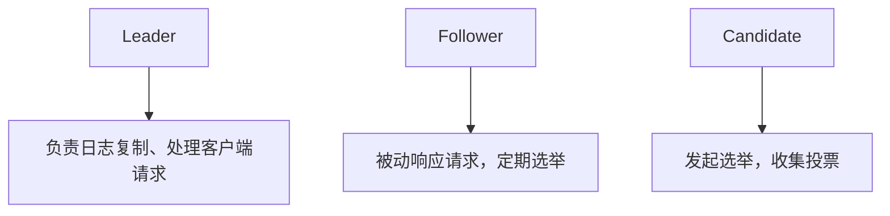
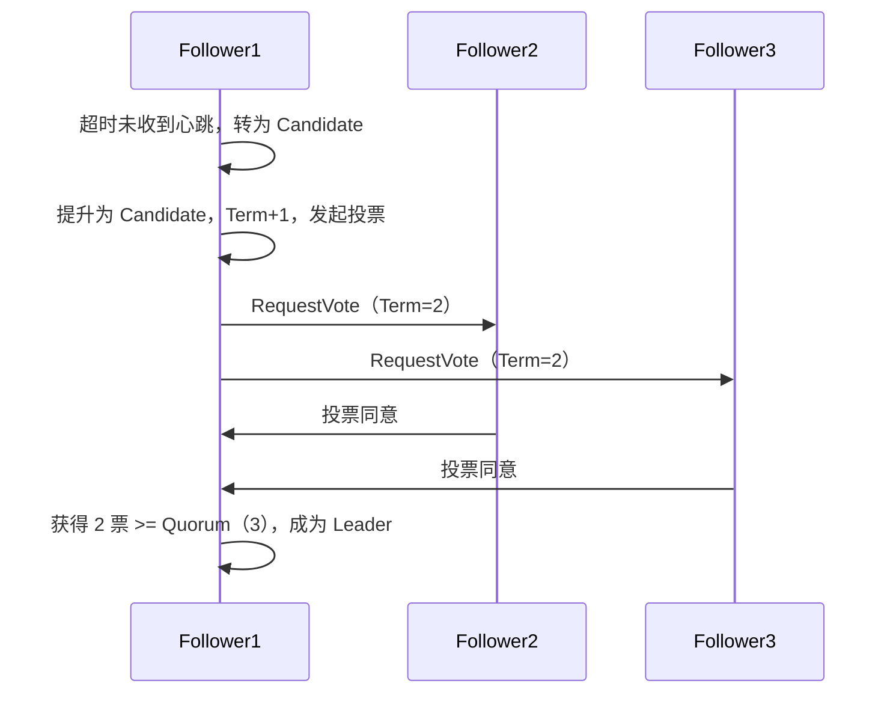
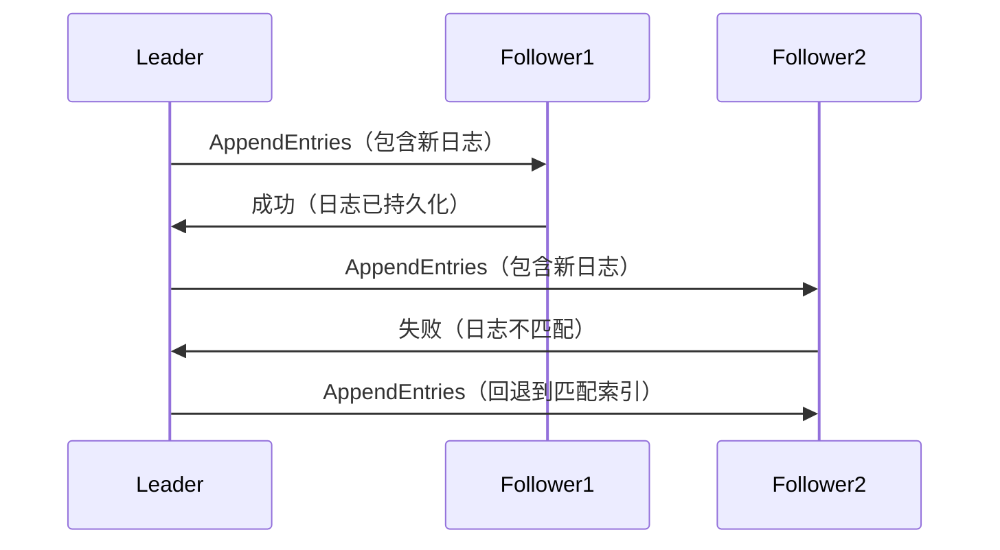
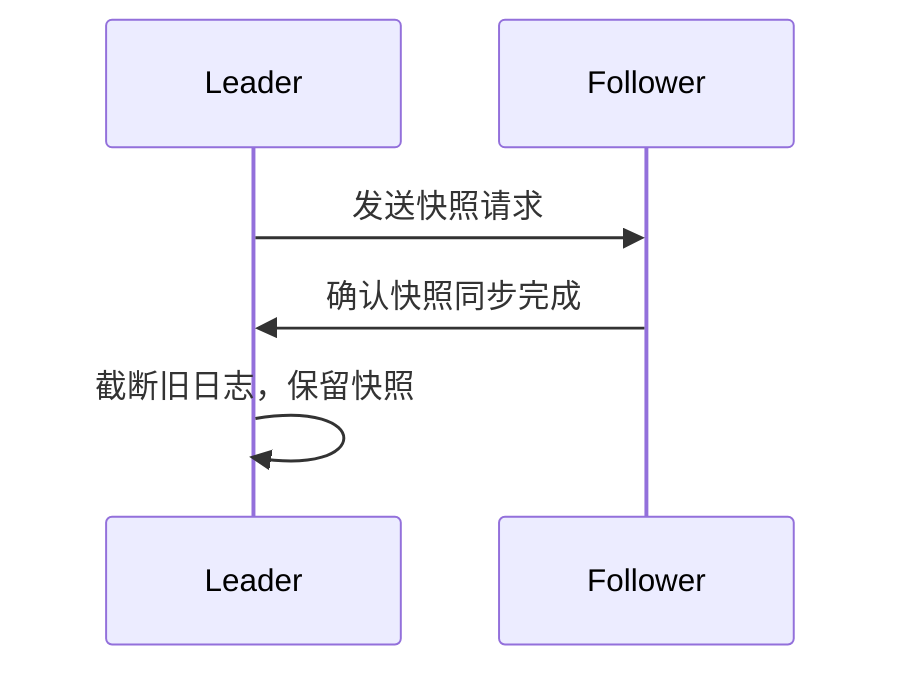

# 1. Raft

# Raft 算法深度解析（面试必备）

***

## 1. Raft 算法概述 &#x20;

### 1.1 定义与目标 &#x20;

**Raft** 是一种 **分布式一致性算法**，旨在替代 Paxos，其核心设计目标是： &#x20;

- **易理解性**：通过清晰的角色划分和阶段设计降低复杂度。 &#x20;
- **高可用性**：通过 Leader 节点集中管理日志复制，确保高效写入。 &#x20;
- **容错性**：支持 **N/2 - 1 节点故障**（N为总节点数）。 &#x20;

### 1.2 核心应用场景 &#x20;

- **数据复制**：如 etcd、TiKV 的日志同步。 &#x20;
- **Leader 选举**：分布式系统的元数据管理。 &#x20;
- **成员变更**：动态调整集群规模。 &#x20;

***

## 2. Raft 核心机制 &#x20;

### 2.1 三种角色 &#x20;




- **Leader**：唯一领导者，负责日志复制和客户端请求。 &#x20;
- **Follower**：默认角色，响应请求，定期触发选举。 &#x20;
- **Candidate**：临时角色，发起选举。 &#x20;

### 2.2 任期（Term）机制 &#x20;

- **定义**：每个任期由一次选举开始，若选举成功则 Leader 管理集群，否则重新选举。 &#x20;
- **作用**：防止脑裂，确保每个任期只有一个合法 Leader。 &#x20;

***

## 3. 核心流程 &#x20;

### 3.1 Leader 选举流程 &#x20;




- **触发条件**：Follower 超时（150-300ms）未收到心跳。 &#x20;
- **投票规则**： &#x20;
  - 每个节点每任期只能投一次票。 &#x20;
  - 获得 **多数票**（N/2 + 1）的 Candidate 成为 Leader。 &#x20;

### 3.2 日志复制机制 &#x20;




- **核心协议**：通过 `AppendEntries` 消息同步日志。 &#x20;
- **提交条件**：日志需被 **多数节点** 复制后提交。 &#x20;

***

## 4. 安全性保障 &#x20;

### 4.1 日志一致性 &#x20;

- **冲突处理**： &#x20;
  - 若 Follower 日志与 Leader 不匹配 → Leader 回退到最近共同日志点，重新同步。 &#x20;
- **提交规则**： &#x20;
  ```mermaid 
  graph TD
      A[Leader 检查日志] --> B[确认多数节点已复制日志]
      B --> C[提交日志到状态机]
  ```

  - **条件**：日志必须被 **超过半数节点** 复制。 &#x20;

### 4.2 快照机制 &#x20;




- **作用**：减少日志存储和同步开销。 &#x20;

***

## 5. Raft 与 Paxos 的对比 &#x20;

| 维度        | Raft               | Paxos                        |
| --------- | ------------------ | ---------------------------- |
| **复杂度**​  | 简单，分阶段设计（选举、日志、安全） | 复杂，涉及 Proposer 和 Acceptor 角色 |
| **网络模型**​ | 同步，依赖心跳和超时机制       | 异步，容忍高延迟                     |
| **实现难度**​ | 低，易于实现             | 高，被称为“最复杂的分布式算法之一”           |
| **吞吐量**​  | 高，Leader 负责批量提交    | 低，多轮协商                       |

***

## 6. 典型应用场景 &#x20;

### 6.1 etcd 的日志同步 &#x20;

```java 
// etcd 使用 Raft 实现键值存储
public class EtcdNode {
    private RaftLog log;
    public void handleClientRequest(Request req) {
        log.appendEntry(req); // 向日志追加操作
        replicateLog(); // 同步到其他节点
    }
}
```


### 6.2 TiKV 的一致性保障 &#x20;

- **写入流程**： &#x20;
  1. 客户端请求写入数据。 &#x20;
  2. Leader 将日志同步到 Follower。 &#x20;
  3. 当收到 **W 个确认** → 日志提交。 &#x20;

***

## 7. 面试高频问题与解答 &#x20;

### 问题 1：Raft 如何保证日志一致性？ &#x20;

**回答**： &#x20;

1. **Leader 复制日志**：通过 `AppendEntries` 消息强制所有 Follower 同步日志。 &#x20;
2. **提交条件**：日志必须被 **多数节点** 复制后才能提交。 &#x20;
3. **冲突处理**： &#x20;
   - 若 Follower 日志与 Leader 不匹配 → Leader 回退到最近共同日志点，重新同步。 &#x20;
   - 示例代码： &#x20;
     ```java 
     // Leader 调整复制索引
     int nextIndex = Math.min(leaderLogIndex, followerLogIndex);
     ```


***

### 问题 2：Raft 的选举流程是怎样的？ &#x20;

**回答**： &#x20;

1. **超时触发**：Follower 超时未收到心跳，转为 Candidate。 &#x20;
2. **投票请求**：Candidate 发起投票，Term+1。 &#x20;
3. **多数票确认**： &#x20;
   - 获得 Quorum（N/2+1 票） → 成为 Leader。 &#x20;
   - 未获得 → 重新选举。 &#x20;
4. **Leader 通知**：新 Leader 向所有节点发送心跳。 &#x20;

***

### 问题 3：Raft 与 Paxos 的区别是什么？ &#x20;

**回答**： &#x20;

| 维度        | Raft               | Paxos                        |
| --------- | ------------------ | ---------------------------- |
| **复杂度**​  | 简单，分阶段设计（选举、日志、安全） | 复杂，涉及 Proposer 和 Acceptor 角色 |
| **网络模型**​ | 同步，依赖心跳和超时机制       | 异步，容忍高延迟                     |
| **实现难度**​ | 低，易于实现             | 高，被称为“最复杂的分布式算法之一”           |
| **吞吐量**​  | 高，Leader 负责批量提交    | 低，多轮协商                       |

***

### 问题 4：如何设计一个基于 Raft 的分布式日志系统？ &#x20;

**回答**： &#x20;

1. **节点角色**： &#x20;
   - Leader 负责日志复制和选举。 &#x20;
   - Follower 被动响应请求。 &#x20;
2. **选举逻辑**： &#x20;
   ```java 
   public class RaftNode {
       private int currentTerm = 0;
       private volatile State state = State.FOLLOWER;

       public void startElection() {
           state = State.CANDIDATE;
           currentTerm++;
           votesReceived = 1; // 自己投票
           sendRequestVoteRpcToAll();
       }
   }
   ```

3. **日志同步**： &#x20;
   ```java 
   public void replicateLog() {
       for (Follower follower : followers) {
           sendAppendEntries(follower, logEntries);
       }
   }
   ```

4. **故障处理**： &#x20;
   - 超时重试、网络分区时自动触发选举。 &#x20;

***

### 问题 5：Raft 的容错能力如何？ &#x20;

**回答**： &#x20;

- **节点故障容忍**： &#x20;
  - N=5 节点集群 → 可容忍 2 节点故障。 &#x20;
- **网络分区**： &#x20;
  - Leader 所在分区若失去多数节点，触发重新选举。 &#x20;

***

## 8. 总结 &#x20;

Raft 是分布式系统中实现 **强一致性** 的核心算法，其设计目标是易理解、高可用和容错性。掌握其核心机制（选举流程、日志复制、任期机制）和对比（如与 Paxos 的区别），是应对分布式系统面试的关键。通过结合流程图、对比表格和代码示例，可以更直观地理解其设计思想与实现细节。
