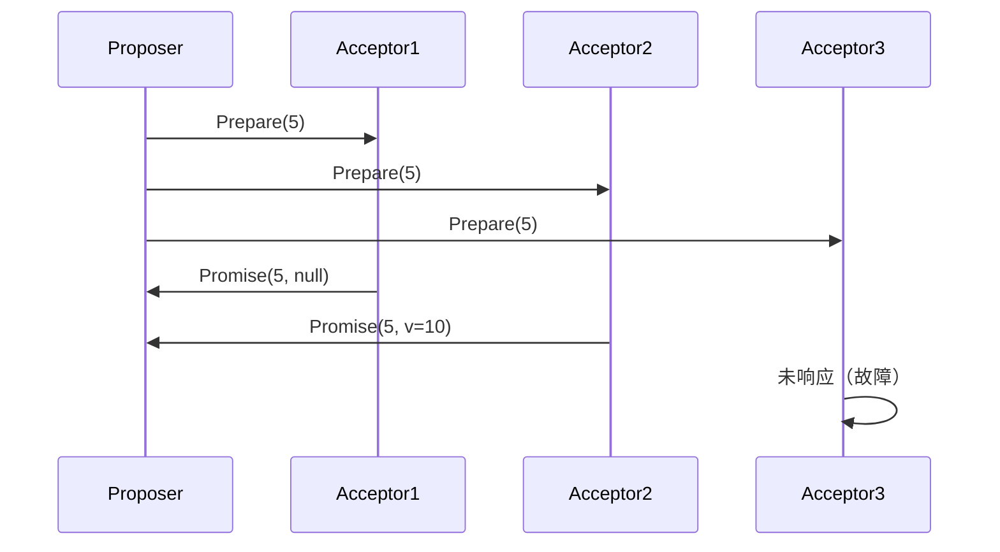
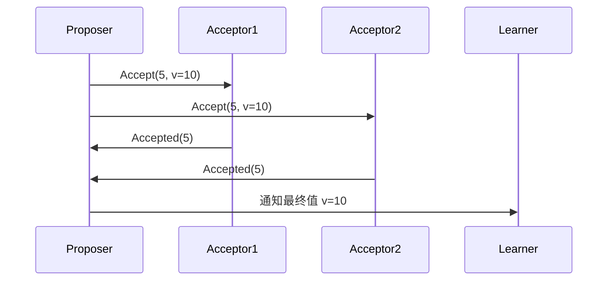
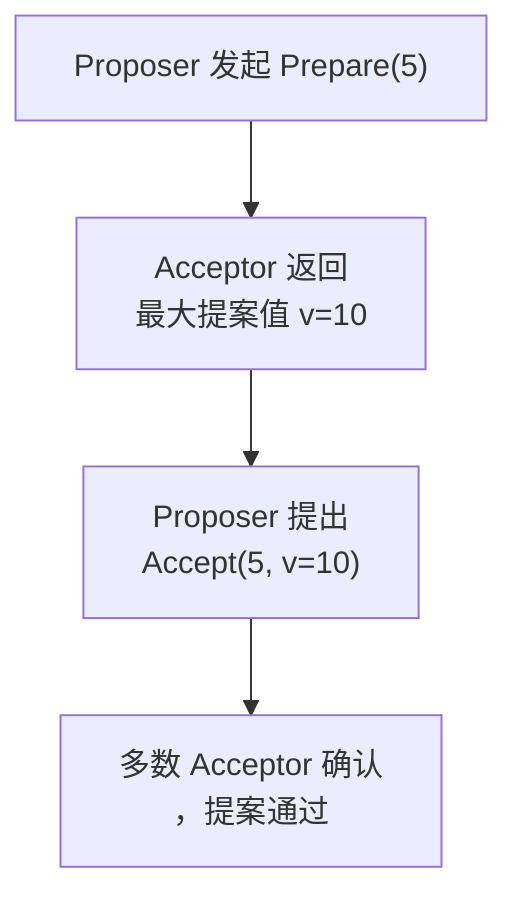

# 2. Paxos

***

# Paxos 算法深度解析（面试必备）

***

## 1. Paxos 算法概述 &#x20;

### 1.1 定义与目标 &#x20;

**Paxos** 是由 Leslie Lamport 提出的 **分布式一致性算法**，旨在解决 **分布式系统中节点如何就某个值达成一致** 的问题。其核心目标是： &#x20;

- **安全性**：确保所有节点最终达成一致的值。 &#x20;
- **容错性**：容忍节点故障（如失败终止）。 &#x20;
- **灵活性**：支持动态节点加入和退出。 &#x20;

### 1.2 核心应用场景 &#x20;

- **分布式数据库**（如 MySQL Cluster）。 &#x20;
- **共识机制**（如 Raft 的早期替代方案）。 &#x20;
- **配置管理**（如 ZooKeeper 的底层实现）。 &#x20;

***

## 2. 核心角色与流程 &#x20;

### 2.1 三个角色 &#x20;

| 角色            | 职责                          |
| ------------- | --------------------------- |
| **Proposer**​ | 提出提案（如“设置值为 X”），并协调其他节点投票。  |
| **Acceptor**​ | 接收提案并投票，确保最终一致性。            |
| **Learner**​  | 学习最终达成一致的值（非必须，但用于通知客户端结果）。 |

### 2.2 两个阶段 &#x20;

#### **阶段 1：准备阶段（Prepare）** &#x20;

1. **Proposer 发起请求**： &#x20;
   - 向 **多数 Acceptor** 发送 `Prepare(n)` 消息，其中 `n` 是提案编号（需递增）。 &#x20;
2. **Acceptor 响应**： &#x20;
   - 若同意参与：承诺不再接受编号小于 `n` 的提案，并返回之前承诺过的最大提案（`<n, v>`）。 &#x20;
   - 若拒绝：返回更高编号的提案（若已存在）。 &#x20;




#### **阶段 2：接受阶段（Accept）** &#x20;

1. **Proposer 提出提案**： &#x20;
   - 根据 Acceptor 返回的最大值 `v`，提出新提案 `Accept(n, v')`。 &#x20;
   - **规则**：若 Acceptor 返回的 `v` 不一致，必须选择其中最大的 `v`。 &#x20;
2. **Acceptor 接受提案**： &#x20;
   - 若提案编号 `n` ≥ 承诺过的最大编号 → 接受并返回确认。 &#x20;




***

## 3. 关键规则与一致性保障 &#x20;

### 3.1 三大安全规则 &#x20;

1. **单一值规则**： &#x20;
   - 如果一个提案被通过，那么所有后续提案的值必须与它一致。 &#x20;
2. **接受规则**： &#x20;
   - Acceptor 只接受编号大于已承诺提案的提案。 &#x20;
3. **提案值规则**： &#x20;
   - Proposer 提出的提案值必须是 Acceptor 返回的最大值（若存在）。 &#x20;

### 3.2 多提案竞争场景 &#x20;

- **冲突示例**： &#x20;
  - Proposer A 提出 `n=5, v=10`，Proposer B 提出 `n=6, v=20`。 &#x20;
  - 若 Acceptor 先承诺 `n=5`，但随后收到更高编号的 `n=6` → 最终通过 `v=20`。 &#x20;
- **解决方式**： &#x20;
  - 通过提案编号递增确保最终一致性。 &#x20;

***

## 4. 典型场景与流程 &#x20;

### 4.1 约聚餐案例（来自知识库\[3]） &#x20;

1. **场景**：A、B、C 三人约时间，需达成一致。 &#x20;
2. **流程**： &#x20;
   - A 提出 `v=白天7点`，发送给 B、C。 &#x20;
   - B 回复 `Promise`，但 C 未响应（故障）。 &#x20;
   - A 收到 B 的投票（多数通过），提交 `v=白天7点`。 &#x20;
   - 后续 C 恢复后，必须接受已通过的提案。 &#x20;

### 4.2 春运抢票系统（来自知识库\[8]） &#x20;

- **问题**：3台服务器卖票，需保证同一张票不被重复卖出。 &#x20;
- **Paxos 实现**： &#x20;
  1. Proposer（服务器1）发起 `Prepare(1.1)`。 &#x20;
  2. Acceptor（服务器2、3）返回无历史提案 → Proposer 提出 `Accept(1.1, 卖出)`。 &#x20;
  3. 多数 Acceptor 确认后，票被卖出。 &#x20;

***

## 5. Paxos 与 Raft 的对比 &#x20;

| 维度        | Paxos                           | Raft                            |
| --------- | ------------------------------- | ------------------------------- |
| **复杂度**​  | 高，涉及多阶段和规则约束                    | 低，分阶段设计（选举、日志同步）                |
| **网络模型**​ | 容忍消息延迟，但需最终传递                   | 依赖心跳和超时机制，同步模型                  |
| **角色**​   | Proposer/Acceptor/Learner（动态角色） | Leader/Follower/Candidate（固定角色） |
| **容错性**​  | 可容忍 ≤ N/2 节点故障（N为总节点数）          | 可容忍 ≤ N/2 节点故障                  |
| **实现难度**​ | 被称为“最复杂的分布式算法之一”                | 易理解，适合工程实现                      |

***

## 6. 面试高频问题与解答 &#x20;

### 问题 1：Paxos 的核心流程是怎样的？ &#x20;

**回答**： &#x20;

Paxos 通过 **两阶段协议** 达成共识： &#x20;

1. **准备阶段（Prepare）**： &#x20;
   - Proposer 发送 `Prepare(n)`，Acceptor 返回之前承诺的最大提案。 &#x20;
2. **接受阶段（Accept）**： &#x20;
   - Proposer 根据返回值提出新提案 `Accept(n, v)`，Acceptor 接受后提交。 &#x20;

**示例**： &#x20;




***

### 问题 2：Paxos 如何解决多个提案冲突？ &#x20;

**回答**： &#x20;

通过 **提案编号递增规则**： &#x20;

- 若 Proposer A 的 `n=5` 与 Proposer B 的 `n=6` 同时存在： &#x20;
  1. Acceptor 优先承诺 `n=6`。 &#x20;
  2. Proposer B 必须选择 Acceptor 返回的最大值（如 `v=10`）作为提案值。 &#x20;
- **关键**：最终通过的提案编号最高，且值需与历史提案一致。 &#x20;

***

### 问题 3：为什么 Paxos 被认为复杂？ &#x20;

**回答**： &#x20;

1. **多角色动态切换**：节点可同时是 Proposer、Acceptor 或 Learner。 &#x20;
2. **无 Leader 角色**：需通过多轮协商，导致流程复杂。 &#x20;
3. **安全规则抽象**：三大规则需严格遵守，否则可能导致脑裂。 &#x20;

***

### 问题 4：Paxos 的容错能力如何？ &#x20;

**回答**： &#x20;

- **节点故障容忍**：最多容忍 **N/2 节点故障**（N为总节点数）。 &#x20;
- **网络分区**：若分区后两部分均未达到多数，无法达成共识。 &#x20;

***

### 问题 5：Paxos 在实际中的变种（如 Multi-Paxos）？ &#x20;

**回答**： &#x20;

- **Multi-Paxos**： &#x20;
  - 选举一个长期 Leader，负责后续所有提案。 &#x20;
  - 减少通信开销，适用于连续决策场景（如日志复制）。 &#x20;
- **优点**： &#x20;
  ```mermaid 
  sequenceDiagram
      Leader->>Acceptor: 并行发送多个提案（如日志条目1、2、3）
      Acceptor->>Leader: 确认后批量提交
  ```


***

## 7. 总结 &#x20;

Paxos 是分布式系统中 **强一致性** 的基石，其核心是通过 **两阶段协议** 和 **提案编号规则** 确保最终一致性。尽管复杂度较高，但理解其角色、流程和规则是应对分布式系统面试的关键。结合实际案例（如春运抢票）和对比 Raft 的设计差异，可以更清晰地掌握其核心思想与应用场景。
