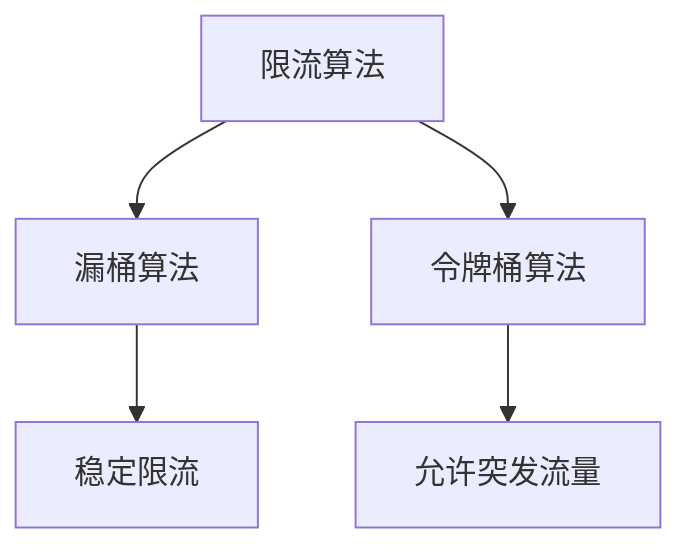
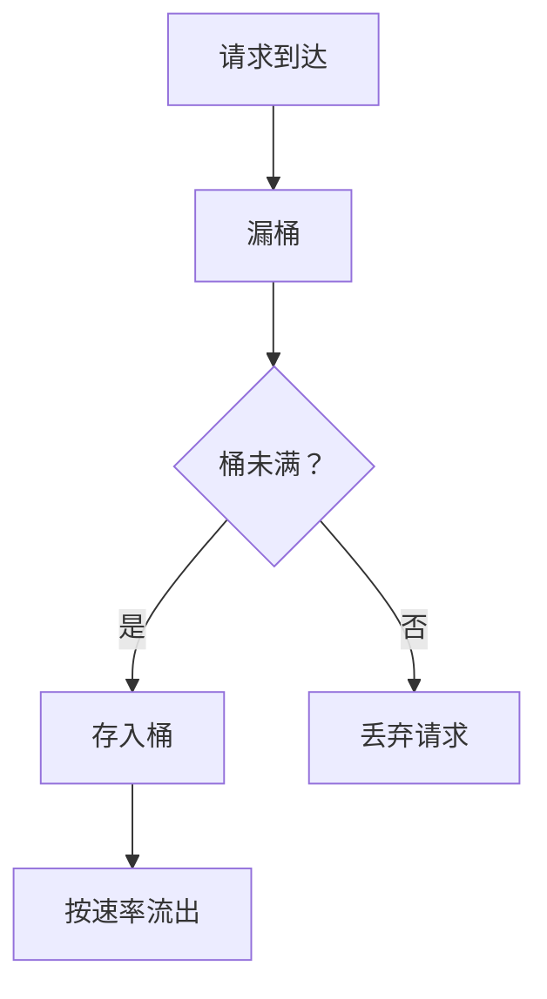
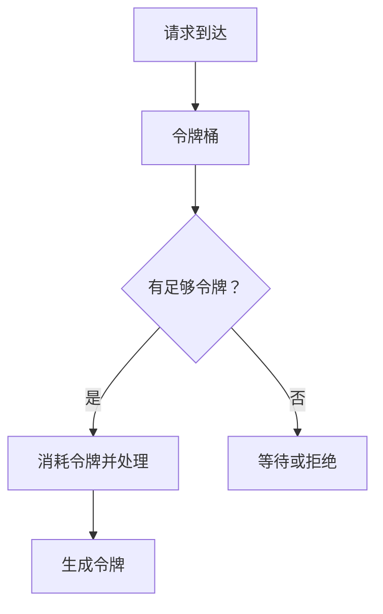
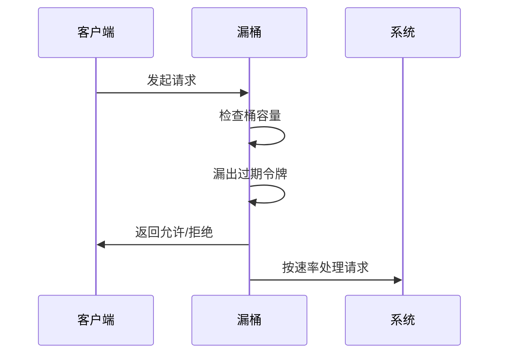
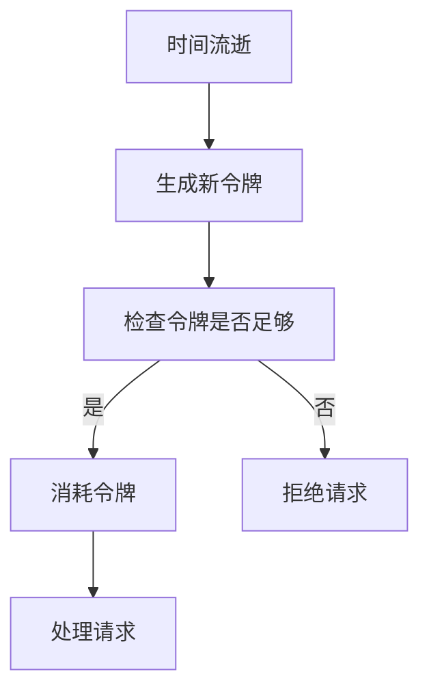

# 1. 限流

***

# Java面试八股——微服务限流算法（Nginx漏桶算法 & 网关令牌桶算法）

***

## 1. 概述与定义

**限流** 是微服务系统中保障高可用的核心手段，通过控制请求速率防止系统过载。常见的限流算法包括 **漏桶算法（Leaky Bucket）** 和 **令牌桶算法（Token Bucket）**。

- **漏桶算法**：请求像水一样流入漏桶，以固定速率流出，桶满则丢弃请求。 &#x20;
- **令牌桶算法**：令牌以固定速率生成，请求需获取令牌才能通过，支持突发流量。




***

## 2. 主要特点对比表

| **特性**​    | **漏桶算法**​              | **令牌桶算法**​             |
| ---------- | ---------------------- | ---------------------- |
| **流量处理**​  | 请求按固定速率流出，平滑流量。        | 允许突发流量，令牌积累后可批量处理请求。   |
| **突发流量**​  | 直接丢弃超出速率的请求。           | 可处理突发流量（通过令牌桶容量）。      |
| **实现复杂度**​ | 简单，适合固定速率场景。           | 稍复杂，需管理令牌生成和消耗。        |
| **适用场景**​  | 网关入口层（如Nginx）、数据库写入限流。 | API网关、秒杀活动等需处理突发流量的场景。 |

***

## 3. 应用目标

### 3.1 典型应用场景

| **场景**​         | **算法选择**​ | **示例**​                 |
| --------------- | --------- | ----------------------- |
| **Nginx入口层限流**​ | 漏桶算法      | 限制单IP每秒10次请求，超出丢弃。      |
| **API网关限流**​    | 令牌桶算法     | 允许每秒100次请求，突发10次请求立即处理。 |
| **数据库写入保护**​    | 漏桶算法      | 限制每秒最多100条写入，避免数据库崩溃。   |

***

## 4. 主要内容及其组成部分

***

### 4.1 漏桶算法核心组件

#### **4.1.1 算法结构**




#### **4.1.2 核心参数**

- **容量（Capacity）**：漏桶的最大存储量。 &#x20;
- **漏速（Leak Rate）**：每秒流出的请求数。 &#x20;

#### **4.1.3 实现示例（Java）**

```java 
public class LeakyBucket {
    private final long capacity; // 桶容量
    private final long leakRate; // 漏速（单位：请求数/秒）
    private long currentWater; // 当前水量
    private long lastTime; // 上次处理时间

    public LeakyBucket(long capacity, long leakRate) {
        this.capacity = capacity;
        this.leakRate = leakRate;
        this.currentWater = 0;
        this.lastTime = System.currentTimeMillis();
    }

    public synchronized boolean allowRequest(int incomingWater) {
        long now = System.currentTimeMillis();
        long timeElapsed = now - lastTime;
        // 计算漏出的水量
        long leaked = (timeElapsed * leakRate) / 1000;
        currentWater = Math.max(0, currentWater - leaked);
        lastTime = now;

        // 检查是否允许请求
        if (currentWater + incomingWater <= capacity) {
            currentWater += incomingWater;
            return true;
        }
        return false;
    }
}
```


***

### 4.2 令牌桶算法核心组件

#### **4.2.1 算法结构**




#### **4.2.2 核心参数**

- **容量（Capacity）**：令牌桶的最大存储量。 &#x20;
- **生成速率（Token Rate）**：每秒生成的令牌数。 &#x20;
- **突发流量（Burst）**：允许的突发请求数。 &#x20;

#### **4.2.3 实现示例（Java）**

```java 
public class TokenBucket {
    private final long capacity; // 桶容量
    private final long refillRate; // 生成速率（单位：令牌/秒）
    private long currentTokens; // 当前令牌数
    private long lastRefillTime; // 上次生成时间

    public TokenBucket(long capacity, long refillRate) {
        this.capacity = capacity;
        this.refillRate = refillRate;
        this.currentTokens = capacity; // 初始化为满桶
        this.lastRefillTime = System.currentTimeMillis();
    }

    public synchronized boolean allowRequest(int tokensRequired) {
        long now = System.currentTimeMillis();
        // 计算新增的令牌数
        long timeElapsed = now - lastRefillTime;
        long tokensToAdd = (timeElapsed * refillRate) / 1000;
        currentTokens = Math.min(currentTokens + tokensToAdd, capacity);
        lastRefillTime = now;

        // 检查是否足够令牌
        if (currentTokens >= tokensRequired) {
            currentTokens -= tokensRequired;
            return true;
        }
        return false;
    }
}
```


***

### 4.3 Nginx漏桶算法配置

#### **4.3.1 配置示例**

```nginx 
# 定义限流维度（基于IP，10MB内存存储状态）
limit_req_zone $binary_remote_addr zone=one:10m rate=10r/s;

server {
    location /api/ {
        # 绑定限流配置
        limit_req zone=one burst=5 nodelay;
        proxy_pass http://backend;
    }
}
```


- **参数说明**： &#x20;
  - `rate=10r/s`：每秒允许10个请求。 &#x20;
  - `burst=5`：允许突发5个请求。 &#x20;
  - `nodelay`：立即处理突发请求，而非排队。

***

## 5. 原理剖析

### 5.1 漏桶算法工作原理

#### **5.1.1 流程图**




#### **5.1.2 关键步骤**

1. **漏出计算**：根据时间差计算漏出的水量。 &#x20;
2. **容量检查**：新请求是否超出容量。 &#x20;
3. **处理请求**：允许请求后更新水量。

***

### 5.2 令牌桶算法工作原理

#### **5.2.1 流程图**




#### **5.2.2 关键步骤**

1. **令牌生成**：按速率累加令牌（即使未使用）。 &#x20;
2. **令牌消耗**：请求需消耗令牌才能通过。 &#x20;
3. **突发处理**：利用桶内已生成的令牌处理突发请求。

***

### 5.3 Nginx限流实现

#### **5.3.1 源码逻辑伪代码**

```java 
class NginxLeakyBucket {
    long rate; // 速率（如10r/s）
    long burst; // 突发容量
    long lastProcessTime; // 上次处理时间
    long currentRequests; // 当前请求数

    boolean allowRequest() {
        long now = currentTimeMillis();
        // 计算可处理的请求数
        long processed = (now - lastProcessTime) * rate;
        currentRequests = Math.max(0, currentRequests - processed);
        lastProcessTime = now;

        // 突发处理
        if (currentRequests + 1 <= burst) {
            currentRequests++;
            return true;
        }
        return false;
    }
}
```


***

## 6. 应用与拓展

### 6.1 Nginx配置实战

#### **6.1.1 防止DDoS攻击**

```nginx 
# 限制单IP每秒10次请求，突发5次
limit_req_zone $binary_remote_addr zone=anti_ddos:10m rate=10r/s;
server {
    location / {
        limit_req zone=anti_ddos burst=5;
    }
}
```


#### **6.1.2 秒杀活动限流**

```nginx 
# 允许每秒1000次请求，突发100次
limit_req_zone $request_uri zone=seckill:10m rate=1000r/s;
location /seckill {
    limit_req zone=seckill burst=100 nodelay;
}
```


***

### 6.2 网关令牌桶集成

#### **6.2.1 Spring Cloud Gateway示例**

```java 
@Configuration
public class GatewayConfig {
    @Bean
    public RouteLocator customRouteLocator(RouteLocatorBuilder builder) {
        return builder.routes()
            .route("api_route", r -> r.path("/api/**")
                .filters(f -> f.requestRateLimiter(config -> 
                    config.setRate(100, Duration.ofSeconds(1)) // 每秒100次
                        .setBurstCapacity(50) // 突发50次
                ))
                .uri("lb://SERVICE"))
            .build();
    }
}
```


***

## 7. 面试问答

### 问题1：漏桶算法和令牌桶算法的核心区别？

**回答**： &#x20;

核心区别如下： &#x20;

1. **流量处理方式**： &#x20;
   - **漏桶**：请求按固定速率流出，平滑流量。 &#x20;
   - **令牌桶**：允许突发流量，令牌积累后可批量处理。 &#x20;
2. **突发流量处理**： &#x20;
   - **漏桶**：直接丢弃超出速率的请求。 &#x20;
   - **令牌桶**：通过 `burst` 参数允许突发流量。 &#x20;

- **示例**： &#x20;
  ```nginx 
  # 漏桶配置（Nginx）
  limit_req zone=one burst=5 nodelay;

  # 令牌桶配置（Spring Gateway）
  .setBurstCapacity(50)
  ```


***

### 问题2：如何实现Nginx的漏桶限流？

**回答**： &#x20;

步骤如下： &#x20;

1. **定义限流维度**： &#x20;
   ```nginx 
   limit_req_zone $binary_remote_addr zone=one:10m rate=10r/s;
   ```

2. **绑定配置到路由**： &#x20;
   ```nginx 
   location /api {
       limit_req zone=one burst=5 nodelay;
   }
   ```

3. **参数说明**： &#x20;
   - `rate`：每秒允许的请求数。 &#x20;
   - `burst`：允许的突发请求数。 &#x20;
   - `nodelay`：立即处理突发请求，而非排队。

***

### 问题3：令牌桶算法如何应对突发流量？

**回答**： &#x20;

通过 **burst 参数** 实现： &#x20;

- **原理**：令牌桶预先生成令牌，突发请求可立即消耗令牌。 &#x20;
- **示例代码**： &#x20;
  ```java 
  // 允许每秒100令牌，突发50令牌
  TokenBucket bucket = new TokenBucket(50, 100);
  if (bucket.allowRequest(1)) {
      // 处理请求
  }
  ```

- **效果**：即使短时间内请求激增，系统也能处理 `burst + rate` 的请求。

***

### 问题4：漏桶算法的缺点？

**回答**： &#x20;

主要缺点： &#x20;

1. **无法处理突发流量**：所有超出速率的请求直接被丢弃。 &#x20;
2. **流量平滑过度**：可能导致请求排队延迟。 &#x20;

- **对比场景**： &#x20;
  - **漏桶**：1秒10个请求，第1秒收到20个请求，前10个通过，后10个丢弃。 &#x20;
  - **令牌桶**：允许突发10个请求，20个请求全部通过（若 `burst=10`）。

***

### 问题5：如何选择漏桶和令牌桶？

**回答**： &#x20;

根据场景选择： &#x20;

1. **选漏桶**： &#x20;
   - 需强制限制实时流量（如数据库写入）。 &#x20;
   - 不允许任何突发请求。 &#x20;
2. **选令牌桶**： &#x20;
   - 允许短暂突发流量（如秒杀活动）。 &#x20;
   - 需处理突发请求但限制平均速率。 &#x20;

- **配置示例**： &#x20;
  ```nginx 
  # 漏桶（严格限流）
  limit_req zone=strict:10m rate=5r/s;

  # 令牌桶（允许突发）
  limit_req zone=flexible:10m rate=5r/s burst=10;
  ```


***

## 结语

限流算法是微服务架构中保障系统稳定的核心手段，面试中需重点掌握 **漏桶与令牌桶的实现原理、配置方法、适用场景**。理解 Nginx 的漏桶配置（如 `limit_req`）、网关的令牌桶集成（如 Spring Cloud Gateway），并能结合实际业务场景（如防刷、秒杀）说明选择依据，是应对复杂问题的关键。
