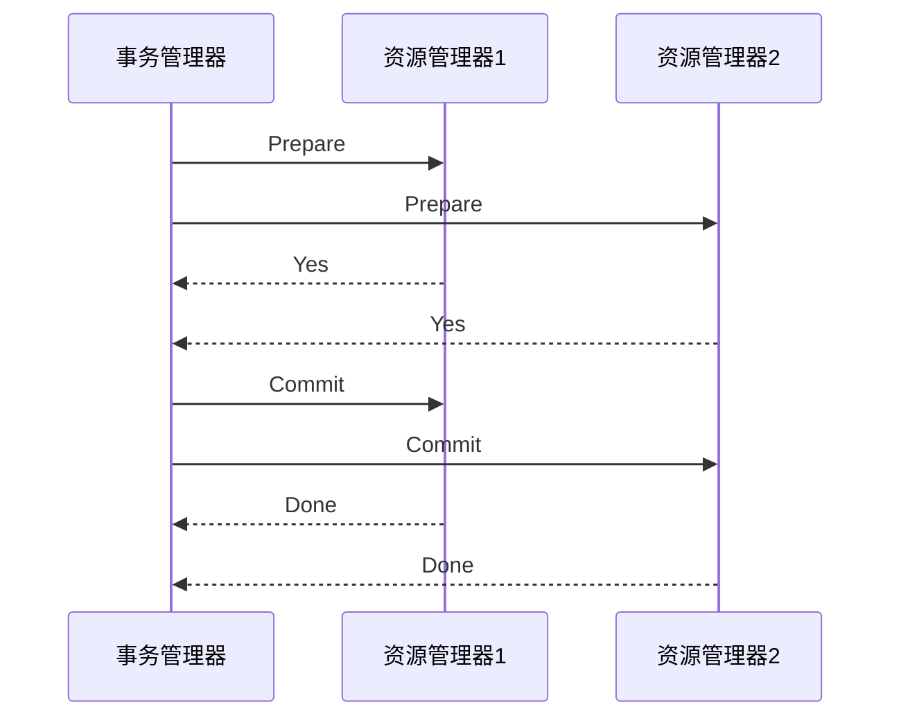
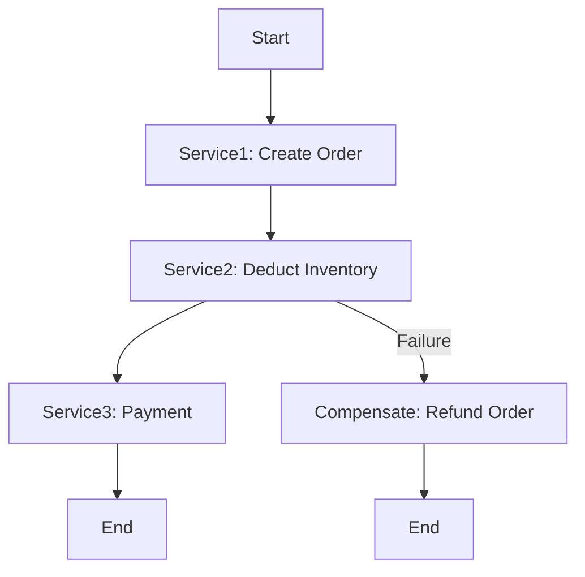

# 2. 分布式事务

# 分布式事务：Java面试八股文详解

***

## 1. 概述与定义

分布式事务是指在分布式系统中，跨越多个服务或数据源的事务处理机制。在微服务架构中，每个服务通常拥有独立的数据库，传统的本地事务无法满足跨服务的数据一致性需求，因此分布式事务应运而生。它的核心目标是确保多个独立服务或数据库之间的一系列操作要么全部成功提交，要么全部回滚，以维护数据一致性和完整性。

### 定义

分布式事务是一种事务处理机制，用于在分布式环境中协调多个参与者（服务或数据库）之间的事务操作，确保数据一致性。在面试中，你可以这样回答：“分布式事务是微服务架构中用于协调多个服务或数据库之间事务操作的机制，确保数据一致性，比如在电商系统中，下单时要同时扣减库存和创建订单，分布式事务能保证这两个操作要么都成功，要么都失败。”这个定义简洁明了，突出核心功能，同时结合场景，能快速抓住面试官的注意力。

### 背景与定位

随着微服务架构的普及，单体应用被拆分为多个独立的服务，每个服务拥有自己的数据库。这种拆分提升了系统的灵活性和可扩展性，但也带来了数据一致性的挑战。分布式事务正是为此设计的解决方案。常见的实现方式包括两阶段提交（2PC）、三阶段提交（3PC）、TCC（Try-Confirm-Cancel）、Saga等，这些方案各有特点，适用于不同场景。分布式事务不仅限于微服务，还广泛应用于分布式数据库、云计算等领域，但在微服务中尤为突出。

***

## 2. 主要特点

分布式事务的核心价值体现在其特性上，以下是其主要特点，面试时可以逐一展开并结合场景说明：

- **跨服务协调** 🌐 &#x20;

  分布式事务能够在多个独立的服务或数据库之间协调事务操作，确保数据一致性。例如，在电商系统中，下单操作涉及订单服务和库存服务，分布式事务保证两者一致。
- **高可用性** 🚀 &#x20;

  通过容错机制和补偿操作，即使部分服务故障，事务也能正常处理或回滚，提升系统可靠性。
- **灵活性** ✨ &#x20;

  支持多种事务模型，如刚性事务（2PC、3PC）和柔性事务（TCC、Saga），可根据业务需求选择合适的方案。
- **复杂性** 🧩 &#x20;

  实现和维护成本较高，需要处理网络延迟、并发冲突、死锁等问题，开发难度较大。
- **性能开销** ⚡ &#x20;

  由于涉及多服务通信和协调，分布式事务的性能开销较大，尤其在高并发场景下可能成为瓶颈。

### 面试Tips

提到“跨服务协调”时，可以举例：“在电商下单场景中，订单服务创建订单，库存服务扣减库存，分布式事务确保两者要么都成功，要么都失败，避免库存超卖。”这样的场景化描述能体现实战经验。对于“性能开销”，需客观陈述其缺点，并补充优化方案，如“可以通过异步补偿或柔性事务减轻性能压力”，展现你的全面思考能力。

***

## 3. 应用目标

分布式事务的设计目标是解决微服务架构中的数据一致性问题，其主要应用目标包括：

- **确保数据一致性** &#x20;

  在多个服务或数据库之间执行事务操作时，保证数据的一致性和完整性，避免部分成功部分失败的情况。
- **支持业务原子性** &#x20;

  实现跨服务的业务原子性操作，确保一系列操作要么全部成功，要么全部失败。
- **提高系统可靠性** &#x20;

  通过补偿机制和容错设计，即使面对网络故障或服务宕机，也能保证事务的正确处理。
- **适应高并发场景** &#x20;

  在高并发环境下，通过柔性事务模型（如TCC、Saga），减少锁冲突和性能瓶颈，提升吞吐量。
- **简化开发复杂度** &#x20;

  提供统一的分布式事务框架（如Seata），降低开发和维护成本，让开发者专注于业务逻辑。

在面试中，可以总结为：“分布式事务的目标是在微服务架构中，确保跨服务的数据一致性和业务原子性，同时提升系统可靠性和性能，简化开发。”这个回答简洁全面，能快速传递核心信息。需要注意的是，“简化开发复杂度”虽非主要目标，但在实际应用中，好的框架能显著降低开发难度，值得一提。

***

## 4. 主要内容及其组成部分

分布式事务是一个复杂的系统，由多种模型和框架组成，下面逐一详细解释其内容，并结合代码示例和图表说明。

### 4.1 两阶段提交（2PC）

两阶段提交是一种刚性事务模型，分为准备（Prepare）和提交（Commit）两个阶段，通过事务管理器（TM）和资源管理器（RM）协作，确保事务一致性。

- **准备阶段**：TM询问所有RM是否准备好提交，RM执行本地事务并锁定资源，返回Yes或No。
- **提交阶段**：若所有RM返回Yes，TM发送Commit指令；若有任一No，则发送Rollback指令。

#### 示例：2PC流程




**图表说明**：此序列图展示了2PC的成功提交流程，TM协调RM完成事务。面试时可以用此图直观解释2PC的原理。

### 4.2 三阶段提交（3PC）

三阶段提交是对2PC的改进，增加了预提交（PreCommit）阶段，减少协调者故障导致的阻塞问题。

- **CanCommit**：TM询问RM是否可以提交。
- **PreCommit**：若所有RM同意，TM发送预提交指令，RM准备提交。
- **DoCommit**：TM发送提交指令，RM执行提交。

#### 与2PC的区别

3PC通过引入超时机制和预提交阶段，降低了阻塞风险，但实现更复杂，实际应用较少。

### 4.3 TCC（Try-Confirm-Cancel）

TCC是一种柔性事务模型，分为Try、Confirm和Cancel三个阶段，适用于高并发和复杂业务场景。

- **Try**：尝试执行业务操作，预留资源（如冻结库存）。
- **Confirm**：确认执行，提交业务操作（如扣减库存）。
- **Cancel**：取消执行，回滚业务操作（如解冻库存）。

#### 示例：TCC实现

```java 
public interface OrderService {
    // Try阶段：预留资源
    boolean tryCreateOrder(Order order);
    // Confirm阶段：确认提交
    boolean confirmCreateOrder(Order order);
    // Cancel阶段：取消操作
    boolean cancelCreateOrder(Order order);
}
```


**代码说明**：此接口定义了TCC的三个阶段，面试时可以用来说明TCC的业务侵入性和实现方式。

### 4.4 Saga

Saga是一种长事务模型，通过一系列本地事务和补偿操作实现最终一致性，适用于业务流程长、并发要求高的场景。

- **正向操作**：按顺序执行一系列本地事务。
- **补偿操作**：若某步失败，执行之前的补偿操作。

#### 示例：Saga流程




**图表说明**：此流程图展示了Saga的正向和补偿流程，面试时可用于解释Saga的最终一致性机制。

### 4.5 分布式事务框架

常见的分布式事务框架包括：

- **Seata**：阿里巴巴开源，支持AT（自动事务）、TCC、Saga等多种模式。
- **Atomikos**：支持XA协议的分布式事务管理器，适用于数据库事务。
- **Bitronix**：轻量级XA事务管理器，性能较优。

#### 组件对比表格

| 框架       | 支持模式        | 优点       | 缺点    |
| -------- | ----------- | -------- | ----- |
| Seata    | AT、TCC、Saga | 功能全面、易集成 | 学习成本高 |
| Atomikos | XA          | 成熟稳定     | 性能开销大 |
| Bitronix | XA          | 轻量级      | 功能有限  |

**表格说明**：此表格对比了主流分布式事务框架的特性，Seata功能最丰富，Atomikos和Bitronix更适合XA场景。面试时可用此表格回答“分布式事务框架有哪些？”的问题。

### 4.6 XA协议

XA是X/Open组织提出的分布式事务规范，支持2PC，常用于数据库层面的分布式事务。虽然不属于独立模型，但在框架如Atomikos中广泛使用，需了解。

#### 示例：XA事务

```java 
XADataSource xaDataSource = new XADataSource();
XAConnection xaConnection = xaDataSource.getXAConnection();
XAResource xaResource = xaConnection.getXAResource();
xaResource.start(xid, XAResource.TMNOFLAGS);
// 执行SQL
xaResource.end(xid, XAResource.TMSUCCESS);
xaResource.prepare(xid);
xaResource.commit(xid, false);
```


**代码说明**：此代码展示了XA事务的基本流程，面试时可用于说明XA的实现细节。

***

## 5. 原理剖析

分布式事务的实现原理涉及协调机制、锁管理、补偿机制等，下面深入解析主要模型的原理。

### 5.1 两阶段提交（2PC）原理

2PC通过TM和RM的协作，确保事务的原子性。

- **准备阶段**：TM发送Prepare请求，RM执行本地事务并锁定资源，返回Yes或No。
- **提交阶段**：若所有RM返回Yes，TM发送Commit；否则，发送Rollback。

#### 问题分析

- **阻塞**：RM在准备阶段锁定资源，等待TM指令，可能导致长时间阻塞。
- **单点故障**：TM故障时，RM无法决策，可能永久阻塞。

### 5.2 三阶段提交（3PC）原理

3PC在2PC基础上增加PreCommit阶段，提升容错性。

- **CanCommit**：TM询问RM是否可提交。
- **PreCommit**：RM预提交，锁定资源但可超时回滚。
- **DoCommit**：TM确认提交。

#### 优势与局限

- **优势**：减少阻塞时间，支持超时回滚。
- **局限**：实现复杂，实际应用较少。

### 5.3 TCC原理

TCC通过业务层面的补偿机制实现最终一致性。

- **Try**：预留资源，如冻结库存。
- **Confirm**：确认操作，如扣减库存。
- **Cancel**：取消操作，如解冻库存。

#### 优点与挑战

- **优点**：无锁等待，高性能，适合高并发。
- **挑战**：业务侵入性强，需手动实现三个阶段，开发成本高。

### 5.4 Saga原理

Saga通过本地事务和补偿操作实现最终一致性。

- **正向流程**：按顺序执行本地事务，每步提交。
- **补偿流程**：若某步失败，执行之前的补偿操作。

#### 适用场景

- **长事务**：业务流程长，需分步执行。
- **最终一致性**：允许短暂不一致，适合高并发。

### 5.5 XA协议原理

XA规范定义了TM和RM之间的接口，支持2PC。数据库通过XAResource实现XA协议，TM协调事务提交或回滚。

#### 注意事项

XA依赖数据库支持，性能开销大，但在强一致性场景中有用。

***

## 6. 应用与拓展

分布式事务在实际项目中应用广泛：

- **电商系统**：下单、支付、扣库存等操作需一致性。
- **金融系统**：转账、支付、结算等场景要求原子性。
- **物流系统**：订单创建、库存更新、配送等流程需协调。

### 拓展方向

分布式事务可与其他技术结合：

- **消息队列**：通过MQ驱动补偿机制，实现最终一致性。
- **Spring Cloud**：集成Seata管理微服务事务。
- **Kubernetes**：在容器化环境中部署分布式事务框架。

***

## 7. 面试问答

以下是五个常见面试问题及详细回答，模仿面试者口吻，确保自然且详实。

### 问题 1：什么是分布式事务？

**回答**： &#x20;

“分布式事务就是在分布式系统中，跨越多个服务或数据库的事务处理，确保数据一致性。比如在微服务里，下单操作要同时创建订单和扣减库存，这两个操作在不同服务里，分布式事务能保证要么都成功，要么都失败，避免数据不一致。简单来说，它就是微服务里解决跨服务事务问题的机制。”

### 问题 2：分布式事务有哪些常见的解决方案？

**回答**： &#x20;

“分布式事务的常见方案有2PC、3PC、TCC和Saga。2PC是两阶段提交，适合强一致性场景，但性能差，容易阻塞；3PC是2PC的改进，增加了预提交阶段，但用得少；TCC是业务补偿模型，适合高并发，像电商下单可以用；Saga是长事务模型，通过补偿实现最终一致性，适合流程长的业务。我在项目里用过Seata的AT模式，自动管理事务，挺方便的。”

### 问题 3：2PC有什么优缺点？

**回答**： &#x20;

“2PC的优点是实现简单，能保证强一致性，通过准备和提交两阶段协调所有参与者。缺点是性能差，准备阶段锁资源容易阻塞，而且协调者是单点故障，一旦挂了参与者就卡住。我在项目里用过XA事务，确实能保证一致性，但高并发时锁冲突严重，后来改用TCC优化了性能。”

### 问题 4：TCC和Saga有什么区别？

**回答**： &#x20;

“TCC和Saga都是柔性事务，但区别挺大。TCC是基于业务补偿，分Try、Confirm、Cancel三个阶段，适合短事务和高并发，比如下单扣库存；Saga是长事务模型，通过一系列本地事务和补偿操作实现最终一致性，适合业务流程长的场景，像订单支付配送全流程。TCC开发成本高，业务侵入性强，Saga更灵活。我在电商项目里用过TCC，下单和扣库存用Try-Confirm-Cancel，效果不错。”

### 问题 5：如何选择分布式事务方案？

**回答**： &#x20;

“选择分布式事务方案得看业务场景。如果要求强一致性，比如金融转账，我会用2PC或XA；如果高并发，像电商秒杀，就选TCC，性能好；如果业务流程长，比如物流配送，用Saga更合适，最终一致性够用。我在项目里一般先试Seata的AT模式，自动管理事务简单，实在不行再根据场景用TCC或Saga，挺灵活的。”

***

## 总结

这篇八股文从分布式事务的定义到原理、应用，再到面试问答，覆盖了所有核心知识点。通过代码、表格和Mermaid图表，内容直观易懂，背熟后能在面试中自信应对问题，展现专业能力！无论你是准备面试还是深入学习分布式事务，这篇文章都能帮你打好基础，轻松上分！✨

[a. CAP](<a. CAP/a. CAP.md> "a. CAP")

[b. BASE](<b. BASE/b. BASE.md> "b. BASE")

[c. Seata](<c. Seata/c. Seata.md> "c. Seata")
