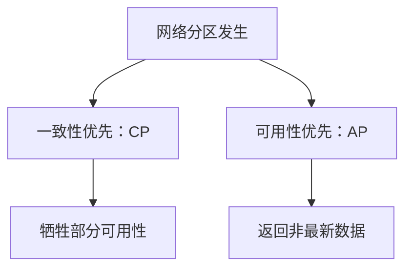

# a. CAP

# 1. 概述与定义

在分布式系统和微服务架构中，分布式事务始终是一个复杂而关键的问题。由于系统由多个独立节点组成，数据一致性、系统可用性与网络分区容错性之间往往存在内在的矛盾。CAP 定理（又称布鲁尔定理）正是在这种背景下提出的，它揭示了在一个分布式系统中，不可能同时完美地满足以下三个基本要求：

- **一致性（Consistency）**：所有节点在同一时刻看到的数据是一致的，即写操作完成后，所有用户看到的都是最新数据。
- **可用性（Availability）**：每个请求都会在有限时间内获得响应，无论该响应是否包含最新的数据。
- **分区容错性（Partition Tolerance）**：即使系统发生网络分区（即节点之间的通信中断），系统依然能够正常运行。

CAP 定理由 Eric Brewer 首次提出，其核心思想是：在面临网络分区的情况下，一个分布式系统只能在一致性与可用性之间做出权衡。换句话说，当网络故障不可避免时，系统设计者必须在保证数据一致性和系统高可用性之间作出取舍。🎯

这种理论为微服务架构下的分布式事务提供了重要指导，帮助我们理解为什么在实际设计中往往需要采用“最终一致性”、“补偿事务”等策略来应对分布式系统的局限性。

# 2. 主要特点

CAP 定理具有以下几个主要特点：

1. **互斥性** &#x20;

   当系统出现网络分区时，不可能同时保证一致性和可用性。必须在两者中选择其一，这决定了系统的设计方向。
2. **网络分区是必然现象** &#x20;

   在分布式系统中，网络故障、延迟甚至中断都是常态，因此分区容错性是不可或缺的属性。
3. **最终一致性思路** &#x20;

   为了兼顾业务需求，很多分布式系统在设计上选择放宽一致性要求，采用最终一致性模型来实现高可用性。通过数据同步、补偿机制等手段，系统最终达到一致状态。
4. **权衡与折中** &#x20;

   CAP 定理要求开发者根据具体业务场景和系统需求，在一致性与可用性之间找到最佳平衡点。例如，金融类业务可能更倾向于保证数据一致性，而社交网络、搜索系统则更看重可用性。

下面的表格对 CAP 三个属性进行了直观对比，并说明了在网络分区情况下的权衡思路：

| 属性        | 定义描述                       | 网络分区情况下的权衡     |
| --------- | -------------------------- | -------------- |
| 一致性 (C)   | 系统中所有节点在同一时刻的数据都是一致的       | 可能牺牲可用性，等待数据同步 |
| 可用性 (A)   | 每个请求在有限时间内都会获得响应           | 可能返回旧数据或部分数据   |
| 分区容错性 (P) | 系统能在网络分区的情况下继续运行，即使节点间通信受阻 | 是分布式系统必须具备的特性  |

通过表格可以看出，在实际系统设计中，一旦出现网络分区，必须选择牺牲一致性或可用性，而分区容错性则是必须具备的能力。💡

# 3. 应用目标

CAP 定理在分布式事务设计中的应用目标主要有以下几点：

1. **明确设计取舍** &#x20;

   在系统架构设计初期，开发者必须根据业务场景和要求决定是追求强一致性还是高可用性，从而合理配置事务处理机制。对于对数据一致性要求极高的业务（如金融、交易类系统），通常选择 CP（牺牲部分可用性以保证一致性）；而对于用户体验要求较高、可以接受数据延迟同步的业务（如社交网络、在线广告系统），则可能选择 AP 模型。
2. **指导架构选择** &#x20;

   CAP 定理为微服务、分布式数据库以及消息队列等系统的设计提供了理论依据。通过理解 CAP 定理，架构师可以在设计分布式事务时更好地预见系统在网络异常情况下的表现，并设计出应对网络分区的策略，如采用补偿事务、异步通信以及最终一致性方案。
3. **优化业务流程** &#x20;

   根据 CAP 定理，企业可以在系统设计中引入业务补偿机制，实现基于最终一致性的事务处理，从而在保证系统高可用性的同时，尽可能提升数据一致性。这样既满足了业务实时性要求，又为后续数据修正和一致性校正提供保障。
4. **降低系统故障风险** &#x20;

   通过对 CAP 定理的深入理解，开发团队可以提前识别系统中可能出现的故障风险，并在设计中预留容错和恢复机制，确保在出现网络故障时系统能够迅速恢复，降低因数据不一致而导致的业务风险。

# 4. 主要内容及其组成部分

在分布式事务中讨论 CAP 定理时，我们需要对以下三个组成部分进行详细解析：

## 4.1 一致性 (Consistency)

一致性要求所有节点在同一时刻看到的数据状态必须完全相同。在分布式事务中，一致性通常通过分布式锁、两阶段提交（2PC）、三阶段提交（3PC）等协议来实现。例如，在银行转账业务中，扣款和入账操作必须同时成功，否则需要回滚以确保账户余额的一致性。

**示例说明** &#x20;

假设有一个转账系统，涉及两个账户 A 和 B。为了保证转账过程中两个账户数据一致，可以采用两阶段提交协议。第一阶段所有参与节点准备执行操作，第二阶段确认所有节点成功后提交事务。如果某个节点出现故障，则所有操作回滚。

## 4.2 可用性 (Availability)

可用性要求每个请求在有限的时间内获得响应。在分布式系统中，为了提高系统可用性，往往采用冗余设计、多副本存储以及异步复制等策略。当网络分区或部分节点失效时，系统仍需保证业务请求能够及时得到处理，哪怕返回的数据不是最新的。

**示例说明** &#x20;

在社交网络系统中，用户的好友列表可能分布在多个节点上。当某个节点出现故障时，系统可以从其他副本中读取数据，保证用户请求得到响应，即使数据可能存在短暂的不一致情况。

## 4.3 分区容错性 (Partition Tolerance)

分区容错性指的是系统在面对网络分区、节点通信中断时，仍能继续提供服务。这是分布式系统的基本要求，因为网络延迟、链路故障等现象在实际应用中不可避免。为实现分区容错性，系统往往会设计数据冗余、故障转移以及自动恢复机制。

**示例说明** &#x20;

在一个跨地域的分布式数据库中，当某个数据中心与其他数据中心之间出现网络中断时，系统应允许本地数据中心继续响应请求，并在网络恢复后进行数据同步，从而确保整体系统仍保持高可用性。

下面使用 Mermaid 语法绘制一幅简单的分布式系统中 CAP 特性的关系图，展示在网络分区场景下如何进行权衡：

图中说明了在网络分区发生时，系统必须选择一致性优先（CP 模型）或可用性优先（AP 模型），不同的选择会带来不同的系统表现。

# 5. 原理剖析

深入理解 CAP 定理的理论基础，对于构建高效稳定的分布式事务系统具有重要意义。下面从理论来源、权衡机制以及实际应用三个角度进行详细剖析。

## 5.1 理论来源与发展

CAP 定理最早由 Eric Brewer 提出，并在随后的研究中得到证明。该定理表明，分布式系统在出现网络分区（Partition）时，无法同时满足强一致性（C）和高可用性（A）。在实际系统设计中，网络分区不可避免，因此必须在一致性和可用性之间做出权衡。

- **一致性（C）**：理论上要求所有写操作都在所有节点上即时生效，但这需要系统具备高度同步能力，往往会影响响应时间。
- **可用性（A）**：要求系统在任何情况下都能返回响应，为此往往允许节点返回旧数据或部分数据。
- **分区容错性（P）**：则要求在网络故障时，系统依然能够保证局部服务的正常运行。由于网络中断的不可预测性，P 成为了必须具备的特性。

这种理论为后续设计出一系列分布式事务处理协议提供了依据，同时也启示我们在实际应用中更多地考虑采用最终一致性而非强一致性。

## 5.2 权衡机制与取舍策略

CAP 定理的核心在于面对网络分区时的一种取舍问题，即：

- 如果选择 **CP 模型**：当网络分区发生时，为了保证数据一致性，系统会牺牲一部分可用性。此时某些请求可能被拒绝或延迟响应，直至网络恢复。
- 如果选择 **AP 模型**：系统会始终保持高可用性，即使在网络分区期间返回的数据可能不是最新状态，最终通过数据同步达到一致。

开发者在设计系统时通常会根据业务场景和用户需求来决定采用哪种模型。例如，在电商交易系统中，订单数据要求强一致性，因此通常采用 CP 模型；而在社交媒体系统中，用户动态信息允许短暂的不一致，因此可选择 AP 模型。

下表对比了 CP 与 AP 模型在分布式事务中的不同侧重点：

| 模型类型  | 侧重点   | 优点                    | 缺点                       |
| ----- | ----- | --------------------- | ------------------------ |
| CP 模型 | 数据一致性 | 保证数据同步一致，避免因数据冲突带来的问题 | 网络分区时可能出现请求超时或拒绝，影响用户体验  |
| AP 模型 | 高可用性  | 系统始终能够响应请求，保证服务连续性    | 数据可能存在延迟同步问题，需要后续进行一致性修正 |

## 5.3 实际应用中的理论实践

在实际应用中，CAP 定理的理论实践体现在以下几个方面：

- **最终一致性** &#x20;

  许多分布式系统放宽了严格一致性的要求，而采用最终一致性模型。数据在经过一段时间后达到一致状态，允许系统在高并发环境下仍能保持高可用性。
- **补偿事务** &#x20;

  当分布式事务因网络分区或其他异常而导致部分操作失败时，通过补偿事务机制，系统可以在后续进行数据修正，确保整体业务逻辑正确执行。
- **异步通信与消息队列** &#x20;

  为了降低对实时一致性的要求，很多系统采用异步通信、事件驱动和消息队列来解耦各服务间的依赖，从而在 CAP 约束下实现更好的业务灵活性。

从理论剖析的角度看，CAP 定理揭示了分布式系统固有的局限性，也为我们提供了一种系统性的思考方式，让我们在设计分布式事务时能够更好地权衡一致性和可用性之间的平衡点。

# 6. 应用与拓展

在微服务架构中，CAP 定理对分布式事务设计具有广泛的应用意义，并且可以在实际项目中根据业务需求不断扩展和优化。下面从应用场景和扩展方向两个角度进行阐述。

## 6.1 应用场景

1. **金融支付与交易系统** &#x20;

   金融领域对数据一致性要求极高。在设计跨多个银行节点的分布式交易系统时，通常采用 CP 模型，通过两阶段或三阶段提交协议确保各环节数据一致性，即使牺牲部分可用性也在所不惜。此时，CAP 定理为设计安全可靠的交易系统提供了理论支持。
2. **电商订单处理** &#x20;

   在电商平台中，订单生成、库存扣减、支付确认等操作涉及多个微服务。为了既保证用户体验又确保关键数据一致性，系统往往采用最终一致性策略，通过异步消息、补偿事务等方式来平衡 CAP 定理中的一致性与可用性问题。
3. **社交网络与内容分发** &#x20;

   对于社交网络、博客、内容分发等业务场景，用户数据更新可以容忍短暂的不一致，系统通常选择 AP 模型，以保证高并发访问下的快速响应。此时，CAP 定理帮助架构师明确在数据同步过程中可能出现的延迟问题，并采用最终一致性手段进行补救。

## 6.2 拓展方向

1. **混合模式设计** &#x20;

   在很多实际系统中，并非简单选择 CP 或 AP 模型，而是根据不同业务场景采用混合模式。关键数据采用强一致性保证，而对实时性要求较高的功能模块采用高可用性设计。通过微服务拆分，实现业务数据在不同模块间的有机结合。
2. **多版本并发控制** &#x20;

   通过引入多版本并发控制（MVCC）和乐观锁机制，在保证系统高并发访问的同时，缓解网络分区对数据一致性的影响，进一步拓展了 CAP 定理在分布式事务中的应用范围。
3. **基于事件溯源的系统设计** &#x20;

   借助事件溯源与 CQRS 模式，将写操作和读操作分离，既可以提高系统响应速度，又能够通过事件回放保证数据最终一致性。这种设计思路在分布式系统中已经得到了广泛应用。
4. **智能补偿与自动修复机制** &#x20;

   结合人工智能和大数据分析，设计出能够根据历史数据自动调整补偿策略的系统，使分布式事务在网络分区发生后能够更快地恢复一致状态，为 CAP 定理下的最终一致性提供保障。

# 7. 面试问答

以下是基于面试场景中常见问题的详细回答，回答内容以面试者角度进行阐述，旨在展示对 CAP 定理及其在分布式事务中的应用的深入理解。

## 问题1：请简述什么是 CAP 定理，并说明它在分布式系统中的核心含义。

【回答】 &#x20;

CAP 定理指出在一个分布式系统中，不可能同时满足一致性（C）、可用性（A）和分区容错性（P）这三个特性。当网络发生分区时，系统必须在保证数据一致性与高可用性之间做出权衡。我认为，这一定理为分布式系统设计提供了理论指导，使我们在构建分布式事务时能够根据业务需求选择适当的模型，如采用 CP 模型确保数据强一致性或使用 AP 模型保证系统高可用性，并通过最终一致性和补偿机制来实现平衡。

## 问题2：在实际系统中，为什么无法同时满足 CAP 三个特性？请举例说明。

【回答】 &#x20;

在分布式系统中，由于网络故障和延迟是常见问题，当网络分区发生时，节点之间无法保证实时同步。如果系统仍要求每个请求返回最新数据（即强一致性），则可能导致部分请求超时或失败，从而影响可用性；反之，如果保证每个请求都能返回响应，则有可能返回旧数据，造成数据不一致。例如，电商系统中库存扣减操作，如果采用严格一致性，会因为网络延迟导致订单处理缓慢，从而影响用户体验；而如果采用高可用策略，则可能出现短暂的库存数据不一致问题。

## 问题3：什么是最终一致性？它如何帮助解决 CAP 定理带来的挑战？

【回答】 &#x20;

最终一致性是一种放宽实时一致性要求的模型，它允许系统在短暂的不一致状态下继续提供服务，待一定时间后通过数据同步达到一致状态。在实际系统中，这种设计能保证高可用性，并在网络分区后通过后台任务或补偿机制实现数据修正。例如，在社交网络中，用户发布动态后，其他用户可能暂时看不到最新状态，但经过一段时间数据最终同步后，所有用户将看到一致的数据。最终一致性正是解决 CAP 定理中一致性与可用性冲突的一种有效策略。

## 问题4：在微服务架构中如何设计分布式事务以应对 CAP 定理的限制？请详细描述你的设计思路。

【回答】 &#x20;

在微服务架构中，我通常采用以下设计思路来应对 CAP 定理的限制： &#x20;

1. 针对核心业务（如支付、订单处理）采用 CP 模型，通过两阶段提交或基于分布式锁的方案确保数据一致性； &#x20;
2. 对于对实时性要求较高但可以容忍短暂不一致的业务（如日志记录、用户评论），采用 AP 模型，通过异步消息队列和最终一致性来保证系统高可用； &#x20;
3. 引入补偿事务机制，当部分操作失败时，通过补偿流程进行数据修正； &#x20;
4. 结合事件溯源和 CQRS 模式，分离写操作与读操作，使得系统在保持高并发访问的同时能够通过后台批量处理达到数据最终一致性。这样的设计能够有效地在 CAP 定理的约束下实现系统的稳定性与灵活性。

## 问题5：请谈谈 CAP 定理对分布式系统设计的启示，并结合你的项目经验说明你是如何应对这些挑战的。

【回答】 &#x20;

CAP 定理对分布式系统设计的最大启示在于必须根据业务需求做出权衡，而不是追求完美的三全属性。在我的项目中，对于金融交易模块，我始终坚持使用 CP 模型，采用两阶段提交来确保数据强一致性；而对于大流量的社交数据处理模块，则采用 AP 模型，通过异步消息和最终一致性机制来保证系统高可用。除此之外，我们还设计了完善的补偿机制，确保在网络分区或故障发生时能够自动触发修正流程。通过这种分模块设计，我不仅保证了关键业务数据的一致性，也确保了整体系统在高并发下的响应速度和稳定性，从而有效应对了 CAP 定理带来的挑战。

# 总结

本文详细解析了分布式事务中 CAP 定理的定义、特点、应用目标及其组成部分，深入剖析了 CAP 定理的理论基础和权衡机制，并探讨了在微服务架构中如何通过最终一致性、补偿事务以及异步通信等策略应对 CAP 定理带来的挑战。文章中通过代码示例、表格对比和 Mermaid 图示，使复杂的理论内容变得直观易懂，为面试时回答相关问题提供了扎实的理论基础和实践经验。

通过本文的学习，面试者可以全面掌握 CAP 定理在分布式事务中的应用场景和设计思路，在面试中既能展示对分布式系统理论的深刻理解，又能结合实际项目经验讲述如何应对系统中的一致性与可用性挑战。这不仅有助于回答面试官提出的具体问题，还能体现出在实际开发中灵活应对复杂系统问题的能力。💼

总之，理解 CAP 定理及其在分布式事务中的平衡与权衡，是设计健壮高效微服务系统的关键所在。掌握这一理论后，我们能够在系统架构设计时根据具体业务需求做出明智决策，在保证系统稳定性和用户体验的同时，满足数据一致性和高并发处理的要求，从而在激烈的面试竞争中脱颖而出。
