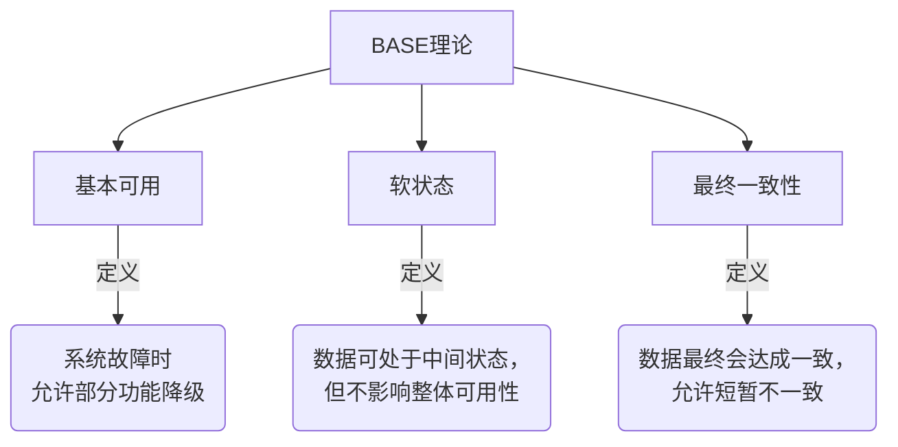
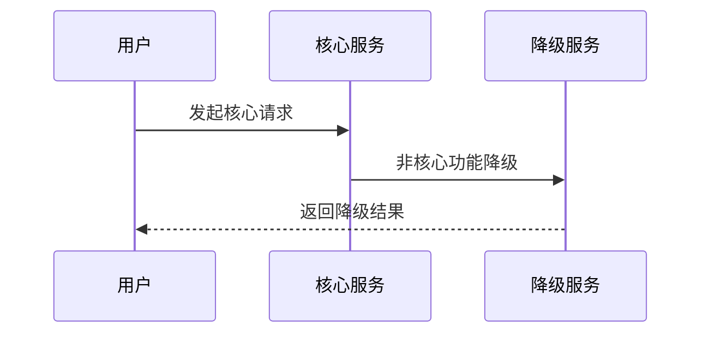
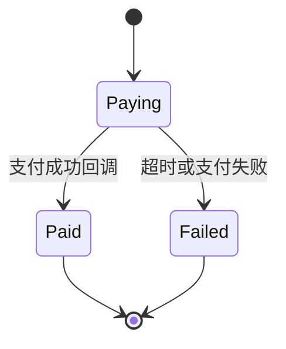
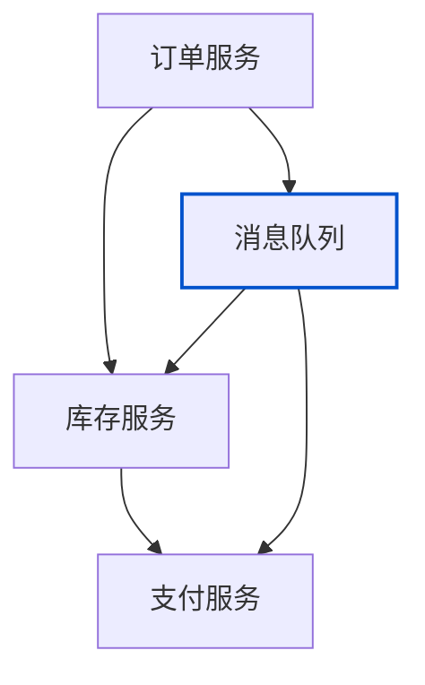
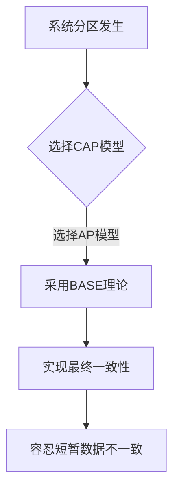
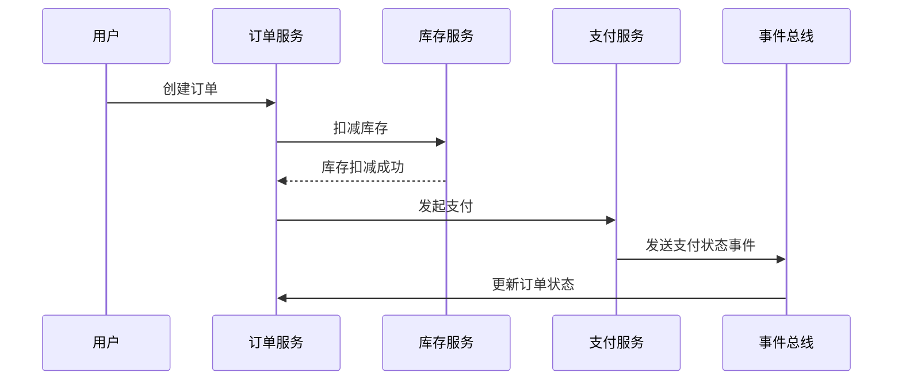
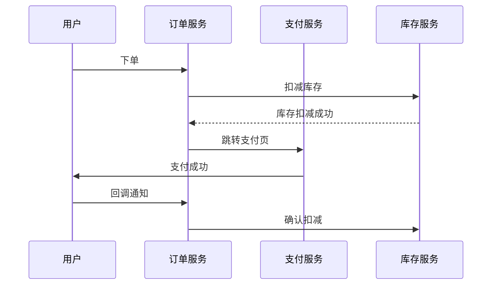
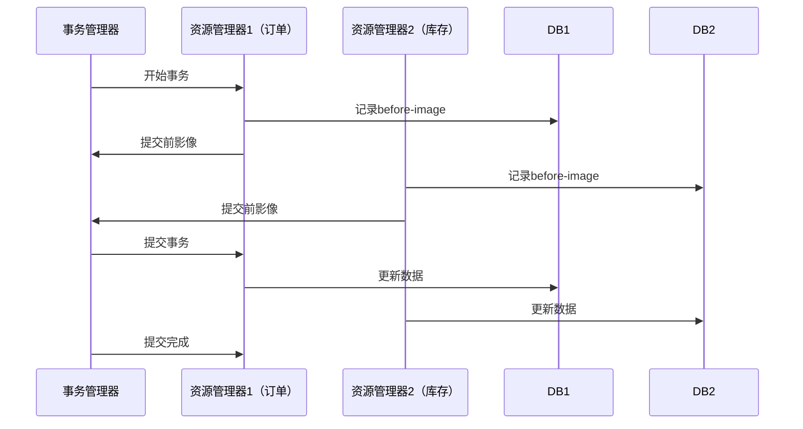

# b. BASE

***

# Java面试八股——微服务分布式事务（BASE理论详解）

***

## 1. 概述与定义

**BASE理论** 是分布式系统设计的核心理论，其名称是三个核心概念的缩写： &#x20;

- **B**asically Available（基本可用） &#x20;
- **S**oft State（软状态） &#x20;
- **E**ventually Consistent（最终一致性） &#x20;

**核心思想**： &#x20;

在分布式系统中，**牺牲强一致性**以换取高可用性，并通过 **最终一致性** 保证数据在延迟后达成一致。BASE理论是对 **CAP理论** 的延伸，尤其适用于 **AP（可用性+分区容忍性）** 的场景。




***

## 2. 主要特点对比表

| **特性**​    | **BASE理论**​              | **CAP理论**​                | **ACID原则**​                  |
| ---------- | ------------------------ | ------------------------- | ---------------------------- |
| **一致性要求**​ | 允许数据短暂不一致，最终达成一致。        | 强一致性（C）与可用性（A）无法同时满足。     | 强一致性（Atomicity, Consistency） |
| **可用性**​   | 优先保证核心功能可用，允许部分功能降级。     | 可用性（A）与分区容忍性（P）可共存（AP模型）。 | 不直接涉及可用性，但需保证事务的原子性与一致性。     |
| **适用场景**​  | 分布式系统、高并发场景（如电商秒杀、支付系统）。 | 分布式系统理论模型，指导系统设计方向。       | 传统关系型数据库事务（如银行交易）。           |

***

## 3. 应用目标

### 3.1 核心目标

- **保证系统可用性**：即使部分节点故障，核心功能仍可运行。 &#x20;
- **容忍数据短暂不一致**：通过异步机制逐步修复数据差异。 &#x20;
- **最终数据一致性**：通过补偿机制（如消息队列、事务日志）确保数据最终一致。

### 3.2 典型场景

| **场景**​     | **BASE理论的应用**​                              |
| ----------- | ------------------------------------------- |
| **电商秒杀**​   | 允许订单状态短暂显示“支付中”，最终由支付回调确认状态。                |
| **分布式事务**​  | 使用 \*\*Seata\*\* 等框架实现最终一致性（如订单、库存、支付的原子性）。 |
| **异步通知系统**​ | 消息队列（如Kafka）确保消息最终送达，容忍短暂延迟。                |

***

## 4. 主要内容及其组成部分

***

### 4.1 基本可用（Basically Available）

#### **4.1.1 定义**

系统在故障时允许 **部分功能降级**，但核心功能仍可运行。 &#x20;

- **示例**： &#x20;
  - 电商大促时，用户登录功能正常，但推荐模块暂时关闭。 &#x20;
  - 支付系统故障时，允许用户下单但延迟扣款。

#### **4.1.2 实现方式**

- **服务降级**：通过 **Hystrix** 或 **Spring Cloud Gateway** 的熔断机制。 &#x20;
- **流量控制**：结合 **漏桶算法** 或 **令牌桶算法** 限制请求量。




***

### 4.2 软状态（Soft State）

#### **4.2.1 定义**

数据允许处于 **中间状态**，但最终会通过异步操作修复。 &#x20;

- **示例**： &#x20;
  - 支付中：用户支付后，订单状态暂时为“支付中”，等待第三方支付回调确认。 &#x20;
  - 库存扣减：先扣减库存，后续通过补偿事务修复超卖问题。

#### **4.2.2 实现方式**

- **异步消息队列**：通过 **Kafka** 或 **RabbitMQ** 异步处理状态变更。 &#x20;
- **状态机设计**：定义中间状态的生命周期（如订单的“待支付”到“已支付”）。




***

### 4.3 最终一致性（Eventual Consistent）

#### **4.3.1 定义**

数据副本在 **延迟后** 达到一致状态，容忍短暂不一致。 &#x20;

- **示例**： &#x20;
  - 微服务间数据通过 **事件总线** 异步同步（如订单服务通知库存服务扣减）。 &#x20;
  - 分布式事务通过 **两阶段提交（2PC）** 或 **Seata AT模式** 最终达成一致。

#### **4.3.2 实现方式**

- **事件驱动架构**：通过 **事件溯源（Event Sourcing）** 记录状态变更。 &#x20;
- **补偿事务**：通过 **TCC模式** 或 **Saga模式** 回滚失败操作。




***

## 5. 原理剖析

### 5.1 BASE与CAP的关系

#### **5.1.1 理论对比**

| **理论**​   | **核心权衡**​                      | **适用场景**​            |
| --------- | ------------------------------ | -------------------- |
| **CAP**​  | 一致性（C）、可用性（A）、分区容忍性（P）三者只能选其二。 | 分布式系统理论设计。           |
| **BASE**​ | 通过牺牲强一致性，换取可用性和分区容忍性。          | 实际分布式系统实现（如电商、社交平台）。 |

#### **5.1.2 实现路径**




***

### 5.2 最终一致性实现机制

#### **5.2.1 案例：支付系统**




#### **5.2.2 关键步骤**

1. **异步通知**：支付结果通过事件总线（如Kafka）通知订单服务。 &#x20;
2. **状态机处理**：订单服务根据支付结果更新最终状态。 &#x20;
3. **补偿机制**：若支付超时，通过定时任务重试或回滚库存。

***

## 6. 应用与拓展

### 6.1 电商系统中的BASE实践

#### **6.1.1 订单与支付流程**




#### **6.1.2 关键设计**

- **软状态**：订单状态允许临时为“支付中”。 &#x20;
- **最终一致性**：通过支付回调确认最终状态。 &#x20;
- **基本可用**：即使支付服务短暂故障，订单仍可创建。

***

### 6.2 分布式事务方案（Seata AT模式）

#### **6.2.1 工作原理**




#### **6.2.2 核心优势**

- **自动回滚**：通过 **前镜像（Before Image）** 和 **后镜像（After Image）** 实现物理级回滚。 &#x20;
- **最终一致性**：即使部分服务失败，通过全局事务协调器（TM）确保数据最终一致。

***

## 7. 面试问答

### 问题1：什么是BASE理论？它与CAP理论有何关系？

**回答**： &#x20;

BASE理论是分布式系统设计的核心理论，包含以下三个核心概念： &#x20;

1. **基本可用（BA）**：系统故障时允许部分功能降级，但核心功能仍可用。 &#x20;
2. **软状态（S）**：数据允许处于中间状态（如支付中的订单），不影响整体可用性。 &#x20;
3. **最终一致性（E）**：数据副本在延迟后最终达成一致。 &#x20;

与CAP理论的关系： &#x20;

- CAP理论指出一致性（C）、可用性（A）、分区容忍性（P）三者不可兼得。 &#x20;
- BASE理论是CAP中 **AP模型** 的实践延伸，通过牺牲强一致性，换取可用性和分区容忍性。 &#x20;
- **示例**：电商系统在分区故障时，允许订单服务降级，但核心下单功能仍可用。

***

### 问题2：如何实现最终一致性？

**回答**： &#x20;

通过以下技术方案实现： &#x20;

1. **异步消息队列**： &#x20;
   - 例如，订单服务通过Kafka通知库存服务扣减。 &#x20;
   - 示例代码（Kafka生产者）： &#x20;
     ```java 
     @KafkaListener(topics = "order-topic")
     public void handleOrderCreatedEvent(OrderEvent event) {
         inventoryService.deductStock(event.getProductId(), event.getQuantity());
     }
     ```

2. **补偿事务**： &#x20;
   - 使用 **TCC模式**（Try-Confirm-Cancel）或 **Saga模式**。 &#x20;
   - 例如，支付失败后通过定时任务回滚库存。 &#x20;
3. **事件溯源**： &#x20;
   - 记录所有状态变更事件，通过重放事件恢复最终状态。

***

### 问题3：BASE理论在电商秒杀中的应用？

**回答**： &#x20;

秒杀场景中，BASE理论通过以下方式应用： &#x20;

1. **基本可用**： &#x20;
   - 允许部分用户因流量过大看到“服务繁忙”，但核心下单功能可用。 &#x20;
2. **软状态**： &#x20;
   - 用户下单后，订单状态暂时为“待支付”，允许超时自动释放库存。 &#x20;
3. **最终一致性**： &#x20;
   - 通过 **分布式锁** 和 **消息队列** 确保支付成功后库存最终一致。 &#x20;
   - 示例代码（Redis分布式锁）： &#x20;
     ```java 
     public boolean tryLock(String key, int expireSeconds) {
         return redisTemplate.opsForValue()
             .setIfAbsent(key, "locked", Duration.ofSeconds(expireSeconds));
     }
     ```


***

### 问题4：如何选择ACID与BASE？

**回答**： &#x20;

根据业务场景选择： &#x20;

1. **选ACID**： &#x20;
   - 需强一致性的场景（如银行转账）。 &#x20;
   - 示例：单数据库事务保证余额变更的原子性。 &#x20;
2. **选BASE**： &#x20;
   - 高并发、分布式场景（如电商、社交平台）。 &#x20;
   - 示例：订单、库存、支付的分布式事务通过 **Seata** 实现最终一致性。

***

### 问题5：如何保证软状态的可靠性？

**回答**： &#x20;

通过以下措施确保软状态的可靠性： &#x20;

1. **超时机制**： &#x20;
   - 例如，支付状态在30分钟后自动标记为“支付失败”。 &#x20;
2. **补偿服务**： &#x20;
   - 定时任务扫描未完成的订单，触发重试或回滚。 &#x20;
   - 示例代码（Spring @Scheduled）： &#x20;
     ```java 
     @Scheduled(fixedRate = 30000)
     public void checkTimeoutOrders() {
         List<Order> timeoutOrders = orderService.findTimeoutOrders();
         timeoutOrders.forEach(order -> {
             orderService.rollback(order.getId());
             inventoryService.rollback(order.getProductId());
         });
     }
     ```

3. **监控与告警**： &#x20;
   - 通过 **Prometheus+Grafana** 监控中间状态的堆积情况。

***

## 结语

BASE理论是微服务系统设计的核心思想，面试中需重点掌握以下内容： &#x20;

1. **核心概念**：基本可用、软状态、最终一致性。 &#x20;
2. **实现技术**：消息队列、分布式事务框架（如Seata）、事件溯源。 &#x20;
3. **场景应用**：电商秒杀、支付系统、订单服务等。 &#x20;

通过结合代码示例（如Kafka消费者、分布式锁）和架构图（如事件总线流程），能更清晰地向面试官展示对分布式系统设计的理解深度。
