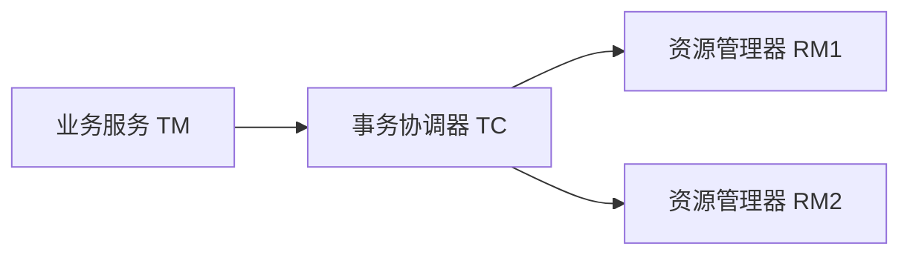
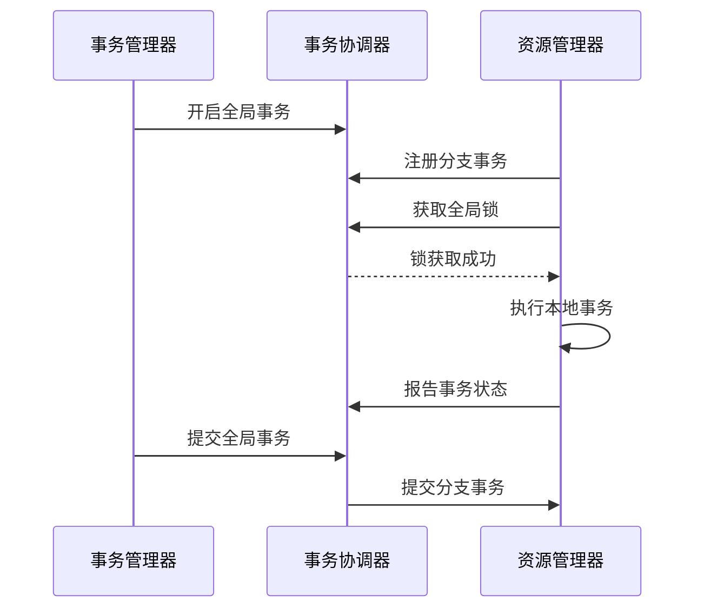

# c. Seata

# Seata：Java面试八股文详解

***

## 1. 概述与定义

Seata是一个开源的分布式事务框架，专为微服务架构设计，旨在解决跨服务操作中的数据一致性问题。它通过全局事务管理，支持多种事务模式，包括AT（自动事务）、TCC（Try-Confirm-Cancel）、Saga和XA，适用于不同的业务场景。Seata的核心是通过全局事务ID（XID）协调多个服务的事务操作，确保分布式环境下数据的一致性和完整性。

### 定义

简单来说，Seata是一个分布式事务管理框架，通过在微服务系统中引入全局事务管理器（TM）、事务协调器（TC）和资源管理器（RM），实现跨服务的数据一致性。在面试中，你可以这样回答：“Seata是阿里巴巴开源的分布式事务框架，支持AT、TCC、Saga和XA等多种模式，通过全局事务ID协调多个服务的事务操作，确保数据一致性。” 这个定义简洁明了，突出核心功能，能快速抓住面试官的注意力。

### 背景与定位

Seata起源于阿里巴巴内部的Fescar项目（Fast & EaSy Commit And Rollback），后来开源并更名为Seata，目标是解决微服务架构中的分布式事务难题。它与Spring Cloud、Dubbo等主流框架无缝集成，支持多种数据库和中间件，是现代微服务系统中保障数据一致性的重要工具。Seata的设计理念是“无侵入性”和“高性能”，通过AT模式实现对业务的零改动，同时提供TCC、Saga等模式满足高并发和复杂业务需求。

***

## 2. 主要特点

Seata的核心价值体现在其特性上，以下是其主要特点，面试时可以逐一展开并结合场景说明：

- **多种事务模式** 🌐 &#x20;

  支持AT、TCC、Saga和XA四种模式，灵活适应不同业务场景。
- **高性能** ⚡ &#x20;

  AT模式通过SQL解析和数据快照实现高效的事务管理，性能开销低。
- **无侵入性** ✨ &#x20;

  AT模式对业务代码零侵入，开发者无需修改业务逻辑。
- **易用性** 🛠️ &#x20;

  提供简单配置和注解支持，快速集成到现有项目。
- **高可用性** 🚀 &#x20;

  支持事务协调器（TC）的集群部署，确保系统可靠性。
- **灵活性** 📦 &#x20;

  支持多种数据库（如MySQL、PostgreSQL）和中间件，兼容性强。

### 面试Tips

提到“无侵入性”时，可以举例：“在电商系统中，使用AT模式管理下单和扣库存的事务，只需加个注解，业务代码不用改，Seata就自动处理了。” 这样的场景化描述能体现实战经验。对于“高性能”，可以补充：“AT模式通过undo\_log实现回滚，比传统2PC效率高很多。” 展现你对技术的深入理解。

***

## 3. 应用目标

Seata的设计目标是解决微服务架构中的分布式事务难题，其主要应用目标包括：

- **确保数据一致性** &#x20;

  在跨服务的事务操作中，保证数据的最终一致性或强一致性。
- **支持多种事务模型** &#x20;

  提供AT、TCC、Saga、XA等多种模式，满足不同业务需求。
- **降低开发复杂度** &#x20;

  通过AT模式的“零侵入”设计，简化分布式事务的开发和维护。
- **提升系统性能** &#x20;

  优化事务管理机制，减少锁冲突和性能开销，适应高并发场景。
- **提高系统可靠性** &#x20;

  通过全局事务协调和补偿机制，确保事务的正确执行和异常回滚。

在面试中，可以总结为：“Seata的目标是为微服务架构提供简单、高效的分布式事务解决方案，支持多种模式，确保数据一致性，同时降低开发难度并提升性能。” 这个回答简洁全面，能快速传递核心信息。

### 补充说明

虽然“降低开发复杂度”不是Seata的首要目标，但在实际应用中，AT模式的易用性显著减少了开发工作量，值得在面试中提及，以体现你对框架的全面理解。

***

## 4. 主要内容及其组成部分

Seata是一个功能丰富的框架，由多个核心组件和事务模式组成，下面详细解释其内容，并结合代码示例、表格和Mermaid图表进行说明。

### 4.1 核心组件

Seata的架构由以下三个核心组件组成：

- **事务管理器（TM，Transaction Manager）** &#x20;

  负责全局事务的发起、提交和回滚，通常集成在业务服务中。
- **事务协调器（TC，Transaction Coordinator）** &#x20;

  负责协调全局事务的状态，维护全局锁和事务日志，是Seata的核心大脑。
- **资源管理器（RM，Resource Manager）** &#x20;

  管理分支事务的资源（如数据库），执行本地事务的提交和回滚。

#### Mermaid图表：Seata架构




**图表说明**：此图展示了Seata的核心架构，TM发起全局事务请求，TC负责协调，RM执行具体的分支事务。面试时可以用这个图直观解释Seata的组件协作。

### 4.2 事务模式

Seata支持四种事务模式，下面逐一详解。

#### 4.2.1 AT模式（自动事务）

AT模式是Seata的默认模式，通过SQL解析和undo\_log实现“无侵入”的分布式事务管理。

- **一阶段**：RM执行本地事务，生成undo\_log记录回滚信息。
- **二阶段**：若全局事务提交，RM删除undo\_log；若回滚，RM根据undo\_log执行回滚。

#### 示例：AT模式配置

```java 
@GlobalTransactional
public void createOrder(Order order) {
    orderService.save(order);         // 分支事务1：保存订单
    stockService.deduct(order.getProductId(), order.getQuantity()); // 分支事务2：扣减库存
}
```


**代码说明**：`@GlobalTransactional`注解开启全局事务，Seata自动协调orderService和stockService的分支事务，提交或回滚无需手动干预。

#### 4.2.2 TCC模式（Try-Confirm-Cancel）

TCC模式是一种基于业务补偿的事务模型，分为Try、Confirm和Cancel三个阶段，适用于高并发和复杂业务场景。

- **Try**：预留资源。
- **Confirm**：确认提交。
- **Cancel**：取消操作。

#### 示例：TCC实现

```java 
public interface OrderTccAction {
    @TwoPhaseBusinessAction(name = "orderTccAction", commitMethod = "confirm", rollbackMethod = "cancel")
    boolean tryCreate(Order order, BusinessActionContext context);
    boolean confirm(BusinessActionContext context);
    boolean cancel(BusinessActionContext context);
}
```


**代码说明**：此接口定义了TCC的三个阶段，Seata通过注解自动管理事务状态，开发者需实现具体逻辑。

#### 4.2.3 Saga模式

Saga模式通过一系列本地事务和补偿操作实现最终一致性，适用于长事务和复杂业务流程。

- **正向操作**：按顺序执行本地事务。
- **补偿操作**：若某步失败，执行之前的补偿操作。

#### 示例：Saga配置

```json 
{
  "name": "createOrderSaga",
  "steps": [
    {"serviceName": "orderService", "method": "createOrder", "compensationMethod": "cancelOrder"},
    {"serviceName": "stockService", "method": "deductStock", "compensationMethod": "restoreStock"}
  ]
}
```


**代码说明**：此JSON配置定义了Saga事务的步骤和补偿方法，Seata根据配置执行正向和补偿流程。

#### 4.2.4 XA模式

XA模式基于XA协议的二阶段提交（2PC），适用于支持XA的数据库，提供强一致性。

- **一阶段**：RM执行本地事务并锁定资源。
- **二阶段**：TC协调RM提交或回滚。

#### 示例：XA配置

```.properties 
seata.config.xa.enabled=true
```


**配置说明**：启用XA模式，适用于需要强一致性的场景，但性能开销较大。

### 4.3 全局锁与分支事务

Seata通过全局锁机制管理并发事务，确保数据一致性。RM在执行分支事务前向TC申请全局锁，避免脏写和冲突。

#### 示例：全局锁流程




**图表说明**：此序列图展示了全局锁的获取和事务提交流程，面试时可以用它解释Seata的并发控制机制。

### 4.4 事务隔离级别

Seata支持多种事务隔离级别，包括读未提交、读已提交、可重复读和串行化，默认使用数据库的隔离级别。

#### 补充说明

事务隔离级别虽不是Seata的主要关注点，但在高并发场景下，它对性能和一致性有影响。比如，读未提交可能导致脏读，而串行化会降低并发性能。面试官可能追问，需有所准备。

***

## 5. 原理剖析

Seata的实现原理涉及事务协调、锁管理、补偿机制等，下面深入解析主要模式的原理。

### 5.1 AT模式原理

AT模式通过SQL解析和undo\_log实现自动事务管理。

- **一阶段**：RM拦截业务SQL，解析SQL类型和影响的数据，生成undo\_log（记录回滚信息），然后执行本地事务。
- **二阶段**：若全局事务提交，RM删除undo\_log；若回滚，RM根据undo\_log生成回滚SQL并执行。

#### 示例：undo\_log表结构

```sql 
CREATE TABLE undo_log (
  id BIGINT(20) NOT NULL AUTO_INCREMENT,
  branch_id BIGINT(20) NOT NULL,
  xid VARCHAR(100) NOT NULL,
  context VARCHAR(128) NOT NULL,
  rollback_info LONGBLOB NOT NULL,
  log_status INT(11) NOT NULL,
  log_created DATETIME NOT NULL,
  log_modified DATETIME NOT NULL,
  PRIMARY KEY (id),
  UNIQUE KEY ux_undo_log (xid, branch_id)
);
```


**代码说明**：undo\_log表存储回滚信息，如xid（全局事务ID）和rollback\_info（回滚数据），Seata在回滚时用这些信息恢复数据。

### 5.2 TCC模式原理

TCC模式通过业务层面的补偿机制实现最终一致性。

- **Try**：执行预留操作，记录中间状态。
- **Confirm**：确认提交，更新资源状态。
- **Cancel**：取消操作，恢复资源。

#### 优点与挑战

- **优点**：无锁等待，高性能，适合高并发。
- **挑战**：业务侵入性强，需手动实现三个阶段，开发成本较高。

### 5.3 Saga模式原理

Saga模式通过本地事务和补偿操作实现最终一致性。

- **正向流程**：按顺序执行本地事务，每步提交。
- **补偿流程**：若某步失败，执行之前的补偿操作。

#### 适用场景

- **长事务**：业务流程复杂，需分步执行。
- **最终一致性**：允许短暂不一致，适合高并发。

### 5.4 XA模式原理

XA模式基于XA协议的2PC实现，RM在准备阶段锁定资源，TC协调提交或回滚。

#### 注意事项

XA依赖数据库支持（如MySQL XA），性能开销大，但在强一致性场景下有优势。

***

## 6. 应用与拓展

Seata在实际项目中应用广泛，以下是一些典型场景：

- **电商系统** &#x20;

  下单、支付、扣库存等操作需保证一致性，AT模式常用于简单场景，TCC适合高并发秒杀。
- **金融系统** &#x20;

  转账、支付、结算等场景要求原子性，XA模式可提供强一致性。
- **物流系统** &#x20;

  订单创建、库存更新、配送等流程需协调，Saga模式适合长事务。

### 拓展

Seata可与其他技术结合：

- **Spring Cloud**：集成Seata管理微服务事务。
- **Dubbo**：为Dubbo服务提供分布式事务支持。
- **Kubernetes**：在容器化环境中部署Seata TC集群。

***

## 7. 面试问答

以下是五个常见面试问题及详细回答，模仿面试者口吻，确保自然且详实。

### 问题 1：Seata是什么？

**回答**： &#x20;

“Seata是阿里巴巴开源的分布式事务框架，专门为微服务设计，支持AT、TCC、Saga和XA等多种模式。它通过全局事务ID协调多个服务的事务，确保数据一致性。我在项目里用过Seata的AT模式，管理订单和库存的事务，效果挺好，配置简单还能保证一致性。”

### 问题 2：Seata的AT模式是怎么工作的？

**回答**： &#x20;

“AT模式是Seata的自动事务模式，原理是拦截业务SQL，解析出影响的数据，生成undo\_log记录回滚信息。一阶段执行本地事务并写undo\_log，二阶段如果全局提交就删掉undo\_log，如果回滚就用undo\_log生成回滚SQL执行。它的优点是无侵入，业务代码不用改，性能也比传统2PC高。我在项目里用AT模式，只加了个@GlobalTransactional注解，事务就自动管好了。”

### 问题 3：Seata的TCC模式有什么优缺点？

**回答**： &#x20;

“TCC模式的优点是高性能，因为没有锁等待，特别适合高并发场景；缺点是业务侵入性强，得自己写Try、Confirm和Cancel三个阶段，开发成本高。我在秒杀项目里用过TCC，Try阶段冻结库存，Confirm扣减，Cancel解冻，性能确实很好，但实现起来花了不少时间，得仔细设计每个阶段的逻辑。”

### 问题 4：Seata如何保证高可用性？

**回答**： &#x20;

“Seata的事务协调器TC支持集群部署，可以用etcd或数据库共享状态，某个TC节点挂了也能自动切换。我在生产环境里搭过Seata TC集群，用MySQL存事务日志，确保高可用。配置好后，基本不用担心单点故障，挺稳定的。”

### 问题 5：如何选择Seata的事务模式？

**回答**： &#x20;

“选择Seata的事务模式得看业务场景。如果业务简单，想省事，就用AT模式，无侵入又高效；如果追求高并发和高性能，就选TCC，但得写补偿逻辑；如果业务流程长，涉及多个步骤，用Saga，适合最终一致性；XA适合强一致性场景，但性能差点。我在项目里一般先试AT，如果满足不了需求，再考虑TCC或Saga，具体看一致性和并发要求。”

***

## 总结

这篇八股文从Seata的定义到原理、应用场景，再到面试问答，覆盖了所有核心知识点。通过代码示例、表格和Mermaid图表，内容直观易懂，背熟后能在面试中自信应对各种问题，展现你的专业能力！✨
