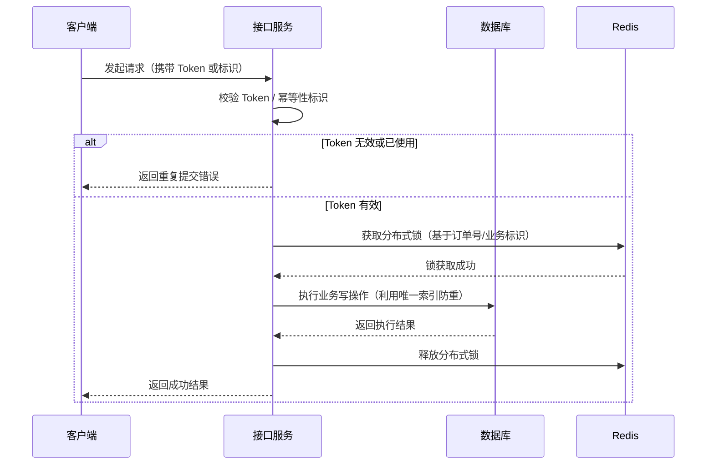

# 3. 接口幂等

## 1. 概述与定义

在分布式微服务系统中，业务接口往往会面临重复请求、网络重试、超时等问题，导致同一业务操作被多次执行，从而引发数据重复、订单重复、支付重复等严重问题。接口幂等性（Idempotency）正是在这种背景下提出的一项重要设计原则，其核心思想是：无论接口被调用多少次，最终对系统产生的影响都应保持一致，即多次执行与单次执行具有相同的效果。 &#x20;

接口幂等的实现方式主要包括三种手段： &#x20;

- **数据库唯一索引**：通过数据库层面的约束，防止重复数据插入，保证业务记录的唯一性。 &#x20;
- **Redisson 分布式锁**：利用分布式锁机制对关键资源加锁，确保同一业务操作不会被并发处理。 &#x20;
- **Token 机制**：在请求时生成唯一标识，后端在处理时校验 Token 是否已使用，防止重复处理。 &#x20;

接口幂等性不仅是提高系统鲁棒性的重要手段，更是保障用户体验和业务正确性的核心保障。💡

## 2. 主要特点

接口幂等性具有以下主要特点，每个特点都直接影响到系统的健壮性和数据一致性：

1. **多次调用效果一致** &#x20;

   无论接口被调用一次或多次，最终的业务状态保持不变。例如，在支付系统中，重复提交支付请求时只会扣除一次金额，确保用户不会被重复扣费。
2. **防止重复数据** &#x20;

   通过数据库唯一索引或者 Token 校验，能够有效防止业务记录重复生成，保证数据的唯一性和完整性。
3. **分布式场景适用** &#x20;

   在分布式环境中，采用 Redisson 分布式锁能够解决多个服务实例并发调用同一接口所导致的数据竞争问题。
4. **业务逻辑补偿机制** &#x20;

   在某些场景下，通过补偿事务或回滚机制进一步保证业务状态最终一致，即使接口调用多次也不会出现不一致的问题。

下面的表格直观对比了数据库唯一索引、Redisson 分布式锁和 Token 机制在实现接口幂等性时的主要特点：

| 实现方式          | 主要原理                  | 优点                 | 缺点或局限                        |
| ------------- | --------------------- | ------------------ | ---------------------------- |
| 数据库唯一索引       | 依赖数据库约束防止重复记录         | 实现简单、可靠，适用于单表操作    | 对复杂业务场景、跨表事务控制较弱             |
| Redisson 分布式锁 | 通过 Redis 分布式锁防止并发重复调用 | 适用于分布式环境，能锁定业务关键资源 | 需要额外引入 Redis 组件，可能引起锁竞争问题    |
| Token 机制      | 请求中携带唯一标识，后端校验 Token  | 能够细粒度控制接口调用，灵活性高   | 需要维护 Token 的有效期和存储管理，可能增加复杂度 |

通过表格可以看出，不同方式各有优缺点，实际开发中常根据具体业务场景选择合适的实现方案或综合使用多种手段确保接口幂等性。

## 3. 应用目标

接口幂等性的应用目标主要体现在以下几个方面：

1. **确保业务正确性** &#x20;

   通过防止接口重复调用，保证每个业务操作仅执行一次，确保数据不会因重复处理而出现异常。 &#x20;

   例如，在订单创建、支付扣款等关键业务中，接口幂等能够避免重复生成订单或重复扣款。
2. **提升系统鲁棒性** &#x20;

   在分布式系统中，网络波动、重试机制可能导致同一请求被多次发送，幂等性设计能够保证系统在高并发、重试场景下依然稳定运行。
3. **优化用户体验** &#x20;

   避免用户在网络异常时因为重复点击导致重复提交，从而减少用户投诉和售后问题，提升用户体验。 &#x20;

   例如，用户在点击“提交订单”后因网络延迟再次点击，系统只会生成一笔订单。
4. **降低数据冗余和资源浪费** &#x20;

   防止重复数据写入数据库，减少系统资源消耗及后续数据清洗和纠正的成本。
5. **支持分布式事务管理** &#x20;

   在分布式系统中，接口幂等性是设计分布式事务和最终一致性的重要基础，能够为后续业务补偿和数据修复提供支持。

通过以上目标，接口幂等性设计可以在实际系统中大大提升业务处理的稳定性和可靠性，降低系统故障和异常带来的影响。🚀

## 4. 主要内容及其组成部分

接口幂等性作为分布式系统中非常重要的业务设计，涉及多个方面的实现方案。下面对每个组成部分进行详细说明：

### 4.1 数据库唯一索引

数据库唯一索引是一种在数据库层面上防止重复记录的重要手段。在设计业务表时，为了确保某个业务数据（例如订单号、交易编号或业务唯一标识）不会被重复插入，可以对该字段设置唯一索引约束。当重复插入操作发生时，数据库会抛出异常，从而保证数据的唯一性。 &#x20;

**示例说明** &#x20;

在订单系统中，可以在订单表中对订单号字段设置唯一索引，代码示例如下：

```sql 
CREATE TABLE orders (
    id BIGINT AUTO_INCREMENT PRIMARY KEY,
    order_no VARCHAR(64) NOT NULL,
    user_id BIGINT NOT NULL,
    amount DECIMAL(10,2) NOT NULL,
    create_time TIMESTAMP DEFAULT CURRENT_TIMESTAMP,
    UNIQUE KEY idx_order_no (order_no)
);
```


上述 SQL 语句为订单表中的 `order_no` 设置了唯一索引，确保相同订单号只会生成一条记录。使用数据库唯一索引方式简单高效，适用于业务操作简单且不需要跨表协同的场景。

### 4.2 Redisson 分布式锁

在分布式系统中，由于同一业务请求可能由多个服务实例并发处理，利用分布式锁能够保证同一业务操作在任一时刻只有一个实例在执行，从而达到接口幂等的目的。Redisson 是基于 Redis 的一个分布式锁实现工具，其提供了简单易用的 API，可以在业务操作前加锁，操作完成后释放锁，确保并发情况下只执行一次操作。 &#x20;

**示例说明** &#x20;

下面是一段基于 Redisson 的 Java 代码示例，展示如何使用分布式锁保证接口幂等性：

```java 
import org.redisson.api.RLock;
import org.redisson.api.RedissonClient;
import java.util.concurrent.TimeUnit;

public class OrderService {
    private RedissonClient redissonClient;

    public OrderService(RedissonClient redissonClient) {
        this.redissonClient = redissonClient;
    }

    public void createOrder(String orderNo) {
        RLock lock = redissonClient.getLock("order_lock:" + orderNo);
        try {
            // 尝试加锁，最多等待 100 毫秒，上锁后 10 秒自动解锁
            boolean acquired = lock.tryLock(100, 10, TimeUnit.SECONDS);
            if (acquired) {
                // 执行业务操作，如创建订单
                System.out.println("执行业务逻辑，订单号：" + orderNo);
            } else {
                // 未获得锁，认为请求已被处理
                System.out.println("订单正在处理中，请勿重复提交：" + orderNo);
            }
        } catch (InterruptedException e) {
            e.printStackTrace();
        } finally {
            if (lock.isHeldByCurrentThread()) {
                lock.unlock();
            }
        }
    }
}
```


代码中，通过获取与订单号相关的锁，确保同一订单在并发请求时只有一个线程能执行创建操作，从而实现接口幂等。

### 4.3 Token 机制

Token 机制通过在请求中携带一个唯一标识（Token），在服务端对 Token 进行校验来保证请求只被处理一次。通常在用户第一次提交请求时，生成一个唯一 Token 并返回给前端，后续请求必须携带该 Token，且 Token 只能使用一次。一旦请求处理完成，Token 被标记为已使用，再次使用将被拒绝。 &#x20;

**示例说明** &#x20;

下面的代码示例展示了如何在 Spring Boot 中实现基于 Token 的接口幂等性控制：

```java 
@RestController
public class PaymentController {
    private final ConcurrentMap<String, Boolean> tokenCache = new ConcurrentHashMap<>();

    // 模拟生成 Token 接口
    @GetMapping("/generateToken")
    public String generateToken() {
        String token = UUID.randomUUID().toString();
        tokenCache.put(token, false);
        return token;
    }

    // 支付接口，必须携带唯一 Token
    @PostMapping("/pay")
    public String pay(@RequestParam("token") String token) {
        // 判断 token 是否存在且未被使用
        if (!tokenCache.containsKey(token)) {
            return "无效 Token，请重新获取。";
        }
        if (tokenCache.get(token)) {
            return "重复提交，Token 已使用。";
        }
        // 标记 Token 已使用
        tokenCache.put(token, true);
        // 执行支付逻辑
        return "支付成功。";
    }
}
```


上述代码中，通过 tokenCache 存储 Token 的状态，确保同一 Token 仅能使用一次，从而防止重复提交。Token 机制适用于需要精确控制接口调用次数的场景。

## 5. 原理剖析

接口幂等性设计在分布式系统中应用广泛，其原理涉及多方面的技术手段与业务逻辑保障。下面从原理、流程和实际场景进行深入剖析。

### 5.1 原理基础

接口幂等性要求接口无论被调用多少次，最终对业务数据的修改都保持一致。其实现原理主要包括：

- 利用数据库唯一索引，通过数据库约束自动拒绝重复记录写入，从而保证数据一致性。
- 采用分布式锁（如 Redisson 分布式锁）在并发场景下对业务操作加锁，确保同一操作只被执行一次。
- 基于 Token 的机制，通过生成全局唯一标识防止重复调用，确保幂等性操作只能执行一次。

这种设计思路的核心在于： &#x20;

1. **防重复提交**：在业务层面预先判断请求是否已经处理，避免重复写操作。 &#x20;
2. **事务补偿机制**：在接口调用过程中若发生异常，通过补偿逻辑确保系统最终达到一致状态。 &#x20;
3. **并发控制**：利用分布式锁和唯一索引，降低并发请求引起的数据竞争问题。

### 5.2 流程剖析

下图使用 Mermaid 语法展示了接口幂等性在实际请求处理过程中的典型流程：




图中展示了请求首先进行 Token 校验或幂等性标识判断，若有效再通过 Redis 获取分布式锁，之后执行数据库操作并利用唯一索引防止重复写入，最后释放锁并返回结果。这一流程既保证了并发控制，又确保了业务操作的唯一性和最终一致性。

### 5.3 实际案例解析

在电商订单、支付扣款等场景中，重复调用往往会带来严重的后果。例如，一个用户在网络波动的情况下重复点击“确认支付”按钮，若系统未做幂等性处理，可能会导致重复扣款和多次生成订单。通过结合数据库唯一索引、分布式锁和 Token 机制，可以从多个层面确保业务操作只执行一次。 &#x20;

- 数据库唯一索引确保即使多次写入也只生成一条订单记录； &#x20;
- 分布式锁确保在并发请求时只有一个线程执行订单创建； &#x20;
- Token 校验则在请求入口过滤掉重复提交，从而全方位保障系统数据的正确性。

## 6. 应用与拓展

接口幂等性不仅仅局限于单一场景，其应用领域和扩展方向十分广泛。下面从实际应用场景和技术拓展两方面进行说明：

### 6.1 实际应用场景

1. **订单系统** &#x20;

   在订单创建、修改和支付过程中，接口幂等性能够防止重复提交导致多次创建订单或重复扣款。结合数据库唯一索引和分布式锁，确保订单信息唯一可靠。
2. **支付系统** &#x20;

   支付接口通常要求高度幂等，避免用户在网络异常重试时重复扣款。采用 Token 校验机制，可以在第一笔支付请求成功后，拒绝后续重复请求。
3. **注册与认证** &#x20;

   用户注册接口中，避免同一手机号或邮箱被重复注册。利用数据库唯一索引对手机号、邮箱等信息进行约束，确保注册数据唯一。
4. **积分/优惠券发放** &#x20;

   在营销活动中，用户可能多次点击领取按钮，通过接口幂等性设计确保每个用户仅能领取一次奖励，防止资源滥发。

### 6.2 技术拓展方向

1. **混合幂等方案** &#x20;

   实际项目中可以综合使用数据库唯一索引、分布式锁和 Token 机制，根据业务场景动态选择最佳组合，既能保证数据一致性，又能提高系统性能。
2. **基于消息队列的幂等性** &#x20;

   对于异步处理场景，可在消息队列中增加消息去重机制，确保重复消息仅被处理一次，实现幂等性要求。
3. **自动化补偿与重试机制** &#x20;

   在复杂业务流程中，通过引入自动补偿和重试机制，当接口调用失败或重复时，自动触发补偿事务，确保系统最终达到一致状态。
4. **幂等性监控与告警** &#x20;

   在系统中建立幂等性监控指标，实时监控重复请求的发生情况，及时预警并定位问题，以便对幂等性策略进行动态调整和优化。

## 7. 面试问答

以下是基于面试场景中常见问题的详细回答，从面试者角度出发，展示对接口幂等性相关实现方案（数据库唯一索引、Redisson 分布式锁、Token 机制）的深刻理解，回答至少包含五个部分。

### 问题1：请解释什么是接口幂等性？它在微服务架构中的作用是什么？

【回答】 &#x20;

接口幂等性指的是一个接口在重复调用时，无论调用多少次，最终对系统产生的效果都是一致的。在微服务架构中，由于存在网络重试、分布式调用等情况，接口幂等性可以防止重复提交，确保数据唯一性和业务正确性，从而大大降低因重复操作引发的系统故障和数据错误。

### 问题2：如何利用数据库唯一索引实现接口幂等？请详细说明其实现原理及适用场景。

【回答】 &#x20;

数据库唯一索引通过对业务关键字段（如订单号、交易号）设置唯一性约束，当重复请求到达时，数据库会自动拒绝重复记录的写入，从而保证数据不会重复生成。其实现原理简单高效，适用于数据写入操作较单一、无需跨表或跨服务协同的场景。例如，在订单系统中，利用唯一索引确保每个订单号只生成一条订单记录，即使发生重试也能自动防止重复生成订单。

### 问题3：请说明在分布式系统中如何利用 Redisson 分布式锁来保证接口幂等性？

【回答】 &#x20;

在分布式环境中，由于多个服务实例可能同时处理相同的业务请求，采用分布式锁（如 Redisson 分布式锁）可以确保在同一时刻只有一个实例执行关键业务逻辑。具体流程是在处理请求前，通过 Redis 获取一个与业务标识相关的锁，如果获取成功则执行业务逻辑，处理完成后释放锁；如果获取失败，则认为请求正在被处理或已处理，从而拒绝重复操作。这种方式能够在高并发场景下有效防止重复处理，适用于订单生成、支付扣款等关键业务场景。

### 问题4：Token 机制在接口幂等性中的实现原理是什么？它的优势和局限性有哪些？

【回答】 &#x20;

Token 机制通过为每次请求生成一个唯一的 Token，并要求客户端在后续请求中携带该 Token，服务端在处理时对 Token 进行校验，从而保证同一 Token 只能被使用一次。其优势在于能精细控制接口调用次数，灵活性高，适合需要严格防止重复提交的场景。但同时需要维护 Token 的生命周期和存储状态，增加一定的系统复杂度，并可能引入额外的缓存或存储开销。

### 问题5：请结合你的项目经验说明在实际业务中如何综合使用数据库唯一索引、分布式锁和 Token 机制来实现接口幂等性？

【回答】 &#x20;

在我参与的某电商项目中，订单提交和支付环节对幂等性要求极高。我们在订单系统中采用了多重手段保障接口幂等： &#x20;

1. 在订单表中对订单号设置唯一索引，确保无论业务如何重试，订单号只会生成一条记录； &#x20;
2. 利用 Redisson 分布式锁对订单生成过程进行加锁，避免多个实例并发生成重复订单； &#x20;
3. 在用户提交订单时，采用 Token 机制防止重复点击“提交订单”按钮，前端生成唯一 Token 后传递给后端进行校验。 &#x20;

通过这种组合方案，即使在高并发和网络不稳定的情况下，也能够确保订单数据的唯一性和系统的正确执行，最终为用户提供了稳定可靠的服务体验。

## 总结

本文详细解析了微服务架构中业务相关领域的“接口幂等”知识点，从概述与定义、主要特点、应用目标到组成部分（数据库唯一索引、Redisson 分布式锁、Token 机制）的实现方案均做了详尽的说明。通过深入剖析接口幂等性的原理和流程，结合实际示例、代码片段、表格对比以及 Mermaid 图示，帮助开发者全面掌握如何在分布式环境下确保接口调用的唯一性与数据一致性。 &#x20;

在实际项目中，无论是订单系统、支付系统还是用户注册等场景，接口幂等性都是确保业务正确性和系统稳定性的核心设计思想。掌握这一知识点不仅能够帮助工程师优化业务流程，降低重复提交导致的错误风险，也能在面试中展示对分布式系统设计的深刻理解和实践经验。通过对各种实现方案的优缺点分析与实际案例的剖析，我们可以根据不同业务需求选择最合适的幂等性实现方案。 &#x20;

总之，接口幂等性设计是分布式微服务系统中不可或缺的一环。无论是通过数据库唯一索引防止重复数据写入，还是借助分布式锁和 Token 机制确保并发控制，都为系统在高并发、网络波动情况下提供了强有力的保障。希望本文能够帮助广大 Java 工程师在面试中从容应对相关问题，并在实际项目开发中设计出更加健壮、高效的微服务系统。💼
