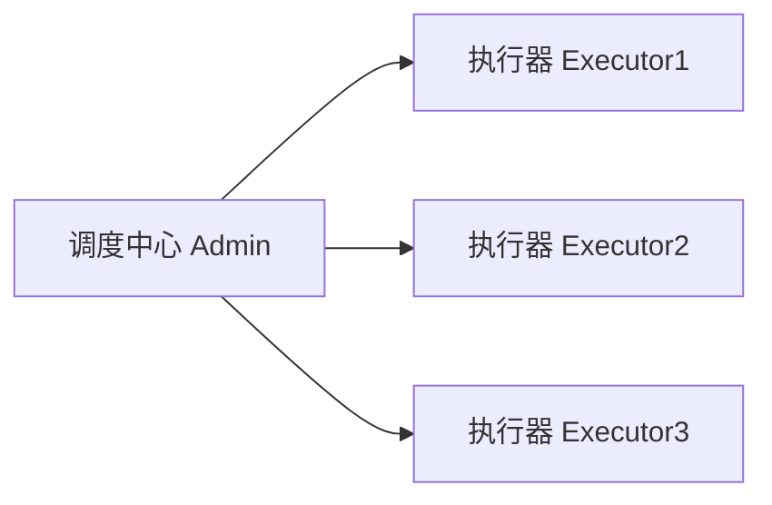
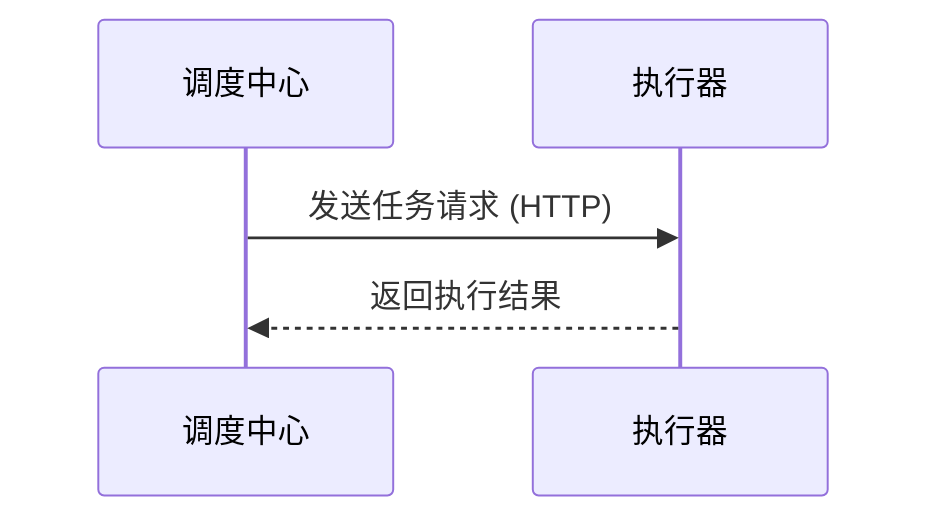

# 4. 任务调度

# Xxl-Job：Java面试八股文详解

***

## 1. 概述与定义

Xxl-Job是一个开源的分布式任务调度平台，旨在为微服务架构提供高效、可靠的任务调度解决方案。它通过集中式的调度中心管理和调度任务，支持多种任务类型（如Java处理器、Shell脚本等），并提供任务分片、失败重试、告警通知等高级特性。Xxl-Job的设计目标是简化任务调度的开发和运维工作，提升系统的可维护性和可扩展性。

### 定义

简单来说，Xxl-Job是一个支持分布式部署的任务调度框架，通过调度中心统一管理任务的创建、调度和监控，支持任务的动态管理和高可用性。在面试中，你可以这样回答：“Xxl-Job是一个轻量级的分布式任务调度平台，提供了任务管理、调度执行、监控告警等功能，特别适合微服务架构中的定时任务和批量处理。” 这个定义简洁明了，突出核心功能，能快速抓住面试官的注意力。

### 背景与定位

Xxl-Job起源于大众点评内部的任务调度系统，后开源并广泛应用于企业级项目。它支持多种任务执行方式，如单机执行、广播执行和分片执行，能够满足不同业务场景的需求。与传统的Quartz框架相比，Xxl-Job更注重分布式环境下的任务调度，提供了更丰富的功能和更高的灵活性，是现代微服务架构中的优选任务调度工具。

***

## 2. 主要特点

Xxl-Job的核心价值体现在其特性上，以下是其主要特点，面试时可以逐一展开并结合场景说明：

- **分布式调度** 🌐 &#x20;

  支持任务的分布式执行，通过调度中心统一管理和调度任务，支持任务分片和广播执行。
- **高可用性** 🚀 &#x20;

  调度中心和执行器均支持集群部署，确保任务调度的可靠性和容错性。
- **任务管理** 📋 &#x20;

  提供Web管理界面，方便任务的创建、编辑、删除和监控，支持任务的动态启停。
- **多种任务类型** 🛠️ &#x20;

  支持Java处理器、Shell脚本、Python脚本等多种任务类型，灵活适应不同业务需求。
- **任务分片** 📦 &#x20;

  支持将任务拆分为多个子任务并行执行，提升任务处理效率，特别适合大数据量处理。
- **失败重试** 🔄 &#x20;

  支持任务失败后的自动重试，确保任务的最终完成。
- **告警通知** 📧 &#x20;

  任务执行失败或超时可触发告警通知，支持邮件、短信等多种通知方式。
- **易用性** ✨ &#x20;

  提供简单配置和API，快速集成到现有项目，支持Spring Boot无缝集成。

### 面试Tips

提到“分布式调度”时，可以举例：“在微服务系统中，定时任务可能分布在多个服务中，Xxl-Job通过调度中心统一管理，执行器集群执行任务，确保任务不重复执行。” 这样的场景化描述能体现实战经验。对于“任务分片”，可以补充：“比如批量处理100万条数据，可以拆成10个分片并行执行，效率提升10倍。” 展现你对技术的深入理解。

***

## 3. 应用目标

Xxl-Job的设计目标是解决微服务架构中的任务调度难题，其主要应用目标包括：

- **集中管理任务** &#x20;

  通过调度中心统一管理所有任务，避免任务分散在各个服务中难以维护。
- **支持分布式执行** &#x20;

  任务可以在多个执行器上并行执行，提升任务处理能力和系统吞吐量。
- **提高任务可靠性** &#x20;

  通过失败重试、告警通知等机制，确保任务的可靠执行和异常处理。
- **简化任务开发** &#x20;

  提供丰富的API和注解支持，降低任务开发的复杂度，让开发者专注于业务逻辑。
- **适应高并发场景** &#x20;

  通过任务分片和负载均衡，应对高并发和大数据量的任务处理需求。

在面试中，可以总结为：“Xxl-Job的目标是为微服务架构提供一个集中式、分布式、高可靠的任务调度平台，支持多种任务类型和执行策略，简化任务管理和开发。” 这个回答简洁全面，能快速传递核心信息。

### 补充说明

虽然“简化任务开发”不是Xxl-Job的首要目标，但在实际应用中，其提供的注解和API显著减少了开发工作量，值得在面试中提及，以体现你对框架的全面理解。

***

## 4. 主要内容及其组成部分

Xxl-Job是一个功能丰富的任务调度平台，由多个核心组件和功能模块组成，下面详细解释其内容，并结合代码示例、表格和Mermaid图表进行说明。

### 4.1 核心组件

Xxl-Job的架构由以下两个核心组件组成：

- **调度中心（Admin）** &#x20;

  负责任务的创建、调度、监控和告警，提供Web管理界面和API。
- **执行器（Executor）** &#x20;

  负责任务的实际执行，可以部署在多个服务节点上，支持集群部署。

#### Mermaid图表：Xxl-Job架构




**图表说明**：此图展示了Xxl-Job的分布式架构，调度中心统一管理多个执行器，执行器负责任务的实际执行。面试时可以用这个图直观解释Xxl-Job的组件协作。

### 4.2 任务类型

Xxl-Job支持多种任务类型，下面逐一详解。

#### 4.2.1 Bean模式

Bean模式是最常用的任务类型，任务处理器以Spring Bean的形式定义，调度中心通过HTTP调用执行器执行任务。

#### 示例：Bean模式任务处理器

```java 
@Component
public class SampleJobHandler extends IJobHandler {
    @Override
    public ReturnT<String> execute(String param) throws Exception {
        System.out.println("执行任务，参数: " + param);
        return ReturnT.SUCCESS;
    }
}
```


**代码说明**：此代码定义了一个Bean模式的处理器，调度中心通过HTTP请求调用`execute`方法执行任务。

#### 4.2.2 GLUE模式

GLUE模式支持在线编写任务代码（Java、Shell、Python等），无需部署代码，适合临时任务或脚本执行。

#### 示例：GLUE模式配置

在Web管理界面选择GLUE模式，输入Shell脚本：

```bash 
#!/bin/bash
echo "Hello, Xxl-Job!"
```


**配置说明**：此脚本将在执行器上执行，调度中心通过HTTP请求触发。

#### 4.2.3 处理器模式

处理器模式支持将任务处理器注册到执行器，调度中心通过处理器名称调用任务。

#### 补充说明

处理器模式与Bean模式类似，但更灵活，支持动态注册和卸载处理器。

### 4.3 调度策略

Xxl-Job支持多种调度策略，下面逐一详解。

#### 4.3.1 单机串行

任务在单个执行器上串行执行，适合简单任务。

#### 4.3.2 广播执行

任务在所有执行器上同时执行，适合数据同步等场景。

#### 4.3.3 分片广播

任务被拆分为多个分片，每个分片在不同执行器上执行，适合大数据量处理。

#### 示例：分片广播配置

在Web管理界面设置分片参数：

- 分片总数：10
- 分片参数：#{index}（分片索引）

执行器通过`ShardingUtil`获取分片信息：

```java 
ShardingUtil.ShardingVO shardingVO = ShardingUtil.getShardingVo();
int index = shardingVO.getIndex();
int total = shardingVO.getTotal();
```


**代码说明**：此代码获取当前分片索引和总分片数，用于处理分片数据。

### 4.4 任务管理

Xxl-Job提供Web管理界面，支持任务的创建、编辑、删除、启停和监控。

#### 示例：任务配置

- **任务名称**：sampleJob
- **执行器**：sampleExecutor
- **任务类型**：Bean模式
- **处理器**：SampleJobHandler
- **Cron**：0 0 1 \* \* ?（每天1点执行）

**配置说明**：此配置定义了一个每天1点执行的Bean模式任务，由SampleJobHandler处理器执行。

### 4.5 监控与告警

Xxl-Job支持任务执行监控和告警，任务失败或超时可触发通知。

#### 示例：告警配置

在Web管理界面设置告警邮箱：

- 告警邮箱：<admin@example.com>

任务失败时，调度中心发送邮件通知。

### 组件对比表格

| 组件          | 功能描述      | 优点      | 缺点     |
| ----------- | --------- | ------- | ------ |
| Xxl-Job     | 分布式任务调度平台 | 功能全面、易用 | 学习成本稍高 |
| Quartz      | 单机任务调度框架  | 成熟稳定    | 不支持分布式 |
| Elastic-Job | 分布式任务调度框架 | 支持弹性伸缩  | 配置复杂   |

**表格说明**：此表格对比了主流任务调度框架的特性，Xxl-Job功能丰富且易用，Quartz适合单机，Elastic-Job支持弹性伸缩但配置复杂。面试时可用此表格回答“Xxl-Job与其他调度框架的区别”。

***

## 5. 原理剖析

Xxl-Job的实现原理涉及任务调度、执行器通信、任务分片等，下面深入解析其核心机制。

### 5.1 任务调度原理

Xxl-Job的调度中心通过Quartz框架实现任务调度，Quartz根据Cron表达式触发任务，调度中心将任务请求发送到执行器。

#### Mermaid图表：任务调度流程




**图表说明**：此图展示了调度中心与执行器之间的HTTP通信流程，面试时可以用它解释Xxl-Job的调度机制。

### 5.2 执行器通信

执行器通过HTTP与调度中心通信，接收任务请求并执行，返回执行结果。执行器支持集群部署，调度中心通过负载均衡选择执行器。

#### 示例：执行器配置

```.properties 
xxl.job.admin.addresses=http://localhost:8080/xxl-job-admin
xxl.job.executor.appname=sampleExecutor
xxl.job.executor.port=9999
```


**配置说明**：此配置指定了调度中心地址、执行器名称和端口，执行器启动后注册到调度中心。

### 5.3 任务分片原理

任务分片通过分片参数实现，调度中心将分片信息传递给执行器，执行器根据分片索引处理相应数据。

#### 示例：分片处理

```java 
public class ShardingJobHandler extends IJobHandler {
    @Override
    public ReturnT<String> execute(String param) throws Exception {
        ShardingUtil.ShardingVO shardingVO = ShardingUtil.getShardingVo();
        int index = shardingVO.getIndex();
        int total = shardingVO.getTotal();
        // 处理第index个分片的数据
        return ReturnT.SUCCESS;
    }
}
```


**代码说明**：此代码展示了如何在处理器中获取分片信息并处理相应数据。

### 5.4 失败重试与告警

Xxl-Job支持任务失败后的自动重试，调度中心记录任务状态，失败时可触发重试或告警。

#### 补充说明

失败重试和告警机制确保任务的可靠性，面试官可能追问其实现细节，需了解任务状态机的设计。

***

## 6. 应用与拓展

Xxl-Job在实际项目中应用广泛，以下是一些典型场景：

- **定时任务** &#x20;

  如每天凌晨清理过期数据、生成日报表等。
- **批量处理** &#x20;

  如批量发送邮件、处理大数据量任务，通过分片提升效率。
- **数据同步** &#x20;

  如跨服务数据同步，通过广播执行确保所有节点同步。
- **告警通知** &#x20;

  任务失败时自动发送告警，及时处理异常。

### 拓展

Xxl-Job可与其他技术结合：

- **Spring Cloud**：在微服务中集成Xxl-Job，管理分布式任务。
- **Docker**：容器化部署执行器，实现弹性伸缩。
- **Prometheus**：集成监控，收集任务执行指标。

***

## 7. 面试问答

以下是五个常见面试问题及详细回答，模仿面试者口吻，确保自然且详实。

### 问题 1：Xxl-Job是什么？

**回答**： &#x20;

“Xxl-Job是一个分布式任务调度平台，提供了任务管理、调度执行、监控告警等功能，特别适合微服务架构中的定时任务和批量处理。它通过调度中心统一管理任务，执行器负责实际执行，支持任务分片、失败重试等高级特性。我在项目里用过Xxl-Job管理定时任务，配置简单，功能强大。”

### 问题 2：Xxl-Job与Quartz有什么区别？

**回答**： &#x20;

“Xxl-Job和Quartz都是任务调度框架，但Xxl-Job更适合分布式环境。Quartz是单机调度框架，任务在本地执行，而Xxl-Job支持分布式部署，任务可以在多个执行器上执行，还支持任务分片和广播执行。Xxl-Job还提供了Web管理界面，操作更方便。Quartz虽然成熟稳定，但不支持分布式，扩展性差。我在项目里用Xxl-Job替代了Quartz，管理更灵活。”

### 问题 3：Xxl-Job的任务分片是怎么实现的？

**回答**： &#x20;

“Xxl-Job的任务分片是通过分片参数实现的。调度中心将任务拆成多个分片，传递给执行器，执行器通过ShardingUtil获取分片索引和总分片数，然后处理相应的数据。比如处理100万条数据，可以设10个分片，每个执行器处理10万条，效率提升很多。我在项目里用过分片处理批量任务，性能提升明显。”

### 问题 4：Xxl-Job如何保证高可用性？

**回答**： &#x20;

“Xxl-Job的调度中心和执行器都支持集群部署。调度中心可以用数据库或Zookeeper做集群，确保某个节点挂了也能继续调度；执行器集群通过负载均衡接收任务请求，某个执行器故障不影响任务执行。我在生产环境里搭过Xxl-Job集群，用MySQL做数据源，挺稳定的。”

### 问题 5：如何在Spring Boot项目中集成Xxl-Job？

**回答**： &#x20;

“在Spring Boot里集成Xxl-Job很简单。先加`xxl-job-core`依赖，然后在配置类里定义执行器Bean，指定调度中心地址和执行器名称；接着写任务处理器，继承IJobHandler并实现execute方法，最后在Web管理界面配置任务，关联到这个处理器。我在项目里用过，配置好后任务就能自动执行了。”

***

## 总结

这篇八股文从Xxl-Job的定义到原理、应用场景，再到面试问答，覆盖了所有核心知识点。通过代码示例、表格和Mermaid图表，内容直观易懂，背熟后能在面试中自信应对各种问题，展现你的专业能力！✨
