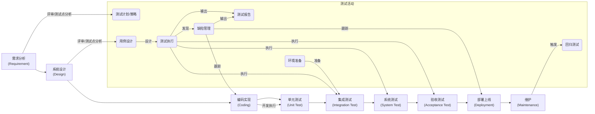
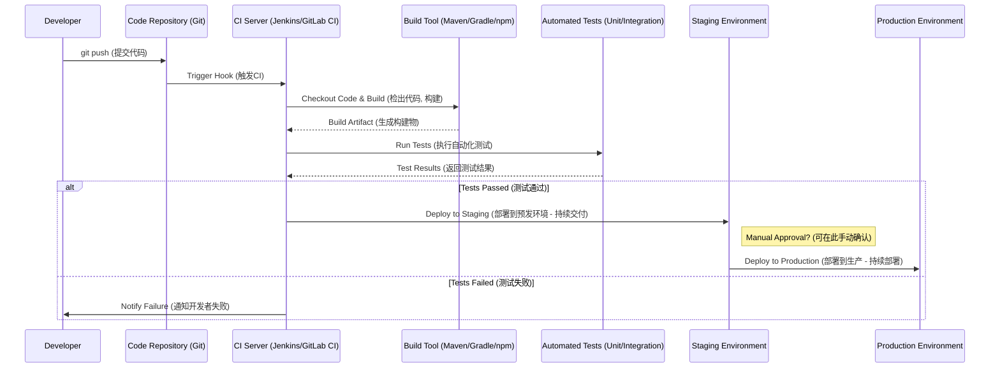
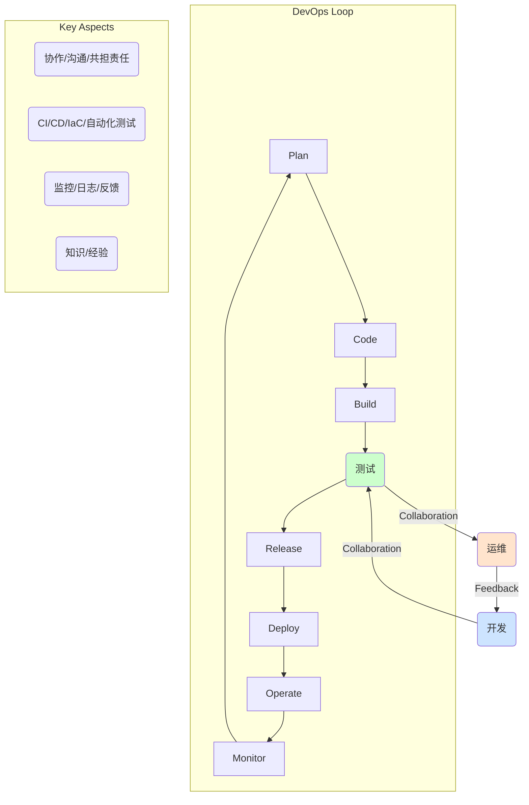

# 一、 软件测试基础 (Software Testing Basics)

### 工作内容 (Work Content)

#### Q：按测试内容划分，测试有哪些种类？

- **功能测试 (Functional Testing):**
  - **目标:** 验证软件功能是否符合需求规格。
  - **开发者类比:** 你开发的功能是否按 PRD (产品需求文档) 或 User Story 实现？
- **性能测试 (Performance Testing):**
  - **目标:** 评估软件在负载下的响应速度、处理能力和资源消耗。
  - **开发者类比:** 你写的 API 在高并发下 QPS/TPS 能达到多少？响应时间 P95 是多少？服务器资源会不会爆？
- **安全测试 (Security Testing):**
  - **目标:** 发现潜在的安全漏洞，防止未授权访问和攻击。
  - **开发者类比:** 代码是否存在 SQL 注入、XSS、CSRF、越权等漏洞？依赖的库是否有已知的安全风险？
- **兼容性测试 (Compatibility Testing):**
  - **目标:** 确保软件在不同环境（OS, 浏览器, 设备, 网络）下正常运行。
  - **开发者类比:** 你的 Web 应用在 Chrome, Firefox, Safari 上表现是否一致？你的 App 在不同 Android 版本/iOS 版本/分辨率下 UI 是否适配？
- **易用性测试 (Usability Testing):**
  - **目标:** 评估用户使用软件的便捷性、满意度。
  - **开发者类比:** 用户完成一个核心操作需要多少步骤？界面是否直观易懂？
- **回归测试 (Regression Testing):**
  - **目标:** 修改代码或新增功能后，确保原有功能未受影响且新 Bug 未引入。
  - **开发者类比:** 你修复了一个 Bug，有没有顺手改坏其他地方？跑一遍相关的单元/集成测试非常有必要。
- **压力测试 (Stress Testing):**
  - **目标:** 测试系统在极端负载下的稳定性和极限。
  - **开发者类比:** 不断加压，看系统在哪个点开始崩溃或性能急剧下降。

#### Q：软件开发（测试）的流程是怎么样的？

典型的 V 模型 或敏捷模型中的流程，强调测试左移 (Shift Left)。



> **关键：** 测试不是开发完成后的独立阶段，而是 **贯穿始终** 的活动。尽早介入（需求、设计评审）能更早发现问题，成本最低。

#### Q：你印象最深刻的 bug 是？

> **回答结构 (STAR原则变种):**
> 1\.  **情境 (Situation/Context):** 简述项目/模块背景。
> 2\.  **任务/现象 (Task/Symptom):** Bug 的具体表现，影响范围。
> 3\.  **行动/排查 (Action/Debugging):** **(重点展示你的能力)** 如何定位问题？
> \*   看了什么日志？(应用日志、系统日志、Nginx日志?)
> \*   用了什么工具？(Debugger, Profiler, Fiddler/Wireshark, Chrome DevTools?)
> \*   怎么分析的？(代码走查、二分法定位、复现步骤、数据追踪?)
> 4\.  **结果/原因 (Result/Root Cause):** Bug 的根本原因（逻辑错误、并发、边界、配置、第三方依赖等）。
> 5\.  **反思/预防 (Reflection/Prevention):** 学到了什么？如何避免？（加单元测试、改进 Code Review、加监控告警等）。

*(请根据你的真实经历准备一个具体案例)*

#### Q：谈谈你对 CI/CD 的理解

**CI (Continuous Integration - 持续集成)** + **CD (Continuous Delivery/Deployment - 持续交付/部署)**



- **CI (持续集成):** 频繁合并代码 -> 自动构建 -> 自动运行 (单元/部分集成) 测试。**核心是快速反馈，尽早发现集成问题。**
- **CD (持续交付/部署):**
  - **持续交付 (Delivery):** CI 通过后，自动部署到 *类生产环境* (Staging/UAT)，达到 **可随时部署** 状态。生产部署通常手动触发。
  - **持续部署 (Deployment):** CI 通过后，自动部署到 **生产环境**。
- **SDET 的角色:** 开发和维护 CI/CD 流水线中的 **自动化测试**，保障流水线的有效性和代码质量。

#### Q：谈谈你对 DevOps 的理解

**DevOps = Culture (文化) + Practices (实践) + Tools (工具)**



- **目标:** 打破开发 (Dev)、测试 (Test) 和运维 (Ops) 之间的壁垒，通过 **自动化** 和 **协作** 提高软件交付的 **速度、质量和可靠性**。
- **核心实践:** CI/CD, 自动化测试, 基础设施即代码 (IaC), 监控与日志, 微服务。
- **SDET 的角色:** 作为 Dev 和 Ops 之间的桥梁，利用技术手段（特别是自动化测试）保障快速迭代下的质量，是 DevOps 文化的重要践行者。

#### Q：什么是 BDD ? 什么是 TDD ?

- **TDD (Test-Driven Development - 测试驱动开发):** **开发方法论**，强调测试先行。

  1. **Red:** 写一个失败的单元测试。
  2. **Green:** 写 **最少量** 的代码让测试通过。
  3. **Refactor:** 重构代码，保持测试通过。

  > **开发者视角:** 先定义好代码的“契约”（测试），再写实现，确保代码的正确性，并驱动出良好的设计（可测试性）。
  >
- **BDD (Behavior-Driven Development - 行为驱动开发):** **协作方法论**，是 TDD 的演进，更侧重业务行为。

  - 使用 **自然语言** (如 Gherkin) 描述用户场景和预期行为。
  - **Given** (给定一个场景/前置条件)
  - **When** (当执行某个动作)
  - **Then** (那么应该产生某个结果)

  ```text
  Feature: User Login

    Scenario: Successful login with valid credentials
      Given the user is on the login page
      When the user enters valid "username" and "password"
      And the user clicks the "Login" button
      Then the user should be redirected to the dashboard page
      And a welcome message "Welcome, username!" should be displayed
  ```

  > **核心:** 让 **业务人员、开发、测试** 使用统一的语言描述需求和验收标准，测试脚本即文档。Cucumber/SpecFlow/Behave 是常用框架。
  >

#### Q：APP的一个页面，你怎么区分是原生Native页面，还是H5？

| 方法                        | 描述                                                                                                                         | 优点                      | 缺点                       |
| --------------------------- | ---------------------------------------------------------------------------------------------------------------------------- | ------------------------- | -------------------------- |
| **调试工具 (最可靠)** | Android:chrome://inspect<br />iOS:Safari 开发菜单 -> 设备。能检查到 HTML/CSS/JS 结构的就是 H5 (WebView)。                    | 准确、直观 (对开发者友好) | 需要连接设备和开启调试模式 |
| **交互体验**          | 流畅度: Native 通常更流畅。<br />控件样式: Native 倾向系统风格，H5 可能自定义或模仿。<br />加载指示: H5 可能有网页加载条。 | 快速初步判断              | 主观，不绝对               |
| **网络依赖**          | 断网后，Native 可能显示基础框架，H5 常显示错误或空白 (除非有离线包)。                                                        | 简单易行                  | 依赖网络状态，可能有缓存   |
| **文本操作**          | H5 文本通常像网页一样易于长按选中/复制。                                                                                     | 特定场景下有效            | 不通用                     |
| **查看元素 (App内)**  | 有些 App 提供的 "查看元素" 或类似开发者选项，可以看到页面类型。                                                              | (如果提供) 比较准确       | 非标准功能，依赖 App 实现  |
| **URL/标题栏**        | 部分内嵌 H5 会显示网页 URL 或特定标题栏。                                                                                    | (如果可见) 直观           | 不一定有                   |

---
