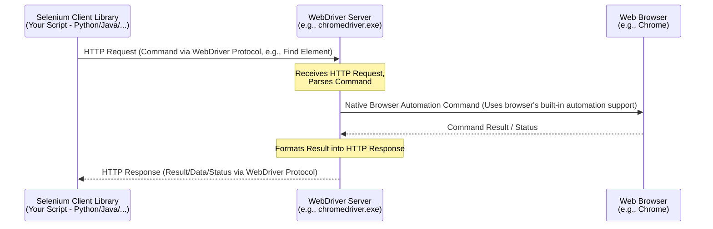
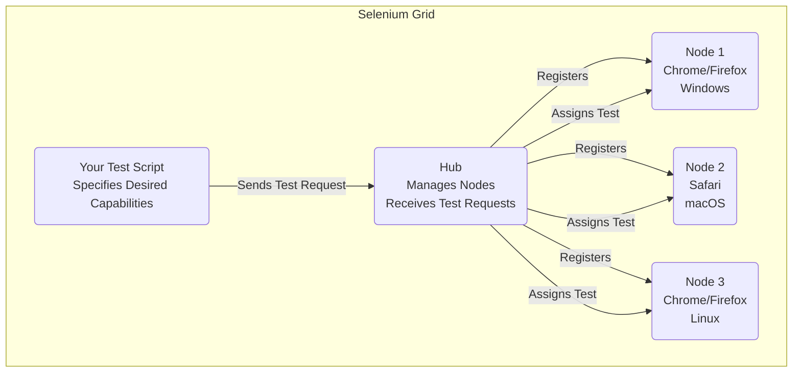

# 七、 Selenium自动化框架

***

## 前言

对于拥有开发背景、准备转向 SDET 岗位的你来说，**Selenium WebDriver** 是必须掌握的核心工具之一。它不仅仅是一个“点点点”的自动化工具，更是一个强大的 **浏览器自动化框架**，允许你用熟悉的编程语言编写健壮、可维护的 Web UI 测试。本指南将深入探讨 Selenium WebDriver 的核心概念、架构、最佳实践以及面试中的常见考点，帮助你将开发经验应用于自动化测试领域。

> **核心理念：** 将自动化测试脚本视为 **软件开发项目** 来对待，运用你的编程能力和设计原则（如封装、模块化）来构建高质量的自动化解决方案。

***

## 一、 Selenium 是什么？

Selenium 不是单个工具，而是一个用于 **Web 浏览器自动化** 的 **项目套件**。其核心目标是提供一套工具，让开发者和测试人员能够通过编程方式控制浏览器行为，主要用于自动化 Web 应用的功能测试。

### Selenium 套件概览

| 组件             | 描述                                                  | 目标用户/用途                           |
| -------------- | --------------------------------------------------- | --------------------------------- |
| **WebDriver**​ | \*\*核心 API\*\*，提供一套面向对象的、与特定语言绑定的接口来驱动浏览器。          | \*\*SDET 主要使用\*\*，用于编写健壮的自动化测试脚本。 |
| Selenium IDE   | 浏览器\*\*录制/回放\*\*插件 (Chrome/Firefox)。                | 快速原型、简单脚本、入门学习。 (不适合复杂项目)         |
| Selenium Grid  | \*\*分布式执行\*\* 测试脚本，允许在多台机器、多种浏览器/操作系统上\*\*并行\*\*运行。 | 提高测试效率，进行跨浏览器兼容性测试。               |

> 本文重点关注 **Selenium WebDriver**，因为它是 SDET 工作中最常用、最重要的部分。

***

## 二、 Selenium WebDriver 架构

理解 WebDriver 的工作原理对于调试和编写高效脚本至关重要。它采用 **客户端-服务器** 架构。

### WebDriver 协议 (W3C / JSON Wire Protocol)




1. **客户端库 (Client Libraries):** 你的测试脚本（使用 Python, Java, C#, JavaScript 等语言编写）调用 Selenium WebDriver API。
2. **WebDriver 协议:** 客户端库将 API 调用转换为遵循 **W3C WebDriver 标准** (或旧的 JSON Wire Protocol) 的 **HTTP 请求**。这些请求是 RESTful 的，包含要执行的命令（如查找元素、点击、获取文本）和参数。
3. **WebDriver 服务器 (Browser Driver):** 这是一个**特定于浏览器**的可执行文件（如 `chromedriver.exe`, `geckodriver.exe` for Firefox）。它监听来自客户端的 HTTP 请求。
4. **与浏览器通信:** WebDriver 服务器解析收到的 HTTP 命令，并使用浏览器**原生**的自动化支持或 API 来控制浏览器执行相应的操作。
5. **响应返回:** 浏览器执行结果返回给 WebDriver 服务器，服务器再将其封装成 HTTP 响应，通过 WebDriver 协议发送回客户端库。
6. **客户端处理:** 客户端库解析 HTTP 响应，将其转换为对应语言的对象或状态，你的脚本可以继续执行或进行断言。

> **开发者视角：** 这就像你用一个库（Selenium Client）去调用一个远程服务（WebDriver Server），这个服务再去操作另一个系统（浏览器）。理解这个 HTTP 通信有助于排查连接问题或超时问题。

***

## 三、 WebDriver 核心概念与 API

### WebDriver 实例与浏览器会话

一切始于创建一个 WebDriver 实例，这会启动一个新的浏览器窗口（会话）。

```python 
# Python Example
from selenium import webdriver

# Creates a new Chrome browser session
driver = webdriver.Chrome()
# Options can be passed for headless mode, user profiles, etc.
# options = webdriver.ChromeOptions()
# options.add_argument('--headless')
# driver = webdriver.Chrome(options=options)

# Navigate to a URL
driver.get("https://www.google.com")

# ... perform actions ...

# Close the current window
# driver.close()

# Quit the driver session and close all associated windows
driver.quit()
```


```java 
// Java Example
import org.openqa.selenium.WebDriver;
import org.openqa.selenium.chrome.ChromeDriver;
// import org.openqa.selenium.chrome.ChromeOptions;

// System.setProperty("webdriver.chrome.driver", "/path/to/chromedriver"); // Set driver path

WebDriver driver = new ChromeDriver();
// ChromeOptions options = new ChromeOptions();
// options.addArguments("--headless");
// WebDriver driver = new ChromeDriver(options);

driver.get("https://www.google.com");

// ... perform actions ...

// driver.close();
driver.quit();
```


### 定位元素 (Locators)

这是自动化脚本的基础：找到你要交互的 HTML 元素。

| 定位策略                   | 描述                                        | 优点                      | 缺点                      | 示例 (Python)                                                                 |
| ---------------------- | ----------------------------------------- | ----------------------- | ----------------------- | --------------------------------------------------------------------------- |
| **ID**​                | 使用元素唯一的 \`id\` 属性                         | \*\*最快、最稳定\*\* (若存在且唯一) | 并非所有元素都有 ID             | \`driver.find\_element(By.ID, "username")\`                                 |
| **Name**​              | 使用元素的 \`name\` 属性 (常见于表单元素)               | 较稳定                     | 可能不唯一                   | \`driver.find\_element(By.NAME, "password")\`                               |
| **Class Name**​        | 使用元素的 \`class\` 属性 (注意：只能用一个类名)           | 可用                      | 经常不唯一，类名可能包含空格          | \`driver.find\_element(By.CLASS\_NAME, "button-primary")\`                  |
| **Tag Name**​          | 使用 HTML 标签名 (如 \`input\`, \`a\`, \`div\`) | 简单                      | **极易不唯一**​              | \`driver.find\_element(By.TAG\_NAME, "h1")\`                                |
| **Link Text**​         | 使用链接 (\`\<a>\` 标签) 的 \*\*完整\*\* 可见文本      | 精确匹配文本                  | 仅限 \`\<a>\` 标签，文本需完全匹配  | \`driver.find\_element(By.LINK\_TEXT, "About Us")\`                         |
| **Partial Link Text**​ | 使用链接 (\`\<a>\` 标签) 的 \*\*部分\*\* 可见文本      | 文本部分匹配，更灵活              | 仅限 \`\<a>\` 标签，可能不唯一    | \`driver.find\_element(By.PARTIAL\_LINK\_TEXT, "About")\`                   |
| **CSS Selector**​      | 使用 CSS 选择器语法                              | **强大、灵活、通常比 XPath 快**​  | 语法需要学习                  | \`driver.find\_element(By.CSS\_SELECTOR, "input#email\[name='email']")\`    |
| **XPath**​             | 使用 XPath 表达式在 DOM 中导航                     | \*\*最强大\*\*，可处理复杂关系/文本  | 语法复杂，通常比 CSS Selector 慢 | \`driver.find\_element(By.XPATH, "//button\[contains(text(), 'Submit')]")\` |

> `Name` > `CSS Selector` > `XPath`。避免使用过于依赖 DOM 结构或文本内容的脆弱定位器 (如绝对 XPath, Link Text)。

### 元素交互 (Interactions)

找到元素后，可以模拟用户操作：

- `element.click()`: 点击元素。
- `element.send_keys("text")`: 在输入框或可编辑元素中输入文本。
- `element.clear()`: 清除输入框内容。
- `element.text`: 获取元素的可见文本。
- `element.get_attribute("attribute_name")`: 获取元素的指定属性值 (如 `value`, `href`, `class`)。
- `element.is_displayed()`: 元素是否可见。
- `element.is_enabled()`: 元素是否可用 (可交互)。
- `element.is_selected()`: (复选框/单选按钮) 是否被选中。
- `element.submit()`: 提交表单 (可以在表单内任一元素上调用)。

### 等待机制 (Waits)

现代 Web 应用是 **异步加载** 的。直接查找元素很可能因为元素尚未加载而失败 (抛出 `NoSuchElementException`)。**必须使用等待机制** 来确保元素出现或达到可交互状态。

| 等待类型                       | 描述                                                                                | 优点                                                              | 缺点                                                                                                | 示例 (Python)                               |
| -------------------------- | --------------------------------------------------------------------------------- | --------------------------------------------------------------- | ------------------------------------------------------------------------------------------------- | ----------------------------------------- |
| **Implicit Wait (隐式等待)** ​ | 设置一个全局超时时间。\`find\_element(s)\` 会在超时时间内\*\*轮询\*\*查找元素，直到找到或超时。                    | 设置一次，全局生效，代码稍简洁。                                                | 1\\. 只针对 \`find\_element(s)\`。  2\\. 对元素状态 (可见/可点击) 无效。  3\\. 可能隐藏性能问题。  4\\. \*\*不推荐\*\*与显式等待混用。 | \`driver.implicitly\_wait(10)\` # 等待最多10秒 |
| **Explicit Wait (显式等待)** ​ | \*\*(推荐)\*\* 针对 \*\*特定条件\*\* 等待，在指定超时时间内反复检查条件是否满足。与 \`ExpectedConditions\` 结合使用。 | 1\\. \*\*更灵活、精确\*\*。  2\\. 可等待各种条件 (可见、可点击、文本出现等)。  3\\. 更稳定可靠。 | 需要为每个等待点编写代码 (但通常封装成方法)。                                                                          | (见下方代码)                                   |
| **Fluent Wait**​           | 显式等待的变种，允许更精细的控制 (轮询间隔、忽略特定异常)。                                                   | 高度可定制。                                                          | 代码更冗长。                                                                                            | (不常用，显式等待通常足够)                            |

**Explicit Wait 示例 (Python):**

```python 
from selenium.webdriver.common.by import By
from selenium.webdriver.support.ui import WebDriverWait
from selenium.webdriver.support import expected_conditions as EC
from selenium.common.exceptions import TimeoutException

# ... driver setup ...
driver.get("some_dynamic_page.html")

try:
    # 等待最多 10 秒，直到 ID 为 'submitButton' 的元素变得可点击
    submit_button = WebDriverWait(driver, 10).until(
        EC.element_to_be_clickable((By.ID, "submitButton"))
    )
    submit_button.click()

    # 等待最多 5 秒，直到 class name 为 'success-message' 的元素可见
    success_message = WebDriverWait(driver, 5).until(
        EC.visibility_of_element_located((By.CLASS_NAME, "success-message"))
    )
    print(success_message.text)

except TimeoutException:
    print("Element did not meet the condition within the time limit.")
    # Handle timeout (e.g., fail the test)

```


> **关键：** **永远不要** 使用 `time.sleep()` 进行固定等待！这是极其不稳定且低效的做法。**始终优先使用显式等待 (Explicit Wait)**。

### 窗口与 Frame 处理

- **多窗口/标签页切换:**
  - `driver.current_window_handle`: 获取当前窗口句柄。
  - `driver.window_handles`: 获取所有已打开窗口的句柄列表。
  - `driver.switch_to.window(window_handle)`: 切换到指定句柄的窗口。
- **处理 Frame/IFrame:** 页面中的 Frame 需要切换进去才能操作其内部元素。
  - `driver.switch_to.frame(frame_reference)`: `frame_reference` 可以是 frame 的 id, name, 索引 (从 0 开始)，或者定位到的 WebElement 对象。
  - `driver.switch_to.default_content()`: 从 Frame 切回到主文档。
  - `driver.switch_to.parent_frame()`: 切换到上一级 Frame (如果是嵌套 Frame)。

### Actions 类 (高级交互)

用于模拟复杂的鼠标和键盘操作。

```python 
# Python Example
from selenium.webdriver.common.action_chains import ActionChains

# ... driver setup ...
menu_element = driver.find_element(By.ID, "mainMenu")
submenu_item = driver.find_element(By.ID, "subMenuItem")
source_element = driver.find_element(By.ID, "draggable")
target_element = driver.find_element(By.ID, "droppable")

actions = ActionChains(driver)

# 鼠标悬停
actions.move_to_element(menu_element).perform()
# 悬停后点击子菜单
actions.move_to_element(submenu_item).click().perform()

# 拖拽
actions.drag_and_drop(source_element, target_element).perform()

# 右键点击
actions.context_click(some_element).perform()

# 双击
actions.double_click(another_element).perform()
```


***

## 四、 设计模式与最佳实践：Page Object Model (POM)

随着测试用例增多，如果将定位器和操作逻辑散落在测试代码各处，会变得极难维护。**Page Object Model (POM)** 是一种广泛应用于 UI 自动化测试的 **设计模式**，旨在提高代码的 **可读性、可维护性和可重用性**。

### 为什么需要 POM？

- **关注点分离 (Separation of Concerns):** 将 **UI 元素定位和操作** 与 **测试逻辑** 分离开。
- **代码重用:** 页面操作封装在 Page Object 类中，多个测试用例可以复用。
- **可维护性:** 当 UI 发生变化时，只需要修改对应的 Page Object 类中的定位器或方法，而不需要修改大量的测试用例代码。
- **可读性:** 测试用例代码更简洁，更侧重于业务流程描述，而不是底层的 UI 操作细节。

### POM 结构示例

1. **Base Page (可选但推荐):** 包含所有页面对象共有的方法 (如构造函数初始化 WebDriver, 通用等待方法等)。
2. **Page Object 类:** 每个页面或重要组件对应一个类。
   - **成员变量:** 存储该页面的元素定位器 (Locators)。
   - **构造函数:** 接收 WebDriver 实例。
   - **方法:** 封装用户在该页面上的操作 (如 `login(username, password)`, `search(query)`, `get_welcome_message()`)。这些方法内部调用 WebDriver API 进行元素定位和交互。
3. **测试脚本 (Test Script):**
   - 导入所需的 Page Object 类。
   - 创建 Page Object 实例。
   - 调用 Page Object 的方法来执行业务流程。
   - 使用断言 (Assertions) 验证结果。

**结构示意 (Python):**

```python 
# base_page.py
from selenium.webdriver.support.ui import WebDriverWait
from selenium.webdriver.support import expected_conditions as EC

class BasePage:
    def __init__(self, driver):
        self.driver = driver
        self.wait = WebDriverWait(self.driver, 10) # Default explicit wait

    def find_element(self, locator):
        return self.wait.until(EC.visibility_of_element_located(locator))

    def click(self, locator):
        self.wait.until(EC.element_to_be_clickable(locator)).click()

    def send_keys(self, locator, text):
        element = self.find_element(locator)
        element.clear()
        element.send_keys(text)

    def get_text(self, locator):
        return self.find_element(locator).text

# login_page.py
from selenium.webdriver.common.by import By
from base_page import BasePage

class LoginPage(BasePage):
    # Locators
    USERNAME_INPUT = (By.ID, "username")
    PASSWORD_INPUT = (By.ID, "password")
    LOGIN_BUTTON = (By.XPATH, "//button[text()='Login']")
    ERROR_MESSAGE = (By.CSS_SELECTOR, ".error-message")

    def __init__(self, driver):
        super().__init__(driver)
        self.driver.get("https://example.com/login") # Navigate on init

    def enter_username(self, username):
        self.send_keys(self.USERNAME_INPUT, username)

    def enter_password(self, password):
        self.send_keys(self.PASSWORD_INPUT, password)

    def click_login(self):
        self.click(self.LOGIN_BUTTON)

    def login(self, username, password):
        self.enter_username(username)
        self.enter_password(password)
        self.click_login()
        # Return the next page object, e.g., DashboardPage
        # return DashboardPage(self.driver)

    def get_error_message(self):
        return self.get_text(self.ERROR_MESSAGE)


# test_login.py (using pytest)
import pytest
from selenium import webdriver
from login_page import LoginPage
# from dashboard_page import DashboardPage # Assuming DashboardPage exists

@pytest.fixture
def driver():
    # Setup WebDriver
    driver = webdriver.Chrome()
    yield driver
    # Teardown WebDriver
    driver.quit()

def test_successful_login(driver):
    login_page = LoginPage(driver)
    dashboard_page = login_page.login("valid_user", "valid_pass") # login method returns next page

    # Assertions on the dashboard page
    # assert dashboard_page.get_welcome_message() == "Welcome, valid_user!"

def test_failed_login(driver):
    login_page = LoginPage(driver)
    login_page.login("invalid_user", "wrong_pass")

    # Assertion on the login page
    assert "Invalid credentials" in login_page.get_error_message()

```


> **开发者视角：** POM 就是面向对象思想在 UI 自动化中的应用。将页面抽象成类，将元素和行为封装起来，提高代码质量。

***

## 五、 Selenium Grid: 分布式测试执行

当测试用例数量庞大，或者需要验证多浏览器/平台兼容性时，单个机器执行会非常慢。**Selenium Grid** 允许将测试分发到多台机器 (Nodes) 上并行执行。




- **Hub:** 中心节点，接收测试请求，管理各个 Node 的状态和能力 (浏览器类型、版本、操作系统)，并将测试分配给匹配的 Node。
- **Node:** 执行节点，实际运行 WebDriver 服务器和浏览器实例。一个 Node 可以注册多种浏览器能力。
- **Desired Capabilities:** 测试脚本在请求 Hub 时，需要指定期望的执行环境（如浏览器名称、版本、平台）。Hub 会查找满足这些能力的空闲 Node 来执行测试。

> **用途:** 大幅缩短测试执行时间，实现跨浏览器/平台测试。Docker 容器化技术常用于简化 Grid 的部署和管理。

***

## 六、 Selenium 的优势与局限性

| 优势 (Pros)                                    | 局限性 (Cons)                                                         |
| -------------------------------------------- | ------------------------------------------------------------------ |
| **开源免费 (Open Source & Free)** ​              | \*\*设置相对复杂 (Setup Complexity)\*\* (需要 Driver, 环境配置)                |
| **多语言支持 (Multi-Language Support)** ​         | \*\*速度可能较慢 (Can be Slow)\*\* (依赖 HTTP 通信, 浏览器渲染)                   |
| **跨浏览器支持 (Cross-Browser Support)** ​         | \*\*不稳定因素 (Flakiness)\*\* (易受网络、环境、异步加载影响 - 需要良好设计)                |
| **跨平台支持 (Cross-Platform Support)** ​         | \*\*仅限 Web 应用 (Web Apps Only)\*\* (不能测桌面/原生 App)                   |
| **庞大的社区和生态 (Large Community & Ecosystem)** ​ | \*\*无法处理非浏览器交互 (Cannot Handle OS Dialogs/Captcha)\*\* (需要额外工具或策略)  |
| **支持多种测试框架集成 (Framework Integration)** ​     | \*\*无内置报告 (No Built-in Reporting)\*\* (需集成 TestNG/pytest/Allure 等) |
| **支持并行测试 (via Grid)** ​                      | \*\*维护成本 (Maintenance Cost)\*\* (UI 变化导致脚本失效)                      |

***

## 七、 实际代码示例

(上面的 POM 示例已包含 Python + pytest 的结构)

### Java + TestNG + Selenium

```java 
// BasePage.java
import org.openqa.selenium.*;
import org.openqa.selenium.support.ui.ExpectedConditions;
import org.openqa.selenium.support.ui.WebDriverWait;
import java.time.Duration;

public class BasePage {
    protected WebDriver driver;
    protected WebDriverWait wait;

    public BasePage(WebDriver driver) {
        this.driver = driver;
        // Default explicit wait of 10 seconds
        this.wait = new WebDriverWait(driver, Duration.ofSeconds(10));
    }

    protected WebElement findElement(By locator) {
        return wait.until(ExpectedConditions.visibilityOfElementLocated(locator));
    }

    protected void click(By locator) {
        wait.until(ExpectedConditions.elementToBeClickable(locator)).click();
    }

    protected void sendKeys(By locator, String text) {
        WebElement element = findElement(locator);
        element.clear();
        element.sendKeys(text);
    }

     protected String getText(By locator) {
        return findElement(locator).getText();
    }
}

// LoginPage.java
import org.openqa.selenium.By;
import org.openqa.selenium.WebDriver;

public class LoginPage extends BasePage {
    // Locators
    private final By USERNAME_INPUT = By.id("username");
    private final By PASSWORD_INPUT = By.id("password");
    private final By LOGIN_BUTTON = By.xpath("//button[text()='Login']");
    private final By ERROR_MESSAGE = By.cssSelector(".error-message");

    public LoginPage(WebDriver driver) {
        super(driver);
        driver.get("https://example.com/login"); // Navigate on init
    }

    public void enterUsername(String username) {
        sendKeys(USERNAME_INPUT, username);
    }

    public void enterPassword(String password) {
        sendKeys(PASSWORD_INPUT, password);
    }

    public void clickLogin() {
        click(LOGIN_BUTTON);
    }

    public DashboardPage loginAs(String username, String password) {
        enterUsername(username);
        enterPassword(password);
        clickLogin();
        // Assuming successful login leads to DashboardPage
        return new DashboardPage(driver);
    }

     public String getErrorMessage() {
        return getText(ERROR_MESSAGE);
    }
}


// LoginTest.java (using TestNG)
import org.openqa.selenium.WebDriver;
import org.openqa.selenium.chrome.ChromeDriver;
import org.testng.Assert;
import org.testng.annotations.*;

public class LoginTest {

    private WebDriver driver;

    @BeforeMethod
    public void setUp() {
        // System.setProperty("webdriver.chrome.driver", "/path/to/chromedriver");
        driver = new ChromeDriver();
        driver.manage().window().maximize();
    }

    @Test
    public void testSuccessfulLogin() {
        LoginPage loginPage = new LoginPage(driver);
        DashboardPage dashboardPage = loginPage.loginAs("valid_user", "valid_pass");
        // Assertions on dashboard page
        // Assert.assertEquals(dashboardPage.getWelcomeMessage(), "Welcome, valid_user!");
        Assert.assertTrue(driver.getCurrentUrl().contains("dashboard")); // Example assertion
    }

    @Test
    public void testFailedLogin() {
        LoginPage loginPage = new LoginPage(driver);
        loginPage.loginAs("invalid_user", "wrong_pass");
        Assert.assertTrue(loginPage.getErrorMessage().contains("Invalid credentials"));
    }

    @AfterMethod
    public void tearDown() {
        if (driver != null) {
            driver.quit();
        }
    }
}
```


***

## 八、 面试要点与准备

面试中关于 Selenium 的问题通常考察你的理解深度和实践经验：

1. **基本概念:** 解释 WebDriver 架构、协议、不同定位器、等待机制。
2. **定位策略:**
   - 各种定位器的优缺点？何时选择 CSS Selector vs XPath？
   - 如何定位动态元素？(运用 `contains`, `starts-with`, 轴)
   - 如何提高定位器的稳定性？(避免绝对路径、文本依赖，使用稳定属性)
3. **等待机制:**
   - **为什么必须用 Wait？** (异步加载)
   - Implicit Wait vs Explicit Wait 的区别？**为什么推荐 Explicit Wait？**
   - 如何使用 Explicit Wait 和 `ExpectedConditions`？
   - 解释 `TimeoutException`。
4. **POM:**
   - **什么是 POM？为什么要用它？** (可维护性、重用性、可读性)
   - 如何设计一个 Page Object 类？包含哪些元素？
   - 如何在测试脚本中使用 Page Object？
5. **常见问题处理:**
   - 如何处理 `NoSuchElementException`? (检查定位器、使用等待)
   - 如何处理 `StaleElementReferenceException`? (元素已过时，需重新查找。常见于页面刷新或 DOM 结构变化后)
   - 如何处理弹出框 (Alerts)? (`driver.switch_to.alert`)
   - 如何处理多窗口/Frame？
   - 如何截图？(`driver.save_screenshot('path/to/image.png')`)
   - 如何执行 JavaScript？(`driver.execute_script(...)`)
6. **框架与集成:**
   - 你使用过哪些测试框架 (pytest/TestNG/JUnit) 来组织 Selenium 测试？
   - 如何生成测试报告 (Allure, ExtentReports)?
   - 如何在 CI/CD (Jenkins/GitLab CI) 中运行 Selenium 测试？
7. **Selenium Grid:**
   - Grid 的作用是什么？(并行、跨浏览器)
   - Hub 和 Node 的角色？
   - 什么是 Desired Capabilities？
8. **代码能力:** 可能会让你现场编写一小段 Selenium 代码，或分析已有代码的问题。

> **准备建议：** 不仅要能说出概念，更要能结合 **实际项目经验** 或 **具体场景** 来解释。准备好可以展示你代码组织能力和解决问题能力的 **代码片段或项目结构**。

***

## 九、 总结

Selenium WebDriver 是 Web UI 自动化的基石，也是 SDET 工具箱中的必备利器。作为有开发背景的候选人，你天然具备了学习和精通 Selenium 的优势。理解其架构原理，熟练运用核心 API，掌握 POM 等设计模式，并结合良好的编程实践，你就能构建出高效、稳定、可维护的自动化测试解决方案。

**持续学习和实践是关键。** 动手编写脚本，尝试解决实际问题，并关注社区的最新发展，你将能在 SDET 的道路上走得更远。

祝你面试顺利！
