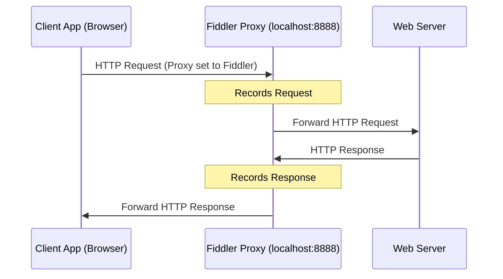
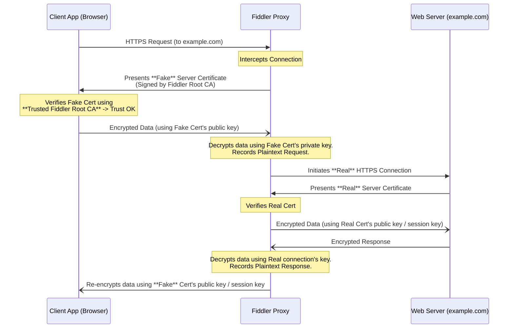

# 五、 测试工具 (Test Tools)

熟悉常用工具及其原理。

### Q：聊聊 fiddler 的抓包原理

Fiddler 是一个 **HTTP/HTTPS 调试代理**。

1. **设置代理:** Fiddler 启动后将自身设置为系统的 Web 代理 (通常监听 `localhost:8888`)。
2. **拦截请求:** 应用程序 (如浏览器) 的 HTTP 请求会先发给 Fiddler。
3. **记录与转发:** Fiddler 记录请求信息，然后将请求转发给目标服务器。
4. **拦截响应:** 服务器的响应先返回给 Fiddler。
5. **记录与转发:** Fiddler 记录响应信息，然后将响应转发给应用程序。

> **本质:** Fiddler 扮演 **中间人** 角色，截取并记录流经它的 HTTP(S) 流量。

### Q：fiddler 怎么抓取 https 请求？

通过 **中间人 (MITM)** 解密技术。

1. **信任根证书:** 用户需要 **安装并信任** Fiddler 生成的根证书 (`Fiddler Root Certificate`)。
2. **拦截连接:** 浏览器请求 HTTPS 网站，连接被 Fiddler 拦截。
3. **伪造证书:** Fiddler 动态生成一个 **目标网站的假证书**，用自己的根证书签名，发给浏览器。
4. **建立加密连接 (浏览器 <-> Fiddler):** 浏览器因为信任 Fiddler 根证书，所以接受了假证书，与 Fiddler 建立 HTTPS 连接。Fiddler 可以解密此连接内容。
5. **建立真实连接 (Fiddler <-> 服务器):** Fiddler 作为客户端，与真实服务器建立正常的 HTTPS 连接。
6. **数据转发与解/加密:** Fiddler 在两条连接之间充当翻译，解密一边的数据，记录下来，再加密发给另一边。

### Q：wireshark 抓包的头部有什么？

Wireshark 是 **网络协议分析器**，抓取的是 **原始网络数据包**，比 Fiddler 更底层。一个数据包通常包含多层协议头：

- **Frame (物理层/链路层帧信息):**
  - 帧编号, 帧长度, 捕获长度, 协议栈 (e.g., `eth:ip:tcp:http`)
- **Ethernet II (以太网头 - 数据链路层):**
  - 源 MAC 地址, 目的 MAC 地址, 上层协议类型 (e.g., IPv4)
- **Internet Protocol (IP 头 - 网络层):**
  - 源 IP 地址, 目的 IP 地址, 上层协议类型 (e.g., TCP, UDP), TTL, Flags等
- **Transmission Control Protocol (TCP 头 - 传输层):**
  - 源端口, 目的端口, 序列号, 确认号, Flags (SYN, ACK, FIN...), 窗口大小
  - **或者 User Datagram Protocol (UDP 头 - 传输层):** 源端口, 目的端口, 长度, 校验和
- **Application Layer Protocol (应用层数据):**
  - **HTTP:** 请求方法(GET/POST), URI, 版本, Headers (Host, User-Agent...), Body
  - **DNS:** 查询/响应信息
  - **TLS/SSL:** Handshake 信息 (加密内容本身通常不可见)

> **对比 Fiddler:** Fiddler 专注于 HTTP/HTTPS 协议的应用层内容，而 Wireshark 能看到包含网络层、传输层在内的完整数据包结构。

***
