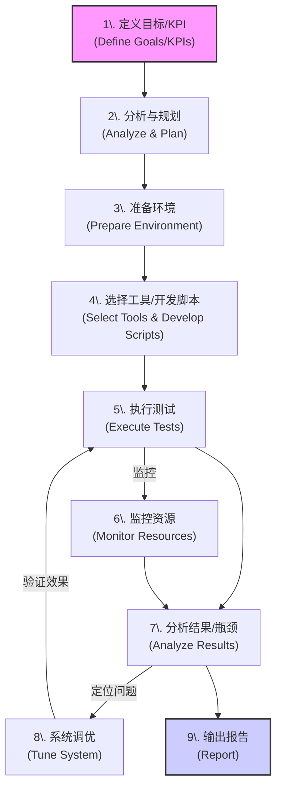

# 六、 性能测试 (Performance Testing)

评估系统在负载下的行为。

### Q：性能测试如何做的？

一个结构化的流程：

1. **定义性能目标:** 明确的、可量化的指标 (如: 500并发下登录<2s, 1000 TPS订单提交, CPU<75%)。
2. **分析与规划:** 识别关键场景，设计测试模型 (负载/压力/稳定性)，确定负载策略。
3. **准备环境:** 搭建 **类生产** 环境 (硬件/软件/网络/数据)。
4. **脚本开发:** 使用工具 (JMeter/k6/LoadRunner) 编写模拟用户行为的脚本 (参数化、关联、检查点)。
5. **执行测试:** 基准 -> 负载 -> 压力 -> 稳定性测试。
6. **监控:** 测试过程中 **必须** 监控服务器资源 (CPU, 内存, 磁盘 IO, 网络 IO, DB 指标)。
7. **结果分析:** 结合事务数据 (响应时间, TPS, 错误率) 和资源监控数据，定位性能瓶颈。
8. **调优与再测试:** 开发/运维调优 (代码/SQL/配置/架构)，然后 **重新测试** 验证效果。
9. **报告:** 总结过程、结果、瓶颈、建议。

### Q：性能测试需要关注哪些方面？

关键指标 (KPIs)：

- **响应时间 (Response Time):**
  - 用户感知最直接的指标。
  - 关注 **平均值** 和 **百分位值** (如 P90, P95, P99)。
- **吞吐量 (Throughput):**
  - 单位时间处理能力 (TPS - Transactions Per Second / RPS - Requests Per Second)。
  - 反映系统处理性能。
- **并发用户数 (Concurrent Users):**
  - 同时与系统交互的用户数 (需要区分“在线”与“正在发请求”的并发)。
- **错误率 (Error Rate):**
  - 失败请求占比。应尽可能低，并分析错误原因。
- **资源利用率 (Resource Utilization):**
  - **CPU Utilization:** 过高 (>75-85%) 可能有计算瓶颈。
  - **Memory Utilization:** 持续高或频繁 GC 可能是内存问题。
  - **Disk I/O:** 磁盘读写压力，高 `iowait` 是常见瓶颈。
  - **Network I/O:** 网络带宽是否成为瓶颈。
  - **(数据库相关):** 慢查询、锁等待、连接数等。
- **系统稳定性 (Stability):**
  - 长时间运行下性能是否衰减？有无内存泄漏？
- **可扩展性 (Scalability):**
  - 增加资源 (如服务器) 时，性能是否能线性或接近线性增长？

***
